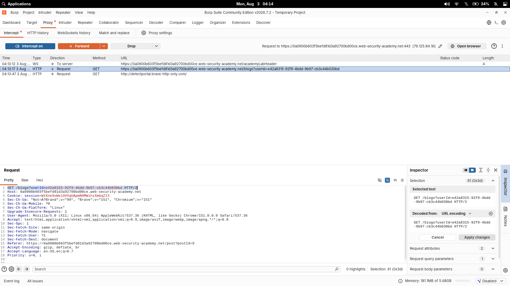
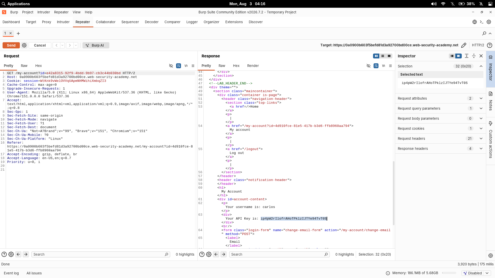

# User ID Controlled By Request Parameter With Unpredictable User IDs

| Field | Value |
|---|---|
| **Difficulty** | Apprentice |
| **Category** | Access Control |
| **Lab URL** | `https://portswigger.net/web-security/access-control/lab-user-id-controlled-by-request-parameter-with-unpredictable-user-ids` |

---

## Lab Objective

The user account page has a horizontal privilege escalation vulnerability, but users are identified with GUIDs (unpredictable IDs). Find the GUID for `carlos`, then submit his API key as the solution.

---

## Skills Learned

- Horizontal privilege escalation via an `id` request parameter
- Bypassing "unpredictable IDs" by leaking them from public content (blog posts)
- GUIDs are not a security control — they only make IDs harder to guess, not impossible to obtain

---

## Recon

Logged in with the supplied credentials (`wiener:peter`). The account page is at:

```text
GET /my-account?id=4d910fce-81e5-417b-b3d6-ffb8960aa794
```

My user ID is a GUID. Unlike the earlier labs, the ID can't be guessed by incrementing a number — but it doesn't need to be guessed if the application leaks it somewhere public.

---

## Finding the Vulnerability

Blog posts on the site link to their author. When I opened a post by `carlos` and clicked his name, the URL revealed his GUID:

```text
GET /blogs?userId=e42a8315-92f9-4bdd-9b97-cb3c44b030bd
```



The `/my-account` endpoint trusts the `id` query parameter to decide whose account to show. Replacing my GUID with carlos's GUID should load his account.

---

## Exploitation Steps

1. Logged in as `wiener:peter`.
2. Opened a blog post authored by `carlos` and clicked his username.
3. Noted his GUID from the URL: `e42a8315-92f9-4bdd-9b97-cb3c44b030bd`.
4. Changed the `id` parameter in `/my-account` from my GUID to carlos's GUID.
5. The page loaded carlos's account showing his username and API key.
6. Submitted the API key to solve the lab.

---

## Payload

Modified request:

```text
GET /my-account?id=e42a8315-92f9-4bdd-9b97-cb3c44b030bd HTTP/2
Host: 0a9900b603f5befd81d3a92700bd00ce.web-security-academy.net
Cookie: session=Wtknk9vilel0VVqUApmNHMWinaxmbgZI3
```



The response contained:

```html
Your username is: carlos
Your API Key is: ip4pW2rIlofrAaHoTPk1zIJTYe94TVTOS
```

---

## Why It Works

The account page performs authorization by reading an `id` parameter supplied by the client. The session cookie confirms I'm logged in, but the `id` decides *whose* data is served. There is no check that the `id` belongs to the logged-in user.

Using a GUID for the ID does not fix this — it only makes random guessing infeasible. Because the application itself publishes user GUIDs in blog post author links, the "unpredictable" ID is freely discoverable, and the horizontal escalation works exactly like the numeric-ID variant.

---

## Root Cause

The developer switched from sequential numeric IDs to GUIDs to "secure" the endpoint, but never added an authorization check. The vulnerability is not the ID format — it's the missing check that the requested resource belongs to the authenticated user.

---

## Impact

Any authenticated user can view any other user's account page, including API keys and other private data. On a real application this enables account data theft, credential harvesting, and can be chained into account takeover.

---

## Mitigation

- Never trust the client-supplied identifier for authorization — resolve the current user from the session server-side
- For account pages, ignore the `id` parameter and load the profile based on the session user (or verify the `id` matches the session user)
- Apply object-level authorization checks on every resource: "does the logged-in user have permission to access this object?"
- Treat GUIDs as a hardening measure, never as a substitute for authorization checks

---

## Key Takeaways

- GUID/UUID ≠ security. Unpredictable IDs still break if the app leaks them (blog links, comments, admin logs)
- Look for public places where other users' IDs appear — author links, comments, message recipients
- When testing horizontal escalation, swap your ID for a victim's ID (collected from public sources) and observe the response
- Always check whether the `id` in a URL is validated against the session

---

## Related Labs

- [04 - User ID Controlled By Request Parameter](../04%20-%20User%20ID%20Controlled%20By%20Request%20Parameter/README.md) — same `id`-parameter escalation; the trick is predicting the GUID
- [05 - User ID Controlled By Request Parameter With Data Leakage In Redirect](../05%20-%20User%20ID%20Controlled%20By%20Request%20Parameter%20With%20Data%20Leakage%20In%20Redirect/README.md) — same horizontal escalation chain

---

## References

- [PortSwigger: Horizontal privilege escalation](https://portswigger.net/web-security/access-control#horizontal-privilege-escalation)
- [PortSwigger: Lab — User ID controlled by request parameter, with unpredictable user IDs](https://portswigger.net/web-security/access-control/lab-user-id-controlled-by-request-parameter-with-unpredictable-user-ids)
- [OWASP: Authorization Cheat Sheet](https://cheatsheetseries.owasp.org/cheatsheets/Authorization_Cheat_Sheet.html)
