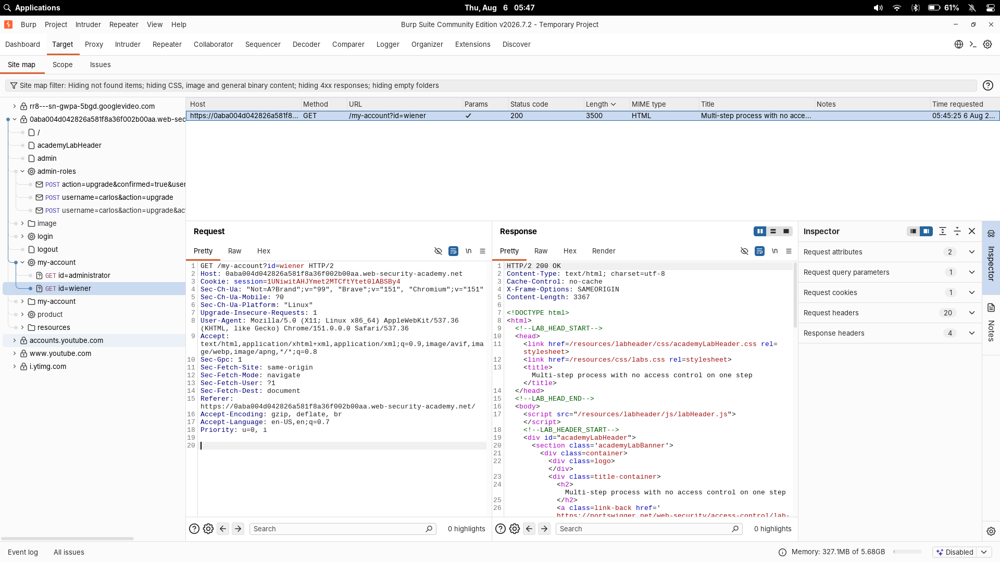
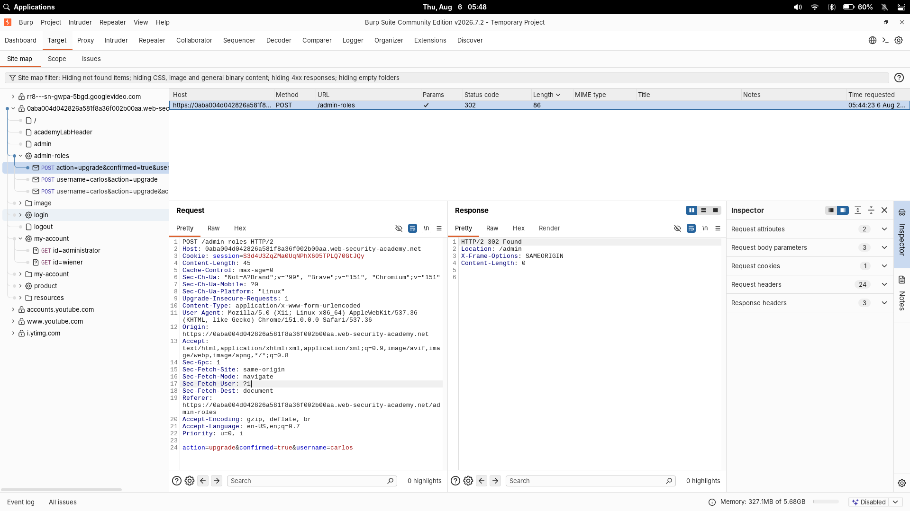
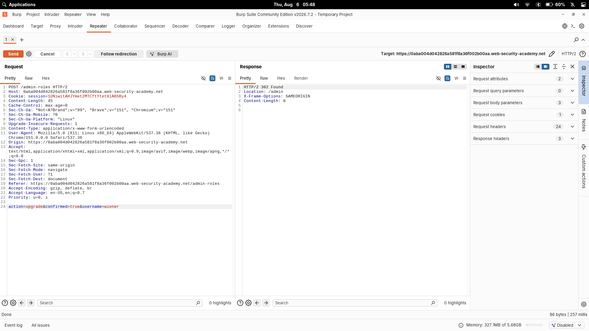

# Multi-Step Process With No Access Control On One Step

| Field | Value |
|---|---|
| **Difficulty** | Practitioner |
| **Category** | Access Control |
| **Lab URL** | `https://portswigger.net/web-security/access-control/lab-multi-step-process-with-no-access-control-on-one-step` |

> Note: The official PortSwigger solution asks you to first promote `carlos` and then replay that request. That is not how I solved it. I inspected and reused the **administrator's confirmation request** directly, without ever initiating or completing a role change as a normal user. I did not first promote Carlos. The walkthrough below documents my actual workflow.

---

## Summary

The admin panel changes a user's role through a two-step process. The first step is protected by an authorization check, but the **confirmation step is not**. I captured the confirmation request from an admin session, swapped in my own non-admin session cookie, changed the target username to mine, and replayed it to promote myself to administrator.

---

## Lab Objective

Log in as `wiener:peter` and exploit the flawed access control in the multi-step role-change process to promote `wiener` to administrator.

---

## Background

**Multi-step process** workflows require several sequential requests before a final action is performed — for example, *create an order → confirm order → pay*. A common implementation mistake is to validate authorization on the *first* visible step and assume that once a user has passed it they can "continue" freely through the remaining requests.

That assumption is wrong. An attacker is not bound to the UI. They can capture any intermediate request, replay it out of context, and skip straight to a later step. If a privileged step (like the final confirmation) does not re-validate the user's role server-side, nothing stops a low-privileged user from triggering it directly.

The security rule is simple: **every privileged step must be authorized independently on the server.** Reaching a confirmation page is not proof of an admin — it is just a page.

---

## Methodology

### Step 1 — Inspect the administrator confirmation request

I logged in as `administrator:admin` and opened the admin panel. When I initiated a role change through the panel, the application did not apply it immediately — it returned a confirmation prompt that required a second request to complete the change.

To find the important request I reviewed the `POST` requests in Burp's HTTP history and identified the **confirmation request** sent immediately before a user was promoted. This is the step that actually performs the role change, so it is the request that matters for the exploit.



The confirmation request looked like this:

```text
POST /admin-roles HTTP/2
Content-Type: application/x-www-form-urlencoded

username=carlos&action=upgrade&confirmed=true
```

The key detail is the `confirmed=true` parameter — it marks this as the terminal confirmation step of the multi-step flow.

---

### Step 2 — Obtain my own session cookie

Next I logged in as the low-privileged user `wiener:peter`. I located a normal request from within my own account and copied my `session` cookie value out of it in Burp Suite.

That cookie is the proof-of-identity the application trusts to decide who I am, so grabbing it lets me impersonate myself inside a request captured from another session.



---

### Step 3 — Modify and replay the confirmation request

I modified the captured confirmation request to act as me instead of the administrator:

1. Replaced the administrator's `session` cookie value with **my own session cookie**.
2. Changed the target username:

Replace:

```text
username=carlos
```

With:

```text
username=wiener
```

The replayed request:

```text
POST /admin-roles HTTP/2
Content-Type: application/x-www-form-urlencoded
Cookie: session=<redacted>

username=wiener&action=upgrade&confirmed=true
```

I replayed it in Burp Repeater and received:

```text
HTTP/2 302 Found
Location: /admin
```

A `302 Found` pointing back to the admin panel is the same response the genuine admin flow returns on success. It means the server accepted the role change instead of rejecting the request as unauthorized — a clear sign the confirmation step had no server-side access control.

---

### Step 4 — Verify

I confirmed the result by checking my account: it now had administrator privileges, and the lab was solved.



---

## Why It Works

The initial step that triggers the confirmation page enforces authorization, which is why a direct non-admin request normally fails. But the **confirmation request** (with `confirmed=true`) performs the actual role change and never re-checks that the caller is allowed to do it.

By replaying the confirmation request with my own valid session cookie, I skipped the only authorized step and jumped straight to the privileged one. The server trusted the supplied parameters and the `confirmed` flag, applied the change to `wiener`, and returned a redirect — silent privilege escalation.

---

## Root Cause

A **server-side authorization failure**: the application checks access on the initial step of the multi-step flow but omits the check on a later step of that flow. Because the confirmation step does not independently re-validate the authenticated user's role, any authenticated user can invoke it directly. All upstream authorization is bypassable because it lives on the wrong step.

---

## Impact

A low-privileged user can escalate to administrator by forging the confirmation step of a privileged multi-step flow. In a real application this leads to:

- Vertical privilege escalation (regular user → admin)
- Account takeover, user management abuse
- Exposure or modification of admin-only data

This illustrates why protecting **only the UI** is insufficient: the mere existence of a confirmation page does not mean the follow-up request is authorized. Access control must run on the server, on every request, not just on the first step the browser happens to show.

---

## Mitigation

- Enforce an authorization check inside **every** privileged handler, including intermediate and confirmation steps — never rely on a previous step having been authorized
- Do not trust correlated security, blindly trusting parameter although `confirmed=true` is client-controllable and not a source of authority
- Bind the confirmation step to a signed, one-time, server-generated token tied to the session that started the flow
- Re-validate the authenticated user's role at the moment the role change is applied, not earlier
- Log and audit every state-changing operation so an unexpected role promotion is visible

---

## Key Takeaways

- Authorization must be checked at **every** step of a multi-step process, independently of the others
- A confirmation page in the UI is not an access-control mechanism — it is just UX
- Reusing a captured privileged request and swapping in your own session cookie is the core of the exploit, and gets caught server side
- A `confirmed=true`-style flag blocks nothing an attacker can't simply set
- When a feature uses a multi-step flow, test authorization independently on each intermediate request

---

## Related Labs

- [10 - URL-Based Access Control Can Be Circumvented](../10%20-%20URL-Based%20Access%20Control%20Can%20Be%20Circumvented/README.md) — an access-control check that leaves one surface unguarded
- [11 - Method-Based Access Control Can Be Circumvented](../11%20-%20Method-Based%20Access%20Control%20Can%20Be%20Circumvented/README.md) — same idea — find the step where the authorization check is missing

---

## References

- [PortSwigger: Access control](https://portswigger.net/web-security/access-control)
- [PortSwigger: Vulnerabilities in multi-step processes](https://portswigger.net/web-security/access-control#vulnerabilities-in-multi-step-processes)
- [PortSwigger: Lab — Multi-step process with no access control on one step](https://portswigger.net/web-security/access-control/lab-multi-step-process-with-no-access-control-on-one-step)
- [OWASP: Authorization Cheat Sheet](https://cheatsheetseries.owasp.org/cheatsheets/Authorization_Cheat_Sheet.html)