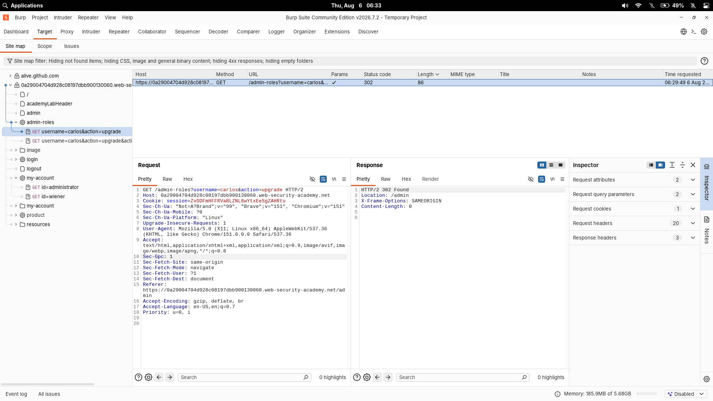
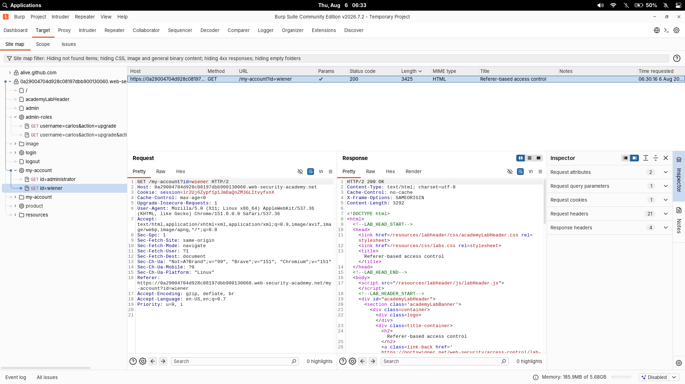
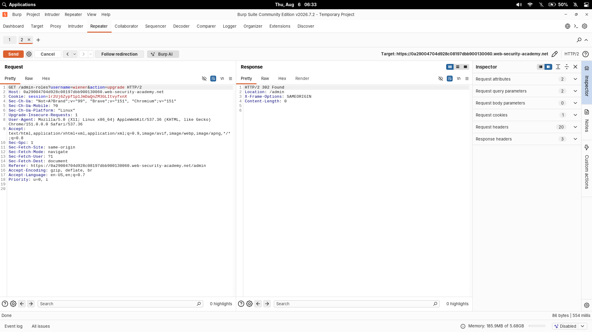

# Referer-Based Access Control Can Be Circumvented

| Field | Value |
|---|---|
| **Difficulty** | Practitioner |
| **Category** | Access Control |
| **Lab URL** | `https://portswigger.net/web-security/access-control/lab-referer-based-access-control` |

---

## Lab Objective

The application only checks access to certain admin functionality using the `Referer` header. Log in as `wiener:peter` and exploit the flawed control to promote yourself to administrator.

---

## Skills Learned

- How to spot access control that trusts a client-controllable header (`Referer`) instead of the session
- Capturing a legitimate admin request to learn its exact shape, then replaying it with an attacker-controlled cookie
- Confirming which header is actually doing the authorization

---

## Recon

First I logged in as `administrator:admin` to learn what the real admin flow looks like. The admin panel has a "promote" action that upgrades a user to administrator. I intercepted that action in Burp Proxy.



The noteworthy thing was *how small* the request was — the session cookie plus a few headers, nothing else. There's no server-side check visible in the URL or body. This is a signal the authorization may rely on something subtle like the `Referer`.

---

## Finding the Vulnerability

Access control should be decided by the **session** — who the server can prove you are. This app, though, trusts the `Referer` header, which is just what the browser *says* the previous page was. Since a client fully controls `Referer`, it's not a security boundary at all.

To exploit it:

1. Log out of `administrator` and log in as `wiener:peter`.
2. The key is that wiener's session must be the one issuing the promote request — but I don't need to be at the admin panel, I just need the request to *look like* it came from there.



So I took wiener's session cookie and replayed the captured promote request **using wiener's cookie**, while keeping the `Referer` pointing at the admin panel.

---

## Exploitation Steps

1. Logged in as `administrator:admin`, intercepted the promote request in Burp and noted it.
2. Logged out, logged in as `wiener:peter`, copied wiener's session cookie.
3. In Repeater, re-sent the captured promote request but swapped the session cookie for wiener's:

```http
POST /admin-roles?username=wiener&action=upgrade HTTP/1.1
Host: <lab-id>.web-security-academy.net
Cookie: session=<wiener-session>
Referer: https://<lab-id>.web-security-academy.net/admin
```

4. Sent it. The server authorized the action based on the `Referer` value alone and promoted wiener to administrator.
5. Reloaded the user account and confirmed the admin privileges — lab solved.



---

## Payload

The essence of the exploit — an admin-promote request replayed under a user's session with the admin `Referer`:

```http
POST /promote?username=wiener&action=upgrade HTTP/1.1
Cookie: session=<wiener-session>
Referer: https://<lab-id>.web-security-academy.net/admin
```

---

## Why It Works

The application decided "is this request authorized?" purely from the `Referer` header value. As long as it pointed at `/admin`, the action went through. The `Referer` header is controlled by the client, so an attacker simply has to set it to whatever value the app is checking — no admin session needed.

---

## Root Cause

Authorization was delegated to the `Referer` header instead of to the server-side session. The application trusted ambient request metadata as proof of privilege.

---

## Impact (Real-World)

A low-privilege user can invoke any admin-only action by attaching an admin-looking `Referer`, leading to arbitrary privilege escalation, data tampering, or account takeover.

---

## Fix

- Authorize every request against the **server-side session/role**, never headers the client controls (`Referer`, `X-Forwarded-*`, etc.)
- Enforce authorization on the backend for the actual resource being accessed
- Avoid relying on `Referer` for anything security-relevant; it is absent and forgeable

---

## Key Takeaways

- `Referer` and similar headers are attacker-controlled metadata — never authorization
- Capture and replay is a fast way to confirm exactly what a request is really checking
- When an admin action works with just a cookie + header, test replaying it under a low-privilege session

---

## Related Labs

- [10 - URL-Based Access Control Can Be Circumvented](../10%20-%20URL-Based%20Access%20Control%20Can%20Be%20Circumvented/README.md) — authorization decided by a header we fully control (`Referer` here)

---

## References

- [PortSwigger: Access control](https://portswigger.net/web-security/access-control)
- [PortSwigger: Referer-based access control](https://portswigger.net/web-security/access-control#access-control-on-referer)
- [OWASP: Authorization Cheat Sheet](https://cheatsheetseries.owasp.org/cheatsheets/Authorization_Cheat_Sheet.html)