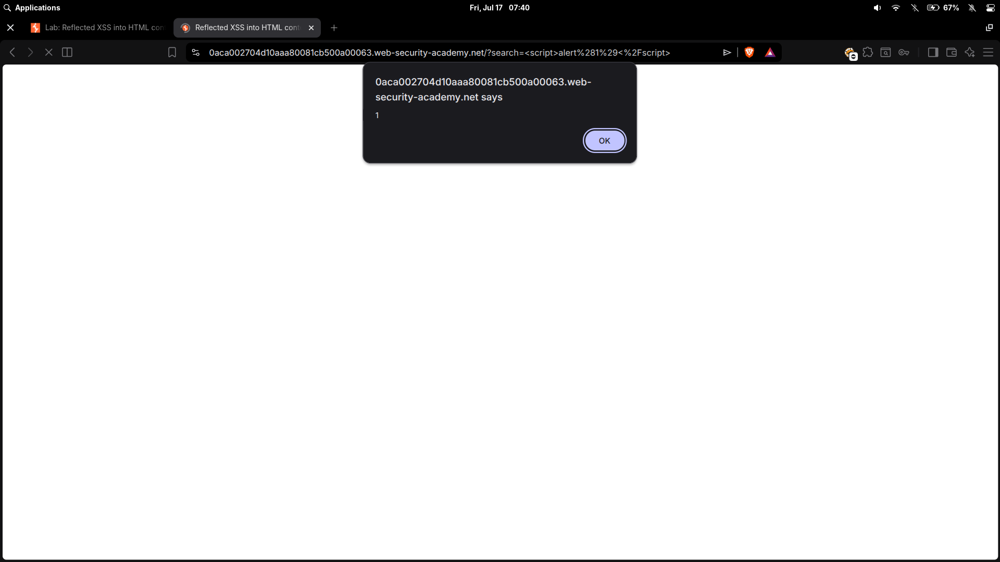

# Reflected XSS into HTML context with nothing encoded

| Field | Value |
|---|---|
| **Difficulty** | Apprentice |
| **Category** | Cross-Site Scripting (XSS) |
| **Lab URL** | `https://portswigger.net/web-security/cross-site-scripting/reflected/lab-html-context-nothing-encoded` |

---

## Lab Objective

Perform a reflected cross-site scripting attack that calls the `alert` function.

---

## Skills Learned

- Identifying reflected input in HTTP responses
- Injecting HTML/JavaScript into an unencoded reflection point
- Understanding the difference between HTML context and attribute/JS contexts

---

## Recon

The lab is a blog-style website with a search function. The search term is reflected on the results page.

I submitted a random string (`test123`) in the search box and observed how the server handled it. The search term appeared directly in the response HTML with no encoding or sanitization.

---

## Finding the Vulnerability

The search term was injected into the page as plain HTML. No `<`, `>`, or `&` were encoded. This means the server takes user input and drops it into the HTML without any escaping.

Tested by submitting:

```
<script>alert(1)</script>
```

If the server encodes the payload, it renders as text on the page. If not, JavaScript executes. In this case, the script executed — no filtering at all.



---

## Exploitation Steps

1. Opened the lab in Burp's browser.
2. Typed `<script>alert(1)</script>` into the search box.
3. Clicked "Search".
4. The alert dialog fired.
5. Lab solved.

---

## Payload

```html
<script>alert(1)</script>
```

The simplest possible XSS proof-of-concept. The `script` tag with inline JavaScript executes in the victim's browser context.

---

## Why It Works

The application takes user input from the `search` query parameter and embeds it directly into the HTML response body without any sanitization, encoding, or escaping.

```
GET /?search=<script>alert(1)</script>
```

The response contains something like:

```html
<h1>Search results for "<script>alert(1)</script>"</h1>
```

The browser parses `script` as an HTML tag and executes the JavaScript. Since there's no Content Security Policy (CSP) blocking inline scripts, the payload runs immediately.

---

## Root Cause

The developer trusted user input and reflected it into the HTML without output encoding. The template probably used something like:

```php
<h1>Search results for "<?= $_GET['search'] ?>"</h1>
```

No `htmlspecialchars()`, no `encodeURI()`, no templating engine auto-escaping.

---

## Impact

Reflected XSS lets an attacker execute arbitrary JavaScript in a victim's browser:

- **Session hijacking** — steal cookies and impersonate the user
- **Phishing** — render fake login forms to capture credentials
- **Keylogging** — capture keystrokes on the page
- **CSRF bypass** — perform actions as the authenticated user
- **Defacement** — alter the page content displayed to the victim

The attack typically requires social engineering (sending a crafted link), but in the right context it can be chained with other vulnerabilities.

---

## Mitigation

- **Output encode** all user-supplied data before reflecting it in HTML responses. Use context-specific encoding:
  - HTML body context: encode `<`, `>`, `&`, `"`, `'`
  - HTML attribute context: encode attribute-specific metacharacters
  - JavaScript context: use `\x` escaping, avoid string concatenation
- **Use a templating engine** with auto-escaping (e.g., React JSX, Angular, Jinja2 with autoescape, Go `html/template`)
- **Implement Content Security Policy (CSP)** to block inline scripts even if HTML injection occurs
- **Validate input** on the server side — reject or strip HTML tags if the use case doesn't require them

---

## Key Takeaways

- Always test every input field for reflected XSS — search boxes, error messages, query parameters, headers
- If you see your input in the page source unencoded, you have a finding
- The HTML context (inside tags, not inside attributes or JS) is the easiest to exploit — `<script>alert(1)</script>` is the first thing to try
- Don't stop at the search box — test URL parameters, hidden fields, and API responses too

---

## Related Labs

- [02 - Stored XSS into HTML context with nothing encoded](../02%20-%20Stored%20XSS%20into%20HTML%20context%20with%20nothing%20encoded/README.md) — same unencoded HTML context; this one reflects instead of storing

---

## References

- [PortSwigger: Cross-site scripting (XSS)](https://portswigger.net/web-security/cross-site-scripting)
- [PortSwigger: Reflected XSS](https://portswigger.net/web-security/cross-site-scripting/reflected)
- [OWASP: XSS](https://owasp.org/www-community/attacks/xss/)
