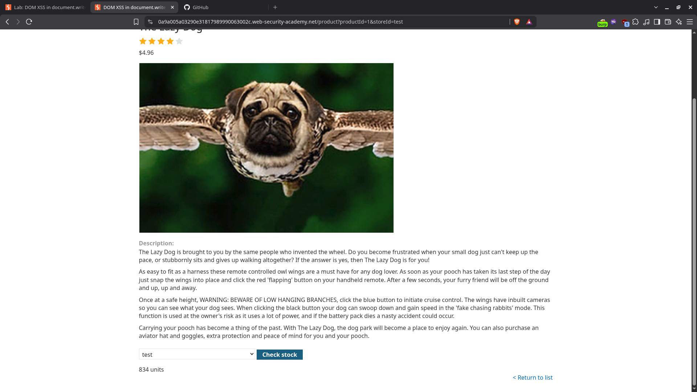
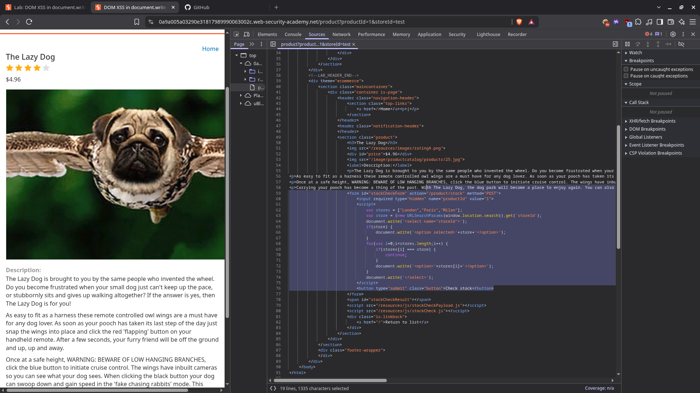
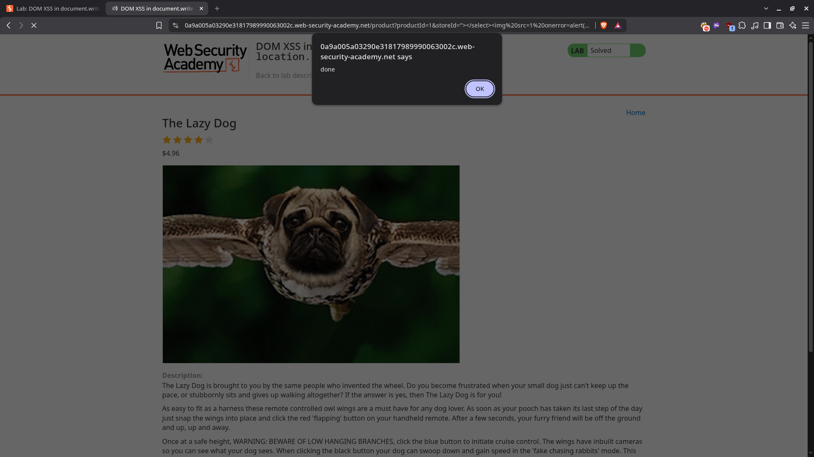

# DOM XSS in document.write sink using source location.search inside a select element

| Field          | Value                                                                                                               |
| -------------- | ------------------------------------------------------------------------------------------------------------------- |
| **Difficulty** | Practitioner                                                                                                        |
| **Category**   | Cross-Site Scripting (XSS)                                                                                          |
| **Lab URL**    | `https://portswigger.net/web-security/cross-site-scripting/dom-based/lab-document-write-sink-inside-select-element` |

---

## Lab Objective

Perform a cross-site scripting attack that breaks out of the `select` element and calls the `alert` function.

---

## Skills Learned

- DOM-based XSS in an element context (not just an attribute context)
- Identifying `document.write` as a sink with `location.search` as the source
- Breaking out of nested HTML elements (`<option>` then `<select>`)
- Crafting a payload that closes multiple tags before injecting a new one

---

## Recon

The lab is a product page with a stock checker. The stock checker is built client-side: it reads a `storeId` parameter from the URL and writes it into a dropdown list.

I added `?storeId=test` to the URL and the value `test` showed up as the selected option in the dropdown. Inspecting the page showed the value was being written straight into the DOM by JavaScript.



---

## Finding the Vulnerability

Opening DevTools on the product page revealed the vulnerable script:

```javascript
var stores = ["London", "Paris", "Milan"];
var store = new URLSearchParams(window.location.search).get("storeId");
document.write('<select name="storeId">');
if (store) {
  document.write("<option selected>" + store + "</option>");
}
for (var i = 0; i < stores.length; i++) {
  if (stores[i] === store) {
    continue;
  }
  document.write("<option>" + stores[i] + "</option>");
}
document.write("</select>");
```



The `store` value comes from `location.search` (fully attacker-controlled) and is concatenated directly into `<option selected>STORE</option>`, which sits inside a `<select>` element. Because `document.write` outputs raw HTML, I can break out of both the `<option>` and the `<select>` and inject my own tags.

This is DOM-based XSS — the server never sees the payload. The browser builds the malicious DOM itself from the URL.

---

## Exploitation Steps

1. Opened the lab
2. Added `?storeId=test` to the URL and confirmed `test` appeared as a selected `<option>` in the dropdown
3. Inspected the page source to find the `document.write` call and the `storeId` source
4. Built a payload that closes the `<option>` and `<select>` tags, then injects an `` with an `onerror` handler: `"></select>`
5. Loaded the URL `?productId=1&storeId="></select>`
6. The `alert(1)` fired and the lab was solved



---

## Payload

```
"></select>
```

The `"` closes the `value` attribute of the `<option>`, `>` closes the `<option>` tag, and `</select>` closes the parent `<select>`. The injected `` then creates a new element whose `onerror` handler runs when the broken `src` fails to load.

---

## Why It Works

`document.write` is a sink — anything passed to it is parsed as HTML by the browser. Here the app concatenates `location.search`'s `storeId` value straight into the HTML string with no encoding.

The browser receives:

```html
<select name="storeId">
<option selected>"></select></option>
</select>
```

The `<select>` and `<option>` close early, and the `` becomes a real DOM node. The `onerror` event fires immediately because `src=1` is not a valid image.

Because the injection happens entirely in client-side JavaScript, server-side filters and encoding do nothing to stop it.

---

## Root Cause

Using `document.write` with attacker-controlled input from `location.search`, dropping it into an HTML element context without any encoding.

---

## Impact

An attacker can run arbitrary JavaScript in the victim's browser:

- **Session hijacking** — steal cookies
- **Phishing** — inject fake login forms
- **Keylogging** — capture keystrokes
- **Redirect** — send the victim to a malicious site

The attack only needs the victim to open a crafted URL, which makes it easy to weaponize (email, message, shortened link).

---

## Mitigation

- Never use `document.write` with untrusted input
- Build DOM nodes with safe APIs like `document.createElement` and `textContent` instead of string concatenation
- Encode output before inserting it into HTML
- Add a Content Security Policy (CSP) that blocks inline event handlers like `onerror`

---

## Key Takeaways

- DOM XSS can live in element contexts, not just attribute contexts — closing the right tags is the whole game
- When the sink is inside nested elements, you may need to close more than one tag to escape
- The fix is in the client-side code; server-side hardening alone won't help
- Always treat `document.write`, `innerHTML`, `eval`, and `location.*` as dangerous together

---

## Related Labs

- [03 - DOM XSS in document.write sink using source location.search](../03%20-%20DOM%20XSS%20in%20document.write%20sink%20using%20source%20location.search/README.md) — same sink and source, but in an attribute context
- [01 - Reflected XSS into HTML context with nothing encoded](../01%20-%20Reflected%20XSS%20into%20HTML%20context%20with%20nothing%20encoded/README.md) — same unencoded context but server-side reflection
- [02 - Stored XSS into HTML context with nothing encoded](../02%20-%20Stored%20XSS%20into%20HTML%20context%20with%20nothing%20encoded/README.md) — stored variant, persistent across page loads

---

## References

- [PortSwigger: DOM-based XSS](https://portswigger.net/web-security/cross-site-scripting/dom-based)
- [PortSwigger: Cross-site scripting (XSS)](https://portswigger.net/web-security/cross-site-scripting)
- [OWASP: DOM based XSS](https://owasp.org/www-community/attacks/xss/#dom-based-xss)
