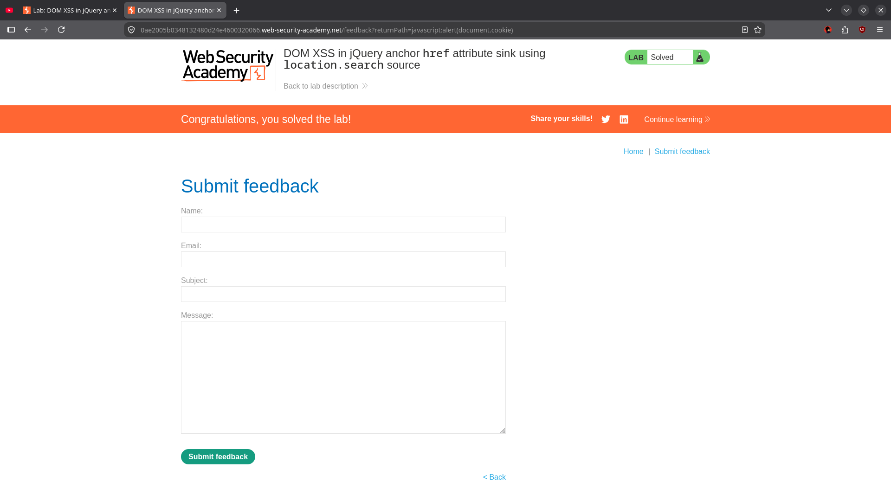

# DOM XSS in jQuery anchor href attribute sink using location.search source

**Category:** Cross-Site Scripting (XSS)
**Difficulty:** Apprentice
**Lab Solved:** Yes

---

## Description

This lab contains a DOM-based cross-site scripting vulnerability in the submit feedback page. It uses the jQuery library's `$()` selector function to find an anchor element, and changes its `href` attribute using data from `location.search`.

**Goal:** Make the "back" link trigger `alert(document.cookie)`.

---

## Solution

### 1. Find the vulnerability

Navigate to the **Submit feedback** page. In the page source, find the JavaScript that reads the `returnPath` query parameter from the URL and uses it to set the `href` attribute of the "back" anchor element via jQuery's `$()` selector.

The vulnerable code pattern looks like:

```javascript
var returnPath = new URLSearchParams(window.location.search).get("returnPath");
$("a.back").attr("href", returnPath);
```

jQuery's `$()` function with a selector that isn't a valid CSS selector (like `javascript:...`) will still pass the string through to the `attr()` method, which sets the raw attribute value.

### 2. Inject the payload

Change the `returnPath` query parameter to:

```
javascript:alert(document.cookie)
```

Full URL:

```
https://YOUR-LAB-ID.web-security-academy.net/feedback/return?returnPath=javascript:alert(document.cookie)
```

### 3. Trigger the XSS

- The "back" link's `href` attribute is now set to `javascript:alert(document.cookie)`.
- Click the "back" link.
- `alert(document.cookie)` fires — the lab is solved.



---

## Root Cause

The application takes user-controlled input from `location.search` and passes it directly into jQuery's `$()` selector, which forwards it as an `href` attribute value. Because there's no sanitization or encoding, a `javascript:` URI scheme is accepted and executed when the link is clicked.

This is distinct from other DOM XSS sinks because:

- The sink is an **anchor `href` attribute** set via jQuery's `.attr()`.
- The source is `location.search` (query parameter).
- The payload works as a `javascript:` URI, not as HTML injection.

---

## Mitigation

- Never pass unsanitized user input into jQuery's `$()` selector or into element attribute values.
- Validate `returnPath` against an allowlist of expected paths (e.g., must start with `/` and contain no special schemes).
- Use `textContent` or explicit URL validation instead of setting raw `href` values from user input.
- Implement a Content Security Policy (CSP) to restrict `javascript:` execution.

---

## Payload Used

```
javascript:alert(document.cookie)
```

Set via the `returnPath` query parameter on the feedback page.
