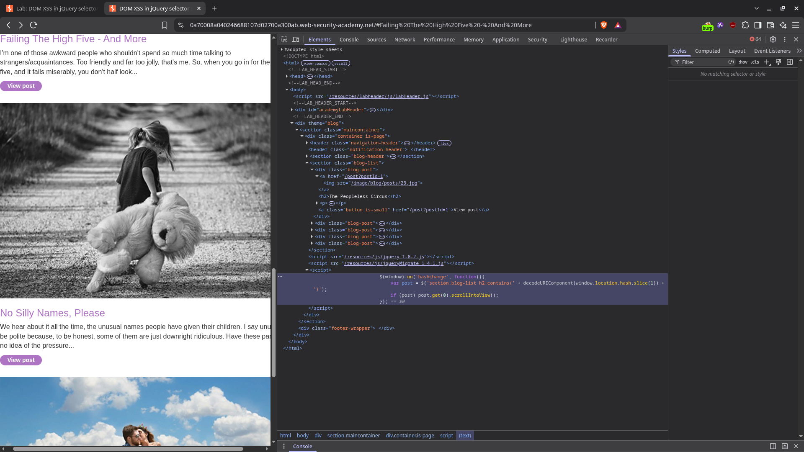
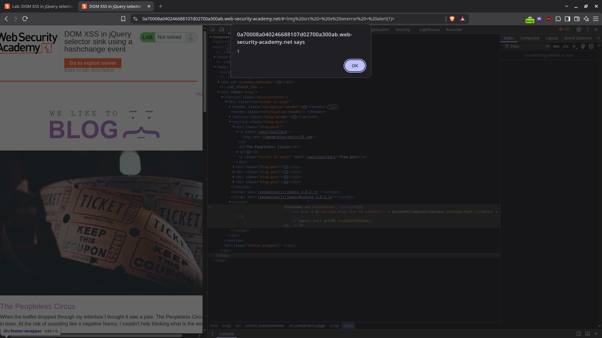
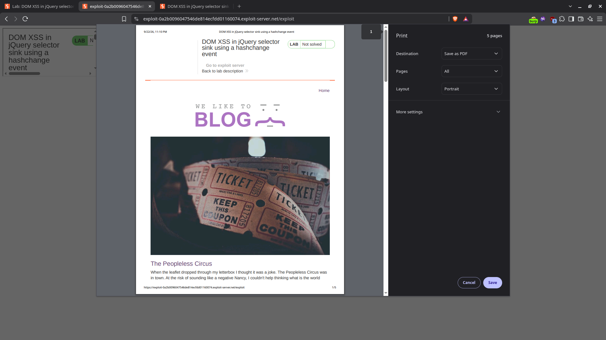

# DOM XSS in jQuery selector sink using a hashchange event

| Field          | Value                                                                                                      |
| -------------- | ---------------------------------------------------------------------------------------------------------- |
| **Difficulty** | Apprentice                                                                                                 |
| **Category**   | Cross-Site Scripting (XSS)                                                                                 |
| **Lab URL**    | `https://portswigger.net/web-security/cross-site-scripting/dom-based/lab-jquery-selector-hashchange-event` |

---

## Lab Objective

Deliver an exploit to the victim that calls the `print()` function in their browser.

---

## Skills Learned

- Recognizing jQuery's `$()` selector as a dangerous DOM XSS sink when fed unsanitized input
- Understanding how `location.hash` can be weaponized via the `hashchange` event
- Exploiting jQuery's historical behavior of parsing selector strings as HTML
- Using an exploit server with a malicious iframe to deliver the payload silently

---

## Recon

The lab is the home page of a blog application. When the URL hash changes, the page auto-scrolls to a blog post whose title matches the hash value. Inspecting the page source revealed an inline `<script>` block containing the following vulnerable code:

```javascript
$(window).on("hashchange", function () {
  var post = $(
    "section.blog-list h2:contains(" +
      decodeURIComponent(window.location.hash.slice(1)) +
      ")",
  );
  if (post) post.get(0).scrollIntoView();
});
```

The application reads `window.location.hash`, decodes it, and concatenates it directly into a jQuery `:contains()` selector string passed to `$()`. The old jQuery version (`jquery_1-8-2.js`) used here interprets the selector string as HTML when it contains characters that break out of the selector context — meaning an attacker-controlled hash can inject arbitrary HTML elements with event handlers.



---

## Finding the Vulnerability

The vulnerability is a DOM-based XSS in the jQuery `$()` selector sink. The source is `location.hash` — fully attacker-controlled via the URL fragment. The sink is the jQuery selector expression inside `$('section.blog-list h2:contains(...)')`.

Because the hash value is decoded with `decodeURIComponent()` and concatenated directly into the selector string without any escaping or validation, a crafted hash can break out of the `:contains()` argument and inject HTML. When jQuery parses the resulting selector string, it treats the injected HTML as real DOM nodes, allowing event handlers like `onerror` or `onload` to fire.

The key insight is that jQuery's `$()` function historically accepts strings that aren't valid CSS selectors and parses them as HTML. This behavior, present in older jQuery versions (the lab uses jQuery 1.8.2), makes the selector a dangerous sink for untrusted input.

---

## Exploitation Steps

1. Opened the lab and confirmed the page auto-scrolls to blog posts when clicking links (the hash changes and `scrollIntoView` fires).
2. Opened DevTools and located the vulnerable `hashchange` handler in the page's inline `<script>`.
3. Identified the jQuery `$()` selector as the sink and `location.hash` as the source.
4. Opened the lab banner and navigated to the exploit server.
5. In the exploit server's Body section, first tested with `alert(1)` to confirm the exploit works — stored the following malicious iframe:
   ```html
   <iframe
     src="https://0a7008a040246688107d02700a300ab.web-security-academy.net/#"
     onload="this.src+=''"
   ></iframe>
   ```
6. Clicked **Store**, then **View exploit** to confirm `alert(1)` fires locally — the exploit works.
7. Switched the payload from `alert(1)` to `print()` for the actual lab solution (the lab requires `print()` to be called).
8. Updated the exploit server's Body with the final payload:
   ```html
   <iframe
     src="https://0a7008a040246688107d02700a300ab.web-security-academy.net/#"
     onload="this.src+=''"
   ></iframe>
   ```
9. Clicked **Store**, then **View exploit** to confirm `print()` fires.
10. Clicked **Deliver exploit to victim** to send the exploit to the victim's browser.
11. The victim's browser loads the exploit page — the iframe first loads the target with an empty hash, then the `onload` handler appends the malicious payload to the hash, triggering the `hashchange` event.
12. jQuery processes the injected `` inside the `:contains()` selector, and `print()` executes in the victim's browser.





---

## Payload

The final exploit is delivered via a malicious iframe hosted on the PortSwigger exploit server. I first tested the exploit with `alert(1)` to confirm the vulnerability was exploitable, then switched to `print()` for the actual lab solution.

```html
<iframe
  src="https://TARGET-LAB-ID.web-security-academy.net/#"
  onload="this.src+=''"
></iframe>
```

When the iframe loads the target URL with an empty hash, the `onload` event fires and appends `` to the URL's hash fragment. This triggers the `hashchange` event on the target page, which causes jQuery to evaluate the malicious string inside the `:contains()` selector. jQuery parses the injected `` tag as HTML, and the `onerror` handler calls `print()`.

---

## Why It Works

The vulnerability chain works as follows:

1. **Source**: `location.hash` is fully attacker-controlled — anyone can set the URL fragment to any value.
2. **Decoding**: `decodeURIComponent(window.location.hash.slice(1))` decodes the fragment without sanitization.
3. **Concatenation**: The decoded value is concatenated directly into a jQuery selector string with no escaping.
4. **Parsing**: Old jQuery versions (like 1.8.2 used here) parse invalid selector strings as HTML when passed to `$()`.
5. **Execution**: Injected HTML elements (like ``) with event handlers are parsed as real DOM nodes, and their event handlers fire.

The exploit works entirely client-side — the server never sees the payload. The attacker only needs the victim to visit a page containing the malicious iframe, which silently sets the hash and triggers the vulnerability.

---

## Root Cause

Using jQuery's `$()` selector function with unsanitized user input from `location.hash`. The developer intended the hash value to be used as a plain text selector argument for `:contains()`, but jQuery's historical behavior of parsing non-CSS-selector strings as HTML means the input is treated as HTML instead — allowing injection of arbitrary elements with event handlers.

The root cause is a combination of two issues:

- **No input escaping**: The hash fragment is not escaped before being placed inside a jQuery selector expression.
- **Unsafe jQuery behavior**: Old jQuery versions accept HTML within selector strings passed to `$()`.

---

## Impact

An attacker can execute arbitrary JavaScript in the victim's browser:

- **Print dialog injection** — as demonstrated in this lab, `print()` can be called silently.
- **Session hijacking** — steal cookies and tokens accessible via JavaScript.
- **Phishing** — inject fake login forms or overlay the page with malicious content.
- **Keylogging** — capture keystrokes entered by the victim.
- **Redirect** — send the victim to a malicious site.

The attack requires no user interaction beyond visiting a page containing the exploit iframe, making it trivially weaponizable via email, messaging, or shortened links.

---

## Mitigation

1. **Never pass unsanitized user input into jQuery `$()` selectors.** Treat `location.hash`, `location.search`, and any URL-derived data as untrusted.

2. **Use `CSS.escape()` or `$.escapeSelector()`** if building selectors from user input:

   ```javascript
   var raw = decodeURIComponent(window.location.hash.slice(1));
   var safe = CSS.escape(raw);
   var post = $('section.blog-list h2:contains("' + safe + '")');
   ```

3. **Use `textContent` instead of jQuery selectors for text matching.** Compare plain text values rather than building selector expressions:

   ```javascript
   $(window).on("hashchange", function () {
     var raw = decodeURIComponent(window.location.hash.slice(1));
     var posts = $("section.blog-list h2").filter(function () {
       return $(this).text() === raw;
     });
     if (posts.length) posts.get(0).scrollIntoView();
   });
   ```

4. **Validate and restrict hash format.** Only accept known formats (e.g., numeric IDs or slugs matching `/^[A-Za-z0-9_-]+$/`). Reject unexpected values.

5. **Implement a Content Security Policy (CSP)** as defense in depth to restrict inline event handlers and script execution.

6. **Update jQuery.** Modern jQuery versions have mitigations against HTML-in-selector injection. The vulnerability is significantly reduced in jQuery 3.x+.

---

## Key Takeaways

- jQuery's `$()` selector can be a dangerous sink when fed unsanitized input — old versions parse selector strings as HTML
- `location.hash` is fully attacker-controllable and must never be concatenated into expressions without escaping
- The `hashchange` event makes hash-based injection automatic and silent — no user click required
- Exploit servers with malicious iframes provide a clean delivery mechanism for DOM XSS attacks
- The fix is entirely client-side: escape or validate input before using it in jQuery selectors

---

## Related Labs

- [06 - DOM XSS in jQuery anchor href attribute sink using location.search source](../06%20-%20DOM%20XSS%20in%20jQuery%20anchor%20href%20attribute%20sink%20using%20location.search%20source/README.md) — same jQuery `$()` sink but via `location.search` and `javascript:` URI
- [05 - DOM XSS in innerHTML sink using source location.search](../05%20-%20DOM%20XSS%20in%20innerHTML%20sink%20using%20source%20location.search/README.md) — similar source (`location.search`) but different sink (`innerHTML`)
- [03 - DOM XSS in document.write sink using source location.search](../03%20-%20DOM%20XSS%20in%20document.write%20sink%20using%20source%20location.search/README.md) — same concept but with `document.write` as the sink

---

## References

- [PortSwigger: DOM-based XSS](https://portswigger.net/web-security/cross-site-scripting/dom-based)
- [PortSwigger: Cross-site scripting (XSS)](https://portswigger.net/web-security/cross-site-scripting)
- [PortSwigger: Lab — DOM XSS in jQuery selector sink using a hashchange event](https://portswigger.net/web-security/cross-site-scripting/dom-based/lab-jquery-selector-hashchange-event)
- [OWASP: DOM-based XSS Prevention Cheat Sheet](https://owasp.org/www-community/attacks/xss/#dom-based-xss)
- [MDN: CSS.escape()](https://developer.mozilla.org/en-US/docs/Web/API/CSS/escape)
