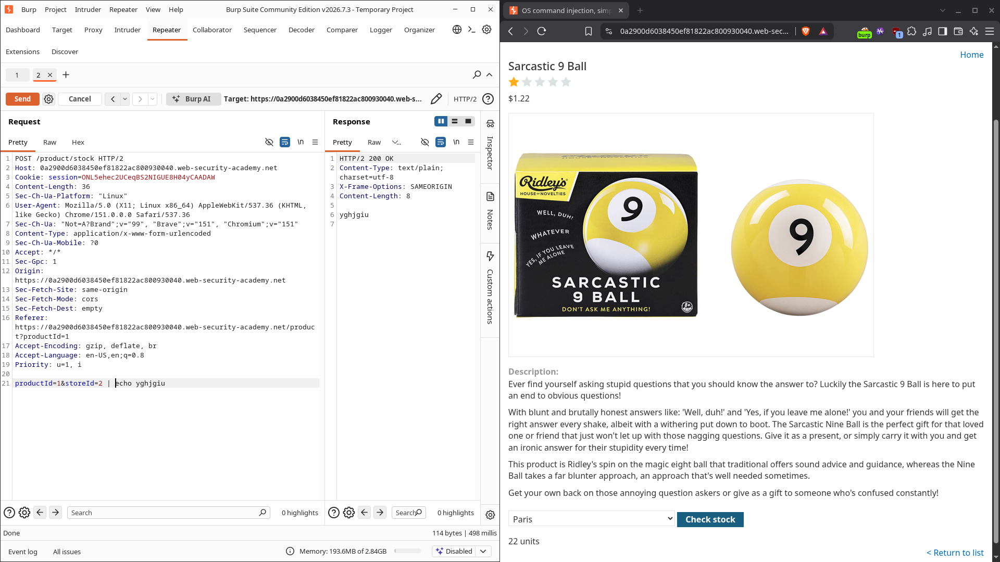
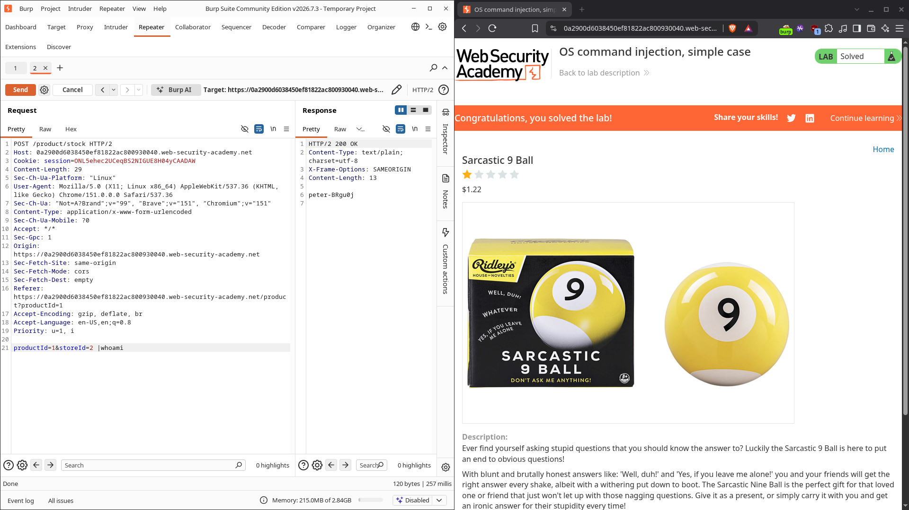

# OS command injection, simple case

| Field          | Value                                                                  |
| -------------- | ---------------------------------------------------------------------- |
| **Difficulty** | Apprentice                                                             |
| **Category**   | OS Command Injection                                                   |
| **Lab URL**    | `https://portswigger.net/web-security/os-command-injection/lab-simple` |

---

## Lab Objective

Execute the `whoami` command through the product stock checker to reveal the name of the current OS user.

---

## Skills Learned

- Spotting shell command injection in a parameter that feeds an OS command
- Using shell metacharacters (`|`) to append a command to the one the server runs
- Reading command output straight out of the HTTP response

---

## Recon

The lab is a shopping site. Each product page has a "Check stock" button that posts the product and store IDs to the server:

```
POST /product/stock HTTP/2
Content-Type: application/x-www-form-urlencoded

productId=1&storeId=2
```

The server responds with the stock level for that store. The `storeId` value is interesting — the response is built by running a command that includes it, so it's a good injection candidate.

---

## Finding the Vulnerability

The key clue is that the application returns the raw output of whatever command it runs. If I can slip a shell metacharacter into `storeId`, the server will happily run extra commands and send their output back in the response.

A quick test with `storeId=2 | echo test` returned `test` alongside the normal stock output — confirming the input is concatenated into a shell command without sanitization.

---

## Exploitation Steps

1. Opened the lab and clicked **Check stock** on any product.
2. Intercepted the `POST /product/stock` request in Burp Proxy and sent it to **Repeater**.
3. In the request body, changed `storeId=2` to include a pipe and the `whoami` command: `storeId=2 |whoami`.
4. Sent the request.
5. The response body now contained the output of `whoami` — the name of the current OS user (a `peter-…` account).
6. Lab solved.

---

## Payload

```http
POST /product/stock HTTP/2
Host: 0a2900d6038450ef81822ac800930040.web-security-academy.net
Content-Type: application/x-www-form-urlencoded

productId=1&storeId=2 |whoami
```





---

## Why It Works

The server builds an OS command that includes the user-supplied `storeId`, something like:

```bash
stockreport 1 2
```

By appending `|whoami`, the request turns it into:

```bash
stockreport 1 2 | whoami
```

The `|` is a shell pipe: it takes the output of the first command and feeds it to `whoami`. `whoami` ignores that input and prints the current user, and because the app returns the command's raw output, that username ends up in the HTTP response.

Other separators work just as well — `&whoami`, `;whoami`, or `` `whoami` `` would each inject the command too.

---

## Root Cause

The application concatenates untrusted user input directly into a shell command:

```python
# Vulnerable pattern
os.system("stockreport " + productId + " " + storeId)
```

or, equivalently, running a shell with the input interpolated:

```python
subprocess.run("stockreport " + productId + " " + storeId, shell=True)
```

There is no input validation, no escaping, and the command runs through a shell — so any metacharacter the user sends becomes part of the command.

---

## Impact

An attacker who can reach this parameter can run arbitrary operating-system commands as the user the web app runs as. That means:

- Reading or modifying any file the app user can access
- Enumerating the host, pulling environment variables and secrets
- Pivoting further into the network
- In a worst case, a full reverse shell

Even "just" reading `whoami` proves the host is compromised at the app's privilege level.

---

## Mitigation

- **Never pass user input to a shell.** Use APIs that don't invoke one — for example `subprocess.run([...])` with a list of arguments and `shell=False`.
- **If a shell is unavoidable**, strictly validate inputs against an allowlist and reject anything containing metacharacters (`| & ; $ > < ` \n`).
- **Apply least privilege** — the service account should have only the permissions it truly needs, so a compromise is contained.
- **Avoid `os.system` / `eval` / `shell=True`** patterns entirely; they are the usual root of this bug.

---

## Key Takeaways

- Any parameter that ends up in a system command is a command-injection target.
- Shell metacharacters like `|`, `&`, and `;` let you chain extra commands.
- If the app returns raw command output, the injection is trivially exploitable.
- Always run external commands with argument lists, not string concatenation through a shell.

---

## Related Labs

- **Blind OS command injection with time delays** — the same injection point, but the output is hidden, so you infer success via timing instead of reading it directly (writeup coming soon).

---

## References

- [PortSwigger: OS command injection](https://portswigger.net/web-security/os-command-injection)
- [PortSwigger: OS command injection cheat sheet](https://portswigger.net/web-security/os-command-injection/cheat-sheet)
- [OWASP: Command Injection](https://owasp.org/www-community/attacks/Command_Injection)
