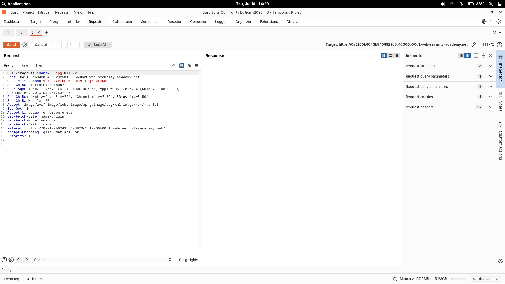
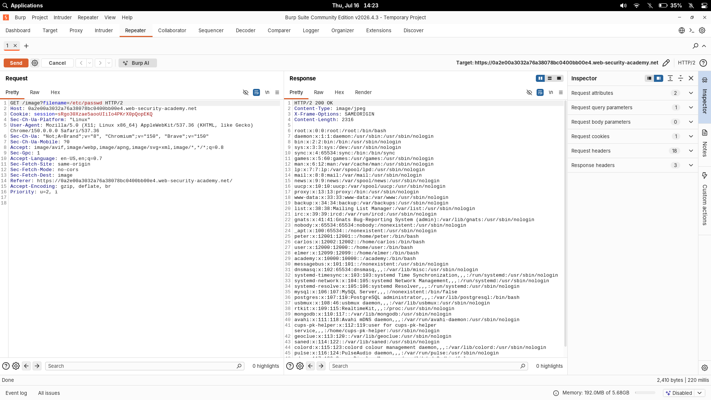

# File Path Traversal — Traversal Sequences Blocked with Absolute Path Bypass

| Field | Value |
|---|---|
| **Difficulty** | Practitioner |
| **Category** | Path Traversal |
| **Lab URL** | `https://portswigger.net/web-security/file-path-traversal/lab-absolute-path-bypass` |

---

## Lab Objective

Read the contents of `/etc/passwd` from the server's filesystem by bypassing a filter that blocks traversal sequences.

---

## Skills Learned

- Identifying path traversal filters
- Bypassing `../` filters using absolute paths
- Understanding the difference between relative and absolute file resolution

---

## Recon

I loaded the lab in Burp's browser. The site is a shop with product images loaded dynamically.

Inspecting the page source and network traffic in Burp's HTTP history revealed the image endpoint:

```
GET /image?filename=36.jpg
```



The `filename` parameter is the vector. Same pattern as the simple case lab, but the server might be filtering this time.

---

## Finding the Vulnerability

I sent the request to Repeater and tested a standard traversal payload:

```
GET /image?filename=../../../etc/passwd
```

The server returned an error — the `../` sequences were being filtered.

Absolute paths don't use `../`. I tried:

```
GET /image?filename=/etc/passwd
```

The response contained the contents of `/etc/passwd`. The filter only blocked relative traversal sequences — not absolute paths.

---

## Exploitation Steps

1. Opened the lab in Burp's browser.
2. Found the image request in Proxy history.
3. Sent it to Repeater.
4. Replaced the filename with `/etc/passwd`.
5. Sent the request.
6. The response body contained the server's `/etc/passwd` file.
7. Lab solved.

---

## Payload

```
/etc/passwd
```



No `../` sequences needed. The application accepts an absolute filesystem path directly.

---

## Why It Works

### Relative vs Absolute Paths

- **Relative paths** (like `../../../etc/passwd`) resolve from the current working directory. They use `../` to step up directories.
- **Absolute paths** (like `/etc/passwd`) start from the filesystem root. They don't need `../` at all.

### What the filter checked

The server likely used a simple string match or regex to block `../`. That catches relative traversal but misses absolute paths entirely.

When the application concatenates the filename with a base directory like `/var/www/images/`, a relative path like `../../../etc/passwd` is interpreted relative to that base. But an absolute path like `/etc/passwd` is handled differently — most filesystem APIs treat an absolute path as-is, ignoring the base directory entirely.

The application ends up reading `/etc/passwd` instead of `/var/www/images//etc/passwd`.

---

## Root Cause

The developer implemented a filter on `../` sequences but didn't consider absolute paths. User input was still passed directly to a filesystem function like `file_get_contents()` or `File.ReadAllBytes()`.

Blocking `../` alone is not enough — any path manipulation is dangerous when user input reaches the filesystem.

---

## Impact

An attacker can read arbitrary server files using absolute paths:

- Configuration files (`/etc/nginx/nginx.conf`, `/etc/apache2/apache2.conf`)
- API keys and secrets (`.env`, `config.php`)
- Source code (to find additional vulnerabilities)
- SSH private keys (`/home/user/.ssh/id_rsa`)
- Database credentials in connection strings
- Environment files containing sensitive variables

---

## Mitigation

- **Canonicalize** the path before use — resolve it to an absolute path and verify it starts with the expected base directory
- **Reject absolute paths** if the application should only serve files from a relative directory
- **Use an allowlist** of permitted filenames or IDs instead of accepting arbitrary paths
- **Use safe filesystem APIs** that prevent directory traversal (e.g., `java.nio.file.Path.normalize()` with prefix checks)
- **Never concatenate user input** directly into filesystem paths

---

## Key Takeaways

- Blocking `../` is not enough — always test absolute paths too
- Understand how path resolution works on the server (relative vs absolute)
- Filters that match patterns can almost always be bypassed
- Always think about what the filter is checking and what it misses

---

## Related Labs

- [01 - File Path Traversal - Simple Case](../01%20-%20File%20Path%20Traversal%20-%20Simple%20Case/README.md) — same directory-traversal read; this one evades a sequence filter with absolute paths

---

## References

- [PortSwigger: File path traversal](https://portswigger.net/web-security/file-path-traversal)
- [PortSwigger: Bypassing filters](https://portswigger.net/web-security/file-path-traversal#bypassing-filters)
