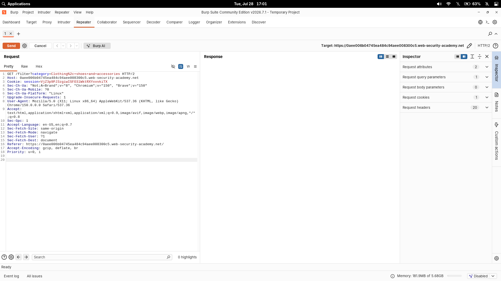
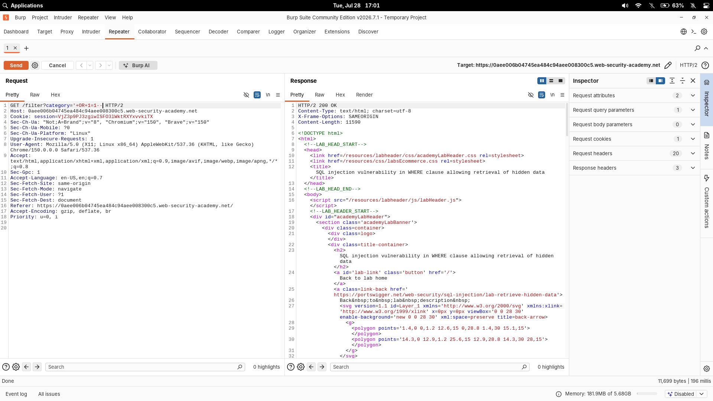

# SQL injection vulnerability in WHERE clause allowing retrieval of hidden data

| Field | Value |
|---|---|
| **Difficulty** | Apprentice |
| **Category** | SQL Injection |
| **Lab URL** | `https://portswigger.net/web-security/sql-injection/lab-retrieve-hidden-data` |

---

## Lab Objective

Cause the application to display all product details in all categories, including unreleased products.

---

## Skills Learned

- Identifying SQL injection points in GET parameters
- Using `OR 1=1` to bypass WHERE clause filters
- Understanding how SQL queries are constructed from user input

---

## Recon

The lab is a shop website with a category filter. Clicking any category (e.g., "Gifts") changes the URL:

```
GET /filter?category=Gifts
```

The page then displays only products in that category. This is the injection point — the `category` parameter likely feeds directly into a SQL query.

---

## Finding the Vulnerability

I tested the `category` parameter with a single quote to see if it breaks the query:

```
GET /filter?category=Gifts'
```

The server returned an error — a clear sign the input is being interpolated into a SQL query without sanitization.

If the query looks something like:

```sql
SELECT * FROM products WHERE category = 'Gifts' AND released = 1
```

Then injecting a single quote causes a syntax error because the quote count is unbalanced.

---

## Exploitation Steps

1. Opened the lab in Burp's browser and clicked any product category.
2. Intercepted the request in Burp Proxy and sent it to Repeater.
3. Replaced `category=Gifts` with: `category=' OR 1=1--`
4. Sent the request.
5. The response contained all products — including those not yet released.
6. Lab solved.

---

## Payload

```http
GET /filter?category=' OR 1=1--
```





---

## Why It Works

The original SQL query the server executes looks like:

```sql
SELECT * FROM products WHERE category = 'Gifts' AND released = 1
```

The injected payload transforms it to:

```sql
SELECT * FROM products WHERE category = '' OR 1=1--' AND released = 1
```

Breaking it down:

- `'` — closes the existing string literal
- `OR 1=1` — adds a condition that is always true
- `--` — comments out the rest of the query (`AND released = 1`)

The `WHERE` clause now evaluates to `true` for every row (because `1=1` is always true), so the query returns all products instead of only the filtered subset.

---

## Root Cause

The developer concatenated user input directly into the SQL query string without using parameterized queries or prepared statements. The `category` parameter value was embedded directly into the SQL statement:

```python
# Vulnerable pattern
query = "SELECT * FROM products WHERE category = '" + category + "' AND released = 1"
```

No input validation, no escaping, no parameterization.

---

## Impact

An attacker can:

- Retrieve hidden or unreleased data from any table the database user can access
- Bypass application logic that depends on WHERE clause filtering
- Use this foothold to escalate to UNION-based attacks, data extraction, or blind SQL injection

Even this simple case is dangerous — the lab hides unreleased products for a reason. An attacker could view pricing, product details, or inventory before they're meant to be public.

---

## Mitigation

- **Use parameterized queries (prepared statements)** — the most effective defense. Placeholders keep user input separate from SQL syntax:

  ```python
  cursor.execute("SELECT * FROM products WHERE category = ? AND released = 1", (category,))
  ```

- **Validate and whitelist** — if the category value should come from a fixed set, validate it against an allowlist
- **Escape user input** only if parameterized queries aren't available (least preferred option)
- **Apply least privilege** — the database user should only have the minimum permissions needed

---

## Key Takeaways

- Any user-supplied parameter that filters data is a potential SQL injection point
- A single quote causing an error is the first sign of SQL injection
- `' OR 1=1--` is the simplest way to bypass a WHERE clause and return all rows
- Always check URL parameters, POST bodies, headers, and cookies for injection points
- The `--` comment syntax is the most reliable way to terminate the rest of the query

---

## References

- [PortSwigger: SQL injection](https://portswigger.net/web-security/sql-injection)
- [PortSwigger: SQL injection cheat sheet](https://portswigger.net/web-security/sql-injection/cheat-sheet)
- [OWASP: SQL Injection Prevention Cheat Sheet](https://cheatsheetseries.owasp.org/cheatsheets/SQL_Injection_Prevention_Cheat_Sheet.html)
