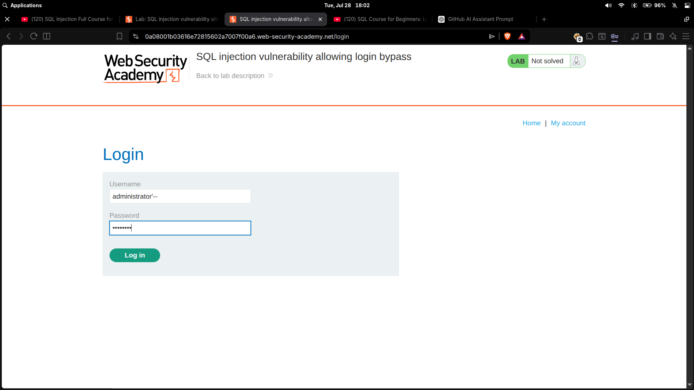

# SQL injection vulnerability allowing login bypass

| Field | Value |
|---|---|
| **Difficulty** | Apprentice |
| **Category** | SQL Injection |
| **Lab URL** | `https://portswigger.net/web-security/sql-injection/lab-login-bypass` |

---

## Lab Objective

Perform a SQL injection attack that logs in to the application as the administrator user.

---

## Skills Learned

- Identifying SQL injection in login forms
- Bypassing authentication using SQL comment syntax
- Understanding how user input is interpolated into login queries

---

## Recon

The lab is a standard shop site with a login page at `/login`. The form asks for a username and password.

I submitted random credentials (`test:test`) to see the response. The page returned "Invalid username or password" — a standard error message that confirms the credentials are checked against a database.

---

## Finding the Vulnerability

The login form takes user input and likely builds a SQL query like:

```sql
SELECT * FROM users WHERE username = 'test' AND password = 'test'
```

If the input is not sanitized, I can manipulate the query structure. I tested the username field with a single quote to see if it breaks the query:

```
administrator'
```

If the server returns an error or behaves differently, SQL injection is present.

---

## Exploitation Steps

1. Opened the lab in Burp's browser and navigated to `/login`.
2. Entered `administrator'--` in the username field and any password.
3. Clicked "Log in".
4. The application logged in as administrator.
5. Lab solved.

---

## Payload

```
administrator'--
```



The payload goes in the **username** field. The password field can be anything — it gets commented out.

---

## Why It Works

The original query the server executes looks like:

```sql
SELECT * FROM users WHERE username = 'administrator' AND password = 'anything'
```

The injected payload transforms it to:

```sql
SELECT * FROM users WHERE username = 'administrator'--' AND password = 'anything'
```

Breaking it down:

- `administrator'` — closes the username string with a valid username
- `--` — comments out the rest of the query (`AND password = 'anything'`)

The query now only checks that the username matches `administrator` and ignores the password entirely. If that user exists, the login succeeds.

---

## Root Cause

The developer concatenated user input directly into the SQL query string:

```python
query = "SELECT * FROM users WHERE username = '" + username + "' AND password = '" + password + "'"
```

No parameterized queries, no input validation, no output encoding. The comment syntax `--` is treated as SQL, not as a literal string value.

---

## Impact

An attacker can:

- Log in as any user without knowing their password
- Gain administrative access to the application
- Use the authenticated session to access privileged functionality

In a real application, this could mean accessing admin panels, viewing other users' data, or escalating privileges further.

---

## Mitigation

- **Use parameterized queries (prepared statements)** — placeholders keep user input separate from SQL syntax:

  ```python
  cursor.execute("SELECT * FROM users WHERE username = ? AND password = ?", (username, password))
  ```

- **Hash passwords** — never store or compare plaintext passwords. Use a strong hashing algorithm like bcrypt.
- **Apply least privilege** — the database user should only have the minimum permissions needed

---

## Key Takeaways

- Login forms are a prime target for SQL injection
- `' OR 1=1--` bypasses authentication by making the WHERE clause always true
- `username'--` logs in as a specific user by commenting out the password check
- Always test every input field — username, password, hidden fields, cookies
- The `--` comment syntax is database-specific but widely supported

---

## References

- [PortSwigger: SQL injection](https://portswigger.net/web-security/sql-injection)
- [PortSwigger: SQL injection cheat sheet](https://portswigger.net/web-security/sql-injection/cheat-sheet)
- [OWASP: SQL Injection Prevention Cheat Sheet](https://cheatsheetseries.owasp.org/cheatsheets/SQL_Injection_Prevention_Cheat_Sheet.html)
