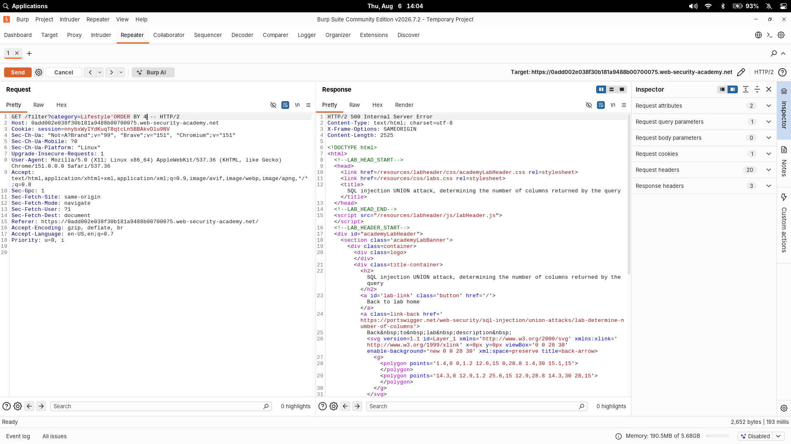
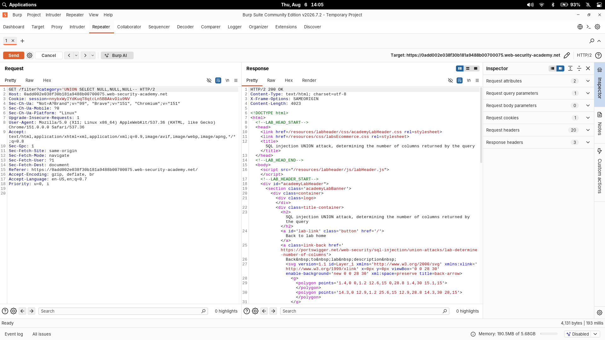

# SQL injection UNION attack, determining the number of columns returned by the query

| Field | Value |
|---|---|
| **Difficulty** | Practitioner |
| **Category** | SQL Injection |
| **Lab URL** | `https://portswigger.net/web-security/sql-injection/union-attacks/lab-determine-number-of-columns` |

---

## Lab Objective

The product category filter is vulnerable to SQL injection and its results are reflected in the response. Use a `UNION` attack to determine the number of columns returned by the query — the first step of any `UNION`-based attack.

---

## Skills Learned

- Two ways to count columns: the `ORDER BY` method and the `NULL` count method
- How a `UNION` attack works and why every `SELECT` must have the same column count
- Confirming the exact column count from the presence/absence of an error

---

## Recon

The category filter is injected via the URL:

```http
GET /filter?category=Lifestyle
```

The matching backend query looks something like:

```sql
SELECT * FROM products WHERE category = 'Lifestyle' AND released = 1
```

The response lists the products, so a `UNION SELECT` can append a row from a completely different query — if I can make the column counts match.

---

## Finding the Vulnerability

A `UNION` only works if both `SELECT`s return the same number of columns. So the first job is to find out how many columns the original query has.

I used the `ORDER BY` method first. `ORDER BY 1`, `ORDER BY 2`, ... work as long as that column index exists. If the index is out of range, the query errors out.

`category=Lifestyle' ORDER BY 4--` returned a **500 error** — meaning column 4 doesn't exist, so the query has **3 columns**.



---

## Exploitation Steps

1. Confirmed the query has 3 columns (since `ORDER BY 4` failed).
2. Built the `UNION` with the same number of `NULL` columns. `NULL` is the right placeholder because it's compatible with any data type.
3. Sent the final request:

```http
GET /filter?category=' UNION SELECT NULL, NULL, NULL-- HTTP/2
```

The response came back **200 OK** — the error disappeared and the page now includes an extra row containing the null values, confirming exactly 3 columns.



4. Lab solved.

---

## Payload

```http
GET /filter?category=' UNION SELECT NULL, NULL, NULL-- HTTP/2
```

For reference, the `ORDER BY` probing that led to it:

```http
GET /filter?category=' ORDER BY 4-- HTTP/2
```

---

## Why It Works

`UNION` appends the result of a second `SELECT` to the first. Both queries must return the same number of columns, else the database throws "the queries have different numbers of columns." By adding `NULL`s one at a time until the error disappears, I learn the column count without knowing the schema or data types.

`NULL` is used because it is type-compatible with any column, so it never causes a type mismatch — the only thing that can break is the column count.

---

## Root Cause

The application concatenates the untrusted `category` value directly into the SQL query with no parameterization:

```sql
SELECT * FROM products WHERE category = '" + category + "' AND released = 1
```

This lets attacker-controlled SQL alter the original query's structure.

---

## Impact

Determining the column count is the prelude to a full `UNION`-based data theft: reading usernames/passwords, other table contents, or the database version. It converts an error-confirming probe into the foundation for arbitrary data retrieval.

---

## Fix

- Use parameterized queries (prepared statements) so user input is data, never SQL
- Validate/whitelist the `category` input
- Least-privilege DB accounts so even a successful injection yields minimal data

---

## Key Takeaways

- `ORDER BY n` probing and the `NULL` column-count method are the two standard ways to size a query before a `UNION`
- `NULL` is the safest placeholder because it's type-agnostic
- A disappearing error is the confirmation the column count is now correct

---

## References

- [PortSwigger: SQL injection UNION attacks](https://portswigger.net/web-security/sql-injection/union-attacks)
- [PortSwigger: Determining the number of columns](https://portswigger.net/web-security/sql-injection/union-attacks#determining-the-number-of-columns-required-in-an-sql-injection-attack)
- [OWASP: SQL Injection Prevention Cheat Sheet](https://cheatsheetseries.owasp.org/cheatsheets/SQL_Injection_Prevention_Cheat_Sheet.html)