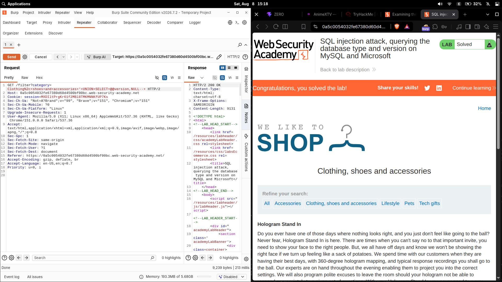

# SQL injection attack, querying the database type and version on MySQL and Microsoft

| Field | Value |
|---|---|
| **Difficulty** | Practitioner |
| **Category** | SQL Injection |
| **Lab URL** | `https://portswigger.net/web-security/sql-injection/examining-the-database/lab-querying-database-version-mysql-microsoft` |

---

## Lab Objective

Display the database version string using a UNION-based SQL injection in the product category filter. The query returns two columns, and the backend database is MySQL (or Microsoft SQL Server).

---

## Skills Learned

- Identifying a SQL injection point in a GET parameter
- Determining the number of columns returned by the query with `ORDER BY`
- Using `@@version` to read the database version on MySQL / Microsoft SQL Server
- Getting the same result from `UNION` alone — without needing a `FROM` clause (unlike Oracle)
- On MySQL, the `#` character also comments out the rest of the line

---

## Recon

The lab is a shop website. Clicking a category filters the products and changes the URL:

```
GET /filter?category=Clothing,+shoes+and+accessories
```

The `category` parameter feeds directly into the SQL query and is the injection point.

---

## Finding the Vulnerability

I confirmed the query reflects its results in the page, which makes it a great target for a `UNION` attack. Before building the `UNION` payload I needed to know how many columns the original query returns.

---

## Exploitation Steps

### 1. Counting columns with `ORDER BY`

I probed the number of columns using `ORDER BY`. `ORDER BY 1` orders the results by the first column, `ORDER BY 2` by the second, and so on. Increasing the number eventually produces an error because the referenced column doesn't exist — so the **highest number that still works reveals the column count**.

```
'+ORDER+BY+1--
'+ORDER+BY+2--
'+ORDER+BY+3--   (error)
```

`ORDER BY 2` returned results, while `ORDER BY 3` errored — so the query returns **2 columns**.

### 2. Building the UNION attack

A `UNION` appends a second `SELECT` to the original query's result set, but both queries must return the **same number of columns**, otherwise the database throws an error. So the injected `SELECT` also needs exactly 2 columns. I used `NULL` as the filler value because `NULL` is compatible with any data type, which lets me confirm the column count without knowing what each column actually contains.

### 3. Retrieving the database version

Since the database is MySQL, the built-in variable `@@version` holds the version string. My final request:

```http
GET /filter?category=Clothing,+shoes+and+accessories'+UNION+SELECT+@@version,+NULL-- HTTP/2
```

The response displayed the MySQL version string and the lab was marked solved.



---

## Payload

```http
GET /filter?category=Clothing,+shoes+and+accessories'+UNION+SELECT+@@version,+NULL-- HTTP/2
```

For reference, the `ORDER BY` probes:

```http
GET /filter?category=Clothing,+shoes+and+accessories'+ORDER+BY+1--
GET /filter?category=Clothing,+shoes+and+accessories'+ORDER+BY+2--
GET /filter?category=Clothing,+shoes+and+accessories'+ORDER+BY+3--
```

---

## Comparison: Official Solution vs. My Solve

| | Official solution | What I did |
|---|---|---|
| **Confirm columns** | `'+UNION+SELECT+'abc','def'#` | `ORDER BY` probes up to `ORDER BY 3` to confirm **2 columns** |
| **Version query** | `'+UNION+SELECT+@@version,+NULL#` | `'+UNION+SELECT+@@version,+NULL--` |
| **Comment character** | `#` | `--` |

Both approaches confirm the same 2-column result and the same `@@version` payload — the difference is just the column enumeration technique and the comment character.

---

## Why It Works

The original query looks roughly like:

```sql
SELECT * FROM products WHERE category = 'Clothing, shoes and accessories'
```

### Why `ORDER BY` reveals the column count

`ORDER BY n` sorts the results by the `n`-th column. When `n` exceeds the actual column count, the database raises an error because no such column exists. Testing increasing values therefore pinpoints the exact number of columns.

### Why the `UNION` must match the column count

`UNION` concatenates the rows from both `SELECT` statements into one result set. The database enforces that both queries return the **same number of columns** — a mismatch raises an error and the query fails. That's why I counted columns first, then built a 2-column `UNION`.

### Why `NULL` is used

`NULL` is type-compatible with every column, so using it as a placeholder lets me test/assemble the `UNION` without knowing the data types of the original columns. It never causes a type mismatch, only a column-count mismatch can break it.

### Why `@@version` works

`@@version` is a built-in global variable in MySQL and Microsoft SQL Server that contains the database version string. Selecting it directly returns the banner:

```sql
SELECT * FROM products WHERE category = 'Clothing, shoes and accessories' UNION SELECT @@version, NULL--'
```

- `'` closes the original string literal
- `UNION` combines the original result with my query
- `SELECT @@version, NULL` — retrieves MySQL's version string in the first column and pads the second with `NULL`
- `--` comments out the trailing quote so the query stays valid

---

## Key Takeaways

- Count columns with `ORDER BY` (increment until it errors) or with `UNION SELECT NULL` (increment until the error disappears)
- `NULL` is the safe placeholder for padding a `UNION` because it matches any type
- On MySQL / MSSQL, `@@version` directly returns the database version
- On MySQL, `#` is an alternative to `--` for commenting out the rest of a line
- Both the `ORDER BY` and `UNION SELECT NULL` methods agree on the same column count — whichever one you use, verify the count before extracting data

---

## Root Cause

The `category` parameter is concatenated directly into the SQL query without parameterization or validation, leaving the query open to `UNION` injection:

```python
query = "SELECT * FROM products WHERE category = '" + category + "'"
```

---

## Impact

A UNION-based SQL injection lets an attacker:

- Enumerate the database schema, tables, and columns
- Exfiltrate sensitive data (credentials, PII, business data)
- Fingerprint the database version to tailor further attacks

Because `@@version` reveals the exact type and version, dropping the remaining steps to SQL and knowing which known CVEs apply.

---

## Mitigation

- **Use parameterized queries (prepared statements)** — user input stays separate from the SQL syntax
- **Validate/whitelist** the `category` parameter
- **Apply least privilege** — the DB account should only read what the app requires
- **Restrict error verbosity** — don't leak SQL errors to the client

---

## References

- [PortSwigger: SQL injection](https://portswigger.net/web-security/sql-injection)
- [PortSwigger: SQL injection cheat sheet](https://portswigger.net/web-security/sql-injection/cheat-sheet)
- [PortSwigger: Examining the database](https://portswigger.net/web-security/sql-injection/examining-the-database)
- [OWASP: SQL Injection Prevention Cheat Sheet](https://cheatsheetseries.owasp.org/cheatsheets/SQL_Injection_Prevention_Cheat_Sheet.html)