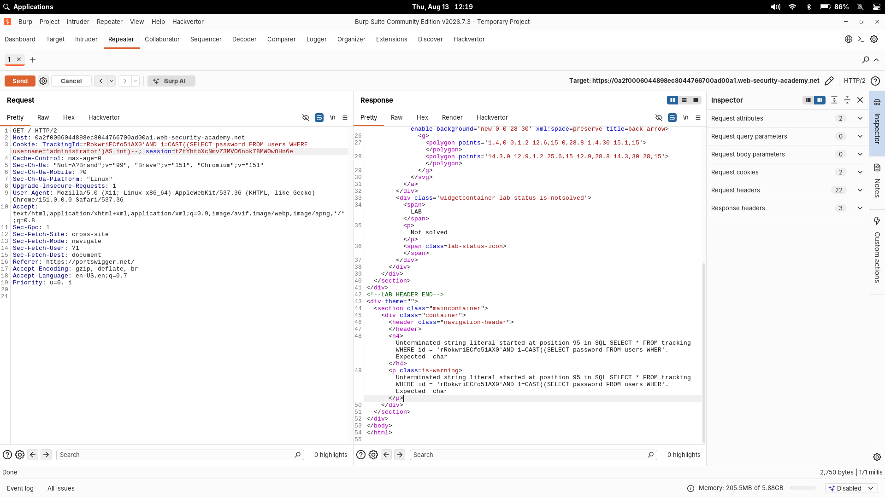
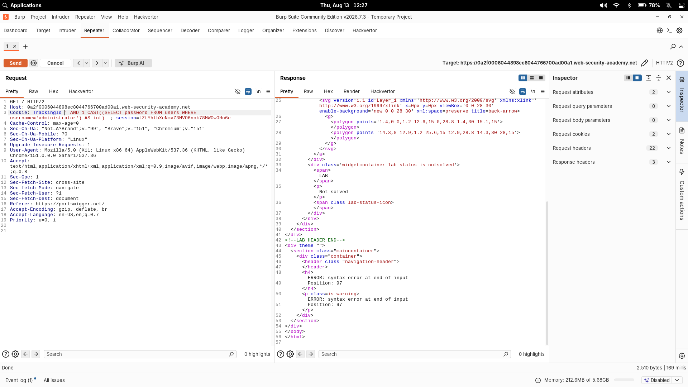
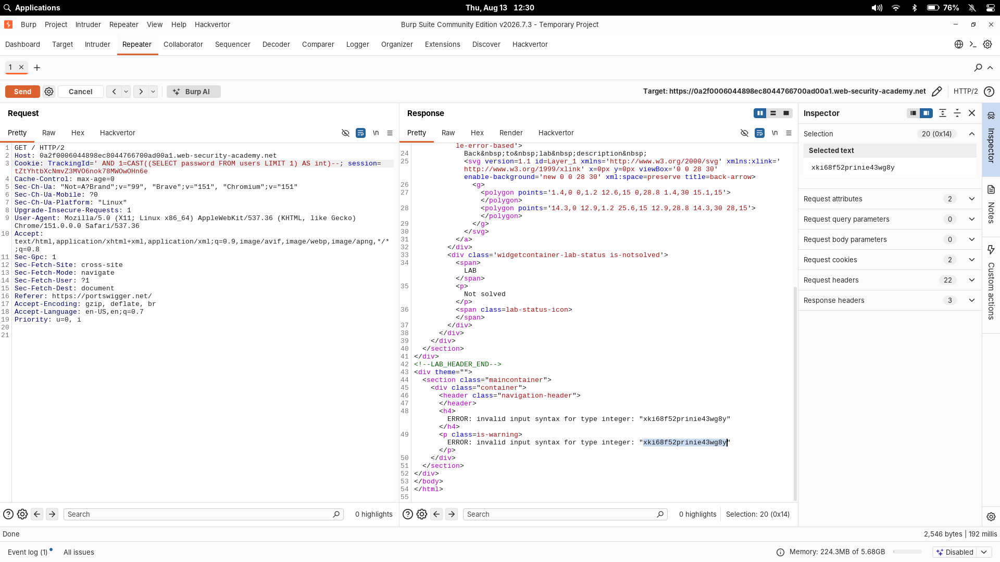

# Visible error-based SQL injection

| Field | Value |
|---|---|
| **Difficulty** | Practitioner |
| **Category** | SQL Injection (Blind) |
| **Lab URL** | `https://portswigger.net/web-security/sql-injection/blind/lab-sql-injection-visible-error-based` |

---

## Lab Overview

The application reads a `TrackingId` cookie for analytics and incorporates its value into a SQL query. The results of the query are never returned to the page, which makes this a *blind* SQL injection at first glance. Unlike the conditional-responses and conditional-errors labs, however, this one hands out **verbose database error messages** — and those errors can be weaponized to dump data directly.

The lab database has a `users` table with `username` and `password` columns. The objective is to leak the password belonging to the `administrator` user, then log in as `administrator`.

The backend is **PostgreSQL** (visible in the `LIMIT` syntax and the `invalid input syntax for type integer` error format).

---

## Vulnerability

The `TrackingId` cookie value is embedded directly into a SQL query with no parameterization:

```sql
SELECT * FROM tracking WHERE id = '<TrackingId cookie>'
```

User-controlled cookie data becomes part of the SQL statement, so anything I place in the cookie value is parsed as SQL. The injection point is the cookie itself, not a URL parameter.

Two properties make the lab exploitable:

1. The vulnerable input is unsafely concatenated into the query.
2. The application returns raw database errors to the client, including the reconstructed query and sometimes the data that caused the error.

---

## Initial Detection

### 1. Identifying the Injection Point

The `TrackingId` cookie is sent on every request to the lab. Since its value is what gets placed inside the SQL string, it is the injection surface. A normal request just loads the page normally — the query result is invisible.

### 2. Triggering a SQL Error

Adding a single quote to the cookie value breaks the string literal:

```http
Cookie: TrackingId=xyz'
```

The injected `'` closes the string early, leaving a stray quote with nothing to pair with. The application answers with a verbose error:

```text
Unterminated string literal started at position ... in SQL
SELECT * FROM tracking WHERE id = 'xyz''. Expected char
```

This error is extremely informative: it discloses the full SQL query and confirms the cookie lands inside a single-quoted string. It also tells me the character that closes the string — and therefore exactly what syntax I need to inject to escape it.

---

## Methodology

### 3. Commenting Out the Remainder of the Query

The original query has trailing syntax after the cookie value (the closing `'` and anything after it). Once my `'` closes the string, that leftover SQL causes another syntax error. SQL comment syntax neutralizes it:

```http
Cookie: TrackingId=xyz'--   -- comments out the rest of the original query
```

With the tail commented out, the injected SQL is the only expression the database parses — a clean base for everything that follows.

### 4. Using CAST() to Generate Database Errors

The query results are never displayed, so a `UNION`-style dump is pointless. Instead, I force the database to raise an error whose *message* contains the data I want.

`CAST()` converts a value from one data type to another. Casting a string to an incompatible type (like `int`) makes the database throw an error that echoes the offending value back.

First I tested the mechanism with a trivial subquery:

```http
Cookie: TrackingId=xyz' AND CAST((SELECT 1) AS int)--'
```

That produced a new, different error:

```text
ERROR: argument of AND must be type boolean, not type integer
Position: ...
```

`AND` requires a boolean expression on both sides, and `CAST((SELECT 1) AS int)` yields an integer. The fix is a comparison, which evaluates to a boolean:

```http
Cookie: TrackingId=xyz' AND 1=CAST((SELECT 1) AS int)--'
```

`1=CAST(...)` is a valid boolean, so the query is now syntactically correct. I have a working template: any value I place inside `CAST((SELECT ...) AS int)` is coerced to an integer, and if it isn't a number, the resulting error message leaks it.

### 5. Extracting the Username (and Hitting the Cookie Length Limit)

With the template working, I pointed the subquery at the `users` table:

```http
Cookie: TrackingId=xyz' AND 1=CAST((SELECT username FROM users) AS int)--'
```

This is where the lab's twist shows up. The `TrackingId` cookie has a **character-length limitation** — long injected queries get truncated server-side. The truncation eats the trailing `--` comment, and without the comment the query breaks again. Notice in the first screenshot that the reconstructed query in the error is cut off mid-subquery (`...FROM users WHER`) and the string is left unterminated:



The fix the lab hints at is to **drop the original TrackingId value** entirely, freeing that space for the injected payload:

```http
Cookie: TrackingId=' AND 1=CAST((SELECT username FROM users) AS int)--'
```

With the original value gone, the query runs — but now a different error appears:

```text
ERROR: more than one row returned by a subquery used as an expression
```

The subquery `SELECT username FROM users` returns every username in the table, and `CAST()` can only operate on a single value. This is progress: the injection executes, I just need to constrain the result set.

As a side note, the length limit is easy to underestimate. Even after removing the original value, a longer payload — the `WHERE username='administrator'` variant of the password query — was still cut off, producing a `syntax error at end of input` instead of a usable result:



This is why the canonical payload keeps the subquery as short as possible.

### 6. Limiting the Result to One Row

`LIMIT 1` forces the subquery to return a single value:

```http
Cookie: TrackingId=' AND 1=CAST((SELECT username FROM users LIMIT 1) AS int)--'
```

Now the database tries to cast a single username to an integer, fails, and — helpfully — puts the offending value in the error message:

```text
ERROR: invalid input syntax for type integer: "administrator"
```

This confirms two things: the cast mechanism works end-to-end, and the first row in the `users` table is the `administrator` account.

### 7. Extracting the Administrator Password

Replacing `username` with `password` gives the exact same behavior, this time for the password column:

```http
Cookie: TrackingId=' AND 1=CAST((SELECT password FROM users LIMIT 1) AS int)--'
```

The database attempts to cast the retrieved password to an integer and the resulting error exposes it:

```text
ERROR: invalid input syntax for type integer: "xki68f52prinie43wg8y"
```



### 8. Completing the Lab

With `administrator` and the leaked password in hand, I logged in via the lab's login form. The credentials were accepted and the lab was marked **Solved**.

---

## Why This Works

- The application inserts the unsanitized `TrackingId` cookie value directly into a SQL string (`SELECT * FROM tracking WHERE id = '...'`).
- Because the input is not parameterized, `'`, `AND`, subqueries, and `--` in the cookie are parsed as SQL rather than treated as data.
- The application surfaces raw database errors to the client, including the offending value inside `CAST()` error messages.
- A type-conversion failure (`CAST(<string> AS int)`) is abused as an **information-disclosure channel**: the error message echoes the string it failed to convert.
- A subquery reaching into the unrelated `users` table feeds that channel, so credentials from another table can be read even though the query's normal results are never displayed.

The `CAST()` behavior, the `LIMIT` clause, and the `invalid input syntax for type integer` error format are **PostgreSQL-specific**. Other databases use different functions (`CONVERT`/`CONVERT()` in some engines), different row-limiting syntax (`ROWNUM` in Oracle, `TOP` in SQL Server), and different error wording — the technique must be adapted per backend rather than assumed to work verbatim everywhere.

---

## Key Takeaways

- **Blind doesn't mean unreadable** — verbose error messages turn an otherwise blind injection into a visible data leak.
- **Escape, comment, then build** — close the string (`'`), neutralize the tail (`--`), then append your own SQL.
- **`CAST()` as a data oracle** — an incompatible type conversion errors out *with the value in the message*; that's the leak channel.
- **Boolean hygiene** — `AND CAST(...)` fails because `AND` needs a boolean; wrap it in a comparison (`1=CAST(...)`) to keep the query valid.
- **Single-row subqueries** — a subquery used as an expression must return exactly one row; `LIMIT 1` enforces that.
- **Cookie length limits bite** — the trailing `--` was silently stripped by truncation; shorten the payload (drop the original value, drop `WHERE`, use `LIMIT 1`) until it fits.
- **Database fingerprinting matters** — PostgreSQL's `LIMIT` and error wording are what made this payload work verbatim.

---

## Mitigation

- **Parameterized queries / prepared statements** are the primary defense. Binding the cookie as a parameter means `'`, `CAST`, and `--` are treated as data, never executable SQL — the injected expression simply can't run.
- **Never build SQL by string concatenation**; centralize query construction so user input can't reshape the statement.
- **Suppress verbose database errors** — the entire lab is exploitable only because the full query and error values reach the client. Return a generic error to users and log details server-side.
- **Least-privilege database accounts** — the app's query user should not be able to read `users` credentials it doesn't need.

Input filtering alone is not a sufficient SQL injection defense — parameterization is the fix.

---

## Related Labs

- [15 - Blind SQL injection with time delays](../15%20-%20Blind%20SQL%20injection%20with%20time%20delays/README.md) — the same blind `TrackingId` injection where the response body reveals nothing; the oracle is response timing via `pg_sleep(10)` on PostgreSQL.
- [13 - Blind SQL injection with conditional errors](../13%20-%20Blind%20SQL%20injection%20with%20conditional%20errors/README.md) — the same data-extraction goal, but the error oracle is triggered conditionally (`TO_CHAR(1/0)` on Oracle) to exfiltrate the password character by character.
- [12 - Blind SQL injection with conditional responses](../12%20-%20Blind%20SQL%20injection%20with%20conditional%20responses/README.md) — blind extraction via a visible "Welcome back" boolean oracle instead of error messages.

---

## References

- [PortSwigger: Blind SQL injection](https://portswigger.net/web-security/sql-injection/blind)
- [PortSwigger: Extracting sensitive data via verbose SQL error messages](https://portswigger.net/web-security/sql-injection/blind#extracting-sensitive-data-via-verbose-sql-error-messages)
- [PortSwigger: Visible error-based SQL injection lab](https://portswigger.net/web-security/sql-injection/blind/lab-sql-injection-visible-error-based)
- [OWASP: SQL Injection Prevention Cheat Sheet](https://cheatsheetseries.owasp.org/cheatsheets/SQL_Injection_Prevention_Cheat_Sheet.html)
