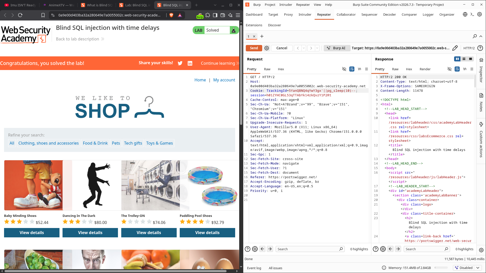

# Blind SQL injection with time delays

| Field | Value |
|---|---|
| **Difficulty** | Practitioner |
| **Category** | SQL Injection (Blind) |
| **Lab URL** | `https://portswigger.net/web-security/sql-injection/blind/lab-sql-injection-time-delays` |

---

## Lab Overview

The application reads a `TrackingId` cookie for analytics and incorporates its value into a SQL query. The query results are never returned, and the application does not respond any differently whether the query returns rows or throws an error — so neither the conditional-responses oracle (a visible "Welcome back" message) nor the conditional-errors oracle (an HTTP 500) is available.

The one observable difference is time. Because the SQL query runs synchronously, delaying the query also delays the HTTP response. The objective of this lab is simply to prove the vulnerability by triggering a **10 second delay**; data extraction is left to the follow-up lab ("Blind SQL injection with time delays and information retrieval").

The backend is **PostgreSQL**, identified by the `||` concatenation operator and the availability of the `pg_sleep()` function.

---

## Vulnerability

The `TrackingId` cookie value is embedded directly into a SQL query with no parameterization:

```sql
SELECT tracking_id FROM tracking WHERE tracking_id = '<TrackingId cookie>'
```

User-controlled cookie data becomes part of the SQL statement, so anything placed in the cookie value is parsed as SQL. The injection point is the cookie itself, not a URL parameter.

Because the query result is invisible and errors are swallowed, the only side channel that survives is the execution time of the query itself.

---

## Initial Detection

The `TrackingId` cookie is sent on every request to the lab's home page. Since its value is placed inside a single-quoted string in the query, I needed a payload that:

1. Closes the string literal (`'`).
2. Appends my own SQL expression.
3. Keeps the rest of the original query syntactically valid.

PostgreSQL's `pg_sleep(seconds)` blocks the session for the given number of seconds. Combined with `||` — PostgreSQL's string concatenation operator — the value can be spliced into the query as a string expression that evaluates to nothing but sleeps while doing so.

---

## Methodology

### 1. Constructing the Payload

The cookie value is wrapped in quotes by the application. My input reopens and reuses the expression so the whole statement stays valid:

```http
Cookie: TrackingId=xyz'||pg_sleep(10)--
```

Broken down:

| Token | Role |
|---|---|
| `xyz` | placeholder original value (kept) |
| `'` | closes the string literal that the app opened |
| `\|\|` | PostgreSQL string concatenation — joins my expression into the query |
| `pg_sleep(10)` | pauses the database session for 10 seconds |
| `--` | SQL comment — neutralizes the trailing `'` and everything after it |

Without the `--`, the leftover closing quote at the end of the original query would produce a syntax error. The comment swallows the tail so the injected expression is the last thing the database parses.

### 2. Sending the Request in Repeater

I sent the modified request from the home page through Burp **Repeater**:

```http
GET / HTTP/2
Host: 0a9e00d403ba32a280649e7a0055002c.web-security-academy.net
Cookie: TrackingId=5YanQBNQ4qYwY3gx'||pg_sleep(10)--
session=h01ZYHCOGL53qTTAbYK14TkQuzY1P2Rt
```



The request took **10,445 ms** to complete — the HTTP response was delayed by a full 10 seconds, exactly matching `pg_sleep(10)`. That timing delta is the proof of injection: without the payload the page responds in well under a second, and the delay only appears when the injected sleep runs server-side.

### 3. Solving the Lab

The 10-second delay satisfied the lab's condition, and the response body returned the confirmation:

```text
Congratulations, you solved the lab!
```

---

## Why This Works

- The application inserts the unsanitized `TrackingId` cookie value directly into a SQL string (`... WHERE tracking_id = '<cookie>'`).
- Because the input is not parameterized, `'`, `||`, `pg_sleep(10)`, and `--` are parsed as SQL rather than treated as data.
- `pg_sleep()` blocks the database session for its argument in seconds; since the query is executed synchronously, the HTTP response is delayed by the same amount.
- No data has to be returned for the leak to be observed — the **response time itself is the side channel**.

The `pg_sleep()` function is **PostgreSQL-specific**. The equivalent delay primitives on other backends are:

| Database | Delay primitive |
|---|---|
| PostgreSQL | `pg_sleep(10)` |
| MySQL / MariaDB | `SLEEP(10)` |
| Microsoft SQL Server | `WAITFOR DELAY '0:0:10'` |
| Oracle | `dbms_pipe.receive_message(('a'), 10)` or a deliberately expensive query (Cartesian product) |

The syntax around the primitive is database-specific too — Oracle and PostgreSQL use `||` for concatenation, whereas SQL Server uses `+`, and each backend has its own comment syntax (`--` is widely supported).

---

## Key Takeaways

- **Blind doesn't mean undetectable** — when the response body reveals nothing, the response *time* can still be the oracle.
- **Synchronous queries leak timing** — a server-side sleep that holds the query also holds the HTTP response; that correlation is the vulnerability's fingerprint.
- **Escape, splice, comment** — close the string (`'`), join in your expression (`||`), and neutralize the tail (`--`).
- **Backend fingerprinting matters** — the delay function is different on every database (`pg_sleep` vs `SLEEP` vs `WAITFOR DELAY` vs `dbms_pipe.receive_message`); knowing the backend dictates the payload.
- **Start simple** — a bare, unconditional delay proves injection before adding the conditional logic needed for data extraction (the next lab).

---

## Mitigation

- **Parameterized queries / prepared statements** are the primary defense. Binding the cookie as a parameter means `'`, `||`, `pg_sleep(10)`, and `--` are treated as data, never executable SQL — the injected expression simply can't run.
- **Never build SQL by string concatenation**; centralize query construction so user input can't reshape the statement.
- **Defense in depth**: validate/whitelist expected input formats even with parameterization.
- **Database timeouts** — an application-level query timeout can cap the blast radius of a delay payload and stop it from tying up database connections.

Input filtering alone is not a sufficient SQL injection defense — parameterization is the fix.

---

## Related Labs

- [14 - Visible error-based SQL injection](../14%20-%20Visible%20error-based%20SQL%20injection/README.md) — same blind `TrackingId` injection, but verbose errors turn it into a visible data leak via `CAST()`.
- [13 - Blind SQL injection with conditional errors](../13%20-%20Blind%20SQL%20injection%20with%20conditional%20errors/README.md) — blind extraction on Oracle using a conditional `TO_CHAR(1/0)` error oracle.
- [12 - Blind SQL injection with conditional responses](../12%20-%20Blind%20SQL%20injection%20with%20conditional%20responses/README.md) — blind extraction using the visible "Welcome back" boolean oracle.

The natural sequel is the next lab in the series — **Blind SQL injection with time delays and information retrieval** — which combines this delay primitive with a conditional to exfiltrate data character by character.

---

## References

- [PortSwigger: Blind SQL injection](https://portswigger.net/web-security/sql-injection/blind)
- [PortSwigger: Exploiting blind SQL injection by triggering time delays](https://portswigger.net/web-security/sql-injection/blind#exploiting-blind-sql-injection-by-triggering-time-delays)
- [PortSwigger: SQL injection cheat sheet](https://portswigger.net/web-security/sql-injection/cheat-sheet)
- [OWASP: SQL Injection Prevention Cheat Sheet](https://cheatsheetseries.owasp.org/cheatsheets/SQL_Injection_Prevention_Cheat_Sheet.html)
