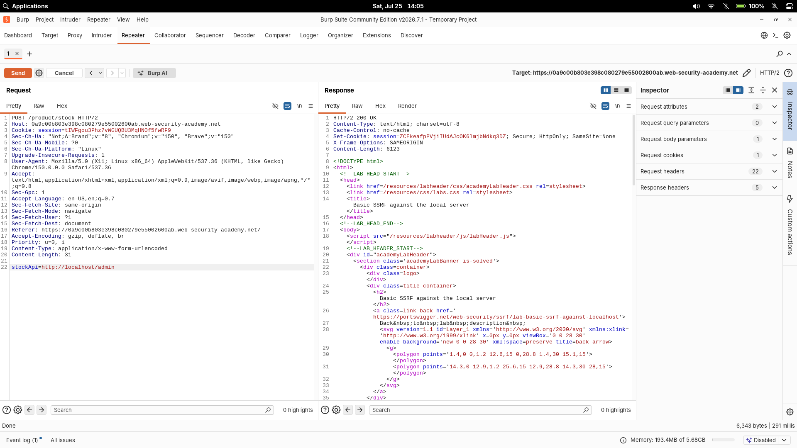

# Basic SSRF against the local server

| Field | Value |
|---|---|
| **Difficulty** | Apprentice |
| **Category** | SSRF |
| **Lab URL** | `https://portswigger.net/web-security/ssrf/lab-basic-ssrf-against-localhost` |

---

## Lab Objective

Change the stock check URL to access the admin interface at `http://localhost/admin` and delete user `carlos`.

---

## Skills Learned

- Identifying SSRF vectors in HTTP parameters
- Using SSRF to access internal services on localhost
- Chaining SSRF with admin actions

---

## Recon

The lab is a shop site with a stock check feature. Clicking "Check stock" sends a POST request to `/product/stock` with a `stockApi` parameter pointing to an internal URL — classic SSRF vector.

---

## Finding the Vulnerability

The `stockApi` parameter is user-controllable and the server fetches whatever URL is provided. There's no validation on the destination, meaning I can make the server send requests to arbitrary hosts including localhost.

---

## Exploitation Steps

1. Visited a product page and clicked "Check stock".
2. Intercepted the POST request in Burp Proxy and sent it to Repeater.
3. Changed the `stockApi` parameter from the internal stock URL to:
   ```
   stockApi=http://localhost/admin
   ```
4. Forwarded the request — the response contained the admin panel HTML with a "Delete" link for user `carlos`.
5. Updated the parameter to delete Carlos:
   ```
   stockApi=http://localhost/admin/delete?username=carlos
   ```
6. Lab solved.

---

## Proof of Exploitation



---

## Why It Works

The server blindly fetches the URL supplied in `stockApi` without validating the target host. By pointing it to `http://localhost/admin`, the server makes an internal request to its own admin interface, which is only supposed to be accessible from localhost. This bypasses any network-level access controls that would block external requests to the admin panel.

---

## Root Cause

The developer trusted user input in the `stockApi` parameter without:
- Whitelisting allowed hosts or URL patterns
- Blocking internal IP ranges (127.0.0.0/8, 10.0.0.0/8, etc.)
- Validating that the destination is a legitimate stock API endpoint

---

## Impact

An attacker can:
- Access internal services on localhost (admin panels, cloud metadata endpoints, etc.)
- Interact with internal APIs that aren't meant to be publicly accessible
- Pivot to attack other internal systems from the server's network perspective

---

## Mitigation

- Maintain a whitelist of allowed hosts/URLs for the `stockApi` parameter
- Block requests to private IP ranges (127.0.0.0/8, 10.0.0.0/8, 172.16.0.0/12, 192.168.0.0/16)
- Use a server-side URL parser and validate the host component before making the request
- Apply network segmentation so internal services are not accessible from the application server

---

## Key Takeaways

- SSRF can turn a simple stock check feature into a gateway to internal services
- Always check for URL parameters that the server might fetch
- Localhost access via SSRF is often the first step to escalating an attack
- `http://localhost/admin` is worth trying whenever you find an SSRF vector

---

## Related Labs

- [02 - Basic SSRF against another back-end system](../02%20-%20Basic%20SSRF%20against%20another%20back-end%20system/README.md) — same stock-check SSRF primitive; this one targets localhost

---

## References

- [PortSwigger: SSRF](https://portswigger.net/web-security/ssrf)
- [PortSwigger: SSRF cheat sheet](https://portswigger.net/web-security/ssrf/url-validation-bypass-cheat-sheet)
