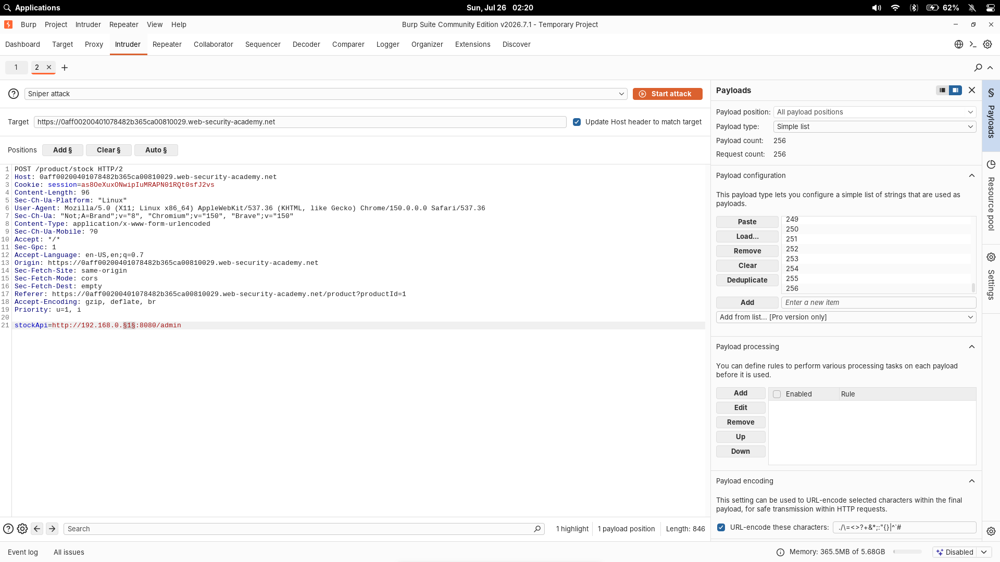
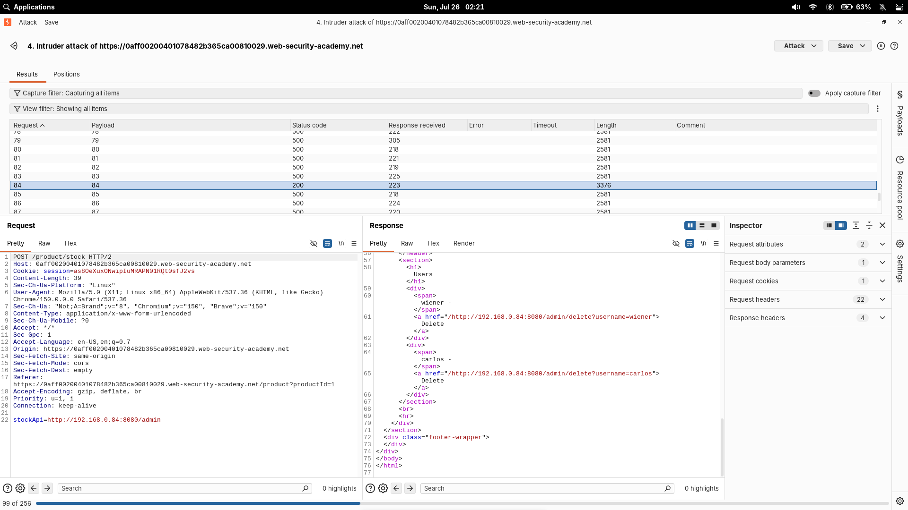
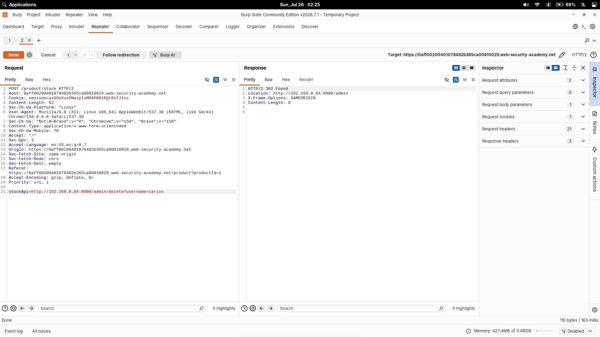

# Basic SSRF against another back-end system

| Field          | Value                                                                             |
| -------------- | --------------------------------------------------------------------------------- |
| **Difficulty** | Apprentice                                                                        |
| **Category**   | SSRF                                                                              |
| **Lab URL**    | `https://portswigger.net/web-security/ssrf/lab-basic-ssrf-against-backend-system` |

---

## Lab Objective

Use the stock check feature to scan the internal `192.168.0.X` range for an admin interface on port `8080`, then delete user `carlos`.

---

## Skills Learned

- Scanning internal IP ranges via SSRF
- Using Burp Intruder with number payloads
- Chaining SSRF discovery with admin actions

---

## Recon

The lab is a shop site with a stock check feature. Clicking "Check stock" sends a POST request to `/product/stock` with a `stockApi` parameter. Unlike the localhost variant, the admin interface lives on a different internal IP.

---

## Finding the Vulnerability

The `stockApi` parameter accepts arbitrary URLs with no host validation. The lab specifies the admin interface is somewhere in `192.168.0.0/24` on port `8080`.

---

## Exploitation Steps

1. Visited a product page and clicked "Check stock".
2. Intercepted the POST request in Burp Proxy and sent it to Intruder.
3. Set `stockApi` to `http://192.168.0.1:8080/admin` then highlighted the final octet and added `§`.
4. In Payloads, selected **Numbers** type — **From: 1**, **To: 255**, **Step: 1**.
5. Started the attack and sorted by **Status** column — one `200` response stood out.
6. Sent that request to Repeater and changed the path to delete carlos.
7. Lab solved.

---

## Proof of Exploitation

---

## Why It Works

The server fetches whatever URL is supplied in `stockApi` without restricting the destination. Iterating through `192.168.0.1-255:8080/admin` finds the internal admin interface. The same SSRF vector performs the delete action — the server itself is authorized to access the admin panel.

---

## Root Cause

The developer trusted user input in the `stockApi` parameter without:

- Whitelisting allowed hosts or URL patterns
- Restricting outbound requests to known internal services
- Validating the IP range of the destination

---

## Impact

An attacker can:

- Scan internal IP ranges by observing response differences
- Discover and interact with internal admin interfaces
- Perform state-changing actions through the vulnerable server
- Use the server as a proxy to reach other internal hosts

---

## Mitigation

- Whitelist allowed hosts or URL patterns for the `stockApi` parameter
- Block requests to private IP ranges (`10.0.0.0/8`, `172.16.0.0/12`, `192.168.0.0/16`)
- Use a server-side URL parser and validate the host component before fetching
- Apply network segmentation so admin interfaces are not accessible from application servers

---

## Key Takeaways

- SSRF can scan internal networks, not just access localhost
- Burp Intruder with number payloads makes IP range brute-forcing trivial
- Always check URL parameters the server might fetch
- Finding an internal service is only half the battle — chaining it with admin actions is the real impact

---

## Related Labs

- [01 - Basic SSRF against the local server](../01%20-%20Basic%20SSRF%20against%20the%20local%20server/README.md) — same SSRF primitive pointed at an internal back-end instead

---

## References

- [PortSwigger: SSRF](https://portswigger.net/web-security/ssrf)
- [PortSwigger: SSRF cheat sheet](https://portswigger.net/web-security/ssrf/url-validation-bypass-cheat-sheet)
